<!-- omit from toc -->
# Demystifying Randomness

A Deep Dive into Random Number Generators and their Implementations.

# Introduction

In the world of computing, randomness is more than a theoretical concept—it's a cornerstone of numerous applications that drive modern technology. From securing sensitive information to simulating complex systems, random numbers play a pivotal role in ensuring efficiency, security, and fairness.

# Target Audience

This article is not for the faint of heart or those simply looking for quick results. It is intended for readers who are willing to delve deeply into the intricacies of randomness and its implementations. If you are someone who enjoys exploring complex concepts, understanding the underlying principles and questioning how things work beneath the surface, then this article is for you.

Be prepared for an in-depth exploration that reflects the author's current understanding and insights. While every effort has been made to present the information thoroughly and accurately, there is no guarantee that it is complete or error-free. This is a journey into the nuanced world of random number generators, and like all explorations, it is marked by both discovery and recognition of the limits of current knowledge.

# Background

Randomness is crucial in fields such as cryptography, where it underpins the generation of secure encryption keys and cryptographic protocols. Without high-quality randomness, data security could be compromised, making it easier for malicious actors to predict or reproduce secret keys.

In simulations and modeling, randomness enables the accurate representation of real-world phenomena. Techniques like [Monte Carlo simulations](https://en.wikipedia.org/wiki/Monte_Carlo_method) and [Particle filters](https://en.wikipedia.org/wiki/Particle_filter) use random sampling to solve mathematical problems and predict outcomes in finance, engineering, and scientific research. The accuracy of these simulations depends heavily on the quality of the random numbers used.

In gaming, randomness ensures that outcomes are unpredictable and fair, enhancing the gaming experience. Whether it’s the roll of a dice, the shuffle of a deck, or the spawn of in-game items, randomness provides the element of chance that keeps games exciting and engaging.

# Let's dive into it

## What is Randomness?

It refers to the lack of pattern or predictability in events. In the context of computing and mathematics, randomness is the concept of generating sequences of numbers or symbols that cannot be reasonably predicted better than by random chance. This unpredictability is essential to ensure fairness, security, and accurate simulation of real-world phenomena.

> [!TIP]
> The following examples use different programming languages on purpose to give the reader something usable no matter which language he chose to code in.

## Types of Randomness?

### Non-Deterministic (TRNG)

Non-deterministic randomness, often referred to as "true randomness," is derived from physical processes that are inherently unpredictable. These are generated through various physical phenomena such as:

* **Thermal Noise**: Electronic circuits generate thermal noise, which is the random fluctuation of electrical signals caused by the thermal agitation of electrons. This noise can be captured and digitized to produce random numbers.

* **Radioactive Decay**: The decay of radioactive isotopes is a random process governed by quantum mechanics. Geiger counters can detect these decay events, and the timing between decays can be used to generate random numbers.

* **Photon Emission**: The emission of photons from certain materials can also be used as a source of randomness. Devices that detect single photons can record the intervals between emissions to generate random sequences.

* **Quantum Randomness**: Quantum mechanics provides several phenomena that are inherently random. For example, measurements of quantum states, such as the polarization of photons or spin of electrons, yield results that are unpredictable.

* **Atmospheric Noise**: Variations in atmospheric conditions, such as radio noise from lightning or other natural sources, can be captured and used as a source of [true randomness](https://www.random.org).

#### Challenges in Generating True Randomness

While true random number generators offer high-quality randomness, they also come with certain challenges:

* **Hardware Complexity**: They often require specialized hardware to capture and process physical phenomena.

* **Environmental Sensitivity**: The quality of randomness can be affected by environmental factors such as temperature, humidity, and electromagnetic interference.

* **Speed**: They may not generate random numbers as quickly as deterministic algorithms, making them less suitable for applications requiring high-throughput random numbers.

##### True Randomness in Personal Computers

In personal computers, true randomness can be sourced from several hardware-based mechanisms:

* **Peripheral Devices**: Some peripherals, such as network cards, sound cards, and disk drives, can capture environmental noise and other random events to generate random numbers. Additionally, using keyboard, gamepad, and mouse inputs as an additional entropy source is common (especially when no other source is available like on certain [gaming consoles](https://www.smogon.com/ingame/rng/)).

* **Hardware Random Number Generators (HRNGs)**: Many modern hardware comes with built-in HRNGs that utilize physical phenomena to generate random numbers.

  * **CPU-Support**

    * **Intel RDRAND**: Intel processors with the Ivy Bridge architecture and later include the [`RDRAND`](https://www.intel.com/content/www/us/en/developer/articles/guide/intel-digital-random-number-generator-drng-software-implementation-guide.html) instruction, which provides random numbers generated by an onboard hardware RNG. This RNG uses thermal noise as its entropy source.

      Here’s an example in [C](https://en.wikipedia.org/wiki/C_(programming_language)), for using the RDRAND instruction to generate a 64-Bit number:

      ```c
      #include <immintrin.h>
      #include <stdio.h>

      int main() {
        unsigned long long random_number;
        
        if (_rdrand64_step(&random_number)) {
          printf("Random 64-bit number: %016llx\n", random_number);
        } else {
          printf("Failed to generate random number\n");
        }

        return 0;
      }
      ```

    * **AMD RDSEED**: Similar to Intel's `RDRAND`, AMD processors also include the [`RDSEED`](https://www.amd.com/content/dam/amd/en/documents/pdfs/developer/aocl/amd-secure-random-number-generator-library-2.0-whitepaper.pdf) instruction. The source of entropy for RDSEED in AMD processors, like Intel’s implementation, is based on a hardware noise source, typically using thermal noise within the silicon to produce true random bits. This entropy source is then conditioned to ensure high-quality randomness suitable for cryptographic applications.

      Here’s an example in [Rust](https://en.wikipedia.org/wiki/Rust_(programming_language)), utilizing the RDSEED intrinsic to generate a 64-Bit number:

      ```rust
      use std::arch::x86_64::_rdseed64_step;

      fn main() {
          let mut random_number: u64 = 0;
          let success: i32;

          unsafe {
              success = _rdseed64_step(&mut random_number);
          }

          if success == 1 {
              println!("Random 64-bit number: {:016x}", random_number);
          } else {
              println!("Failed to generate random number");
          }
      }
      ```

    * **ARM RNDR**: In ARM architecture, [`RNDR` and `RNDRRS`](https://developer.arm.com/documentation/ka005114/latest/) are instructions used to read random numbers. These instructions are part of the ARMv8.5-A architecture and later versions, providing access to random number generation functionality directly from the CPU.

      Here’s an example in [ARM-Assembler](https://en.wikipedia.org/wiki/Assembly_language), using the `RNDR` register to generate a 64-Bit number:

      ```armasm
      .global _start

      .section .data
      random_number: .space 8

      .section .text
      _start:
          mrs x0, RNDR
          str x0, random_number
          
          mov x8, 93
          mov x0, 0
          svc 0
      ```

  * **Operating System Support**
  
    * **Windows** operating systems provide access to hardware-based randomness through the "Cryptography: Next Generation"-API (CNG) using functions such as [`BCryptGenRandom`](https://learn.microsoft.com/de-de/windows/win32/api/bcrypt/nf-bcrypt-bcryptgenrandom).

      Here’s an example in [C++](https://en.wikipedia.org/wiki/C%2B%2B), using the bcrypt library to generate a 64-Bit number:

      ```c++
      #include <windows.h>
      #include <bcrypt.h>
      #include <iostream>

      #pragma comment(lib, "bcrypt.lib")

      int main() {
          UCHAR random_number[8]; // Generate 64-bit random number
          NTSTATUS status = BCryptGenRandom(
              NULL,
              random_number,
              sizeof(random_number),
              BCRYPT_USE_SYSTEM_PREFERRED_RNG
          );

          if (status == STATUS_SUCCESS) {
              std::cout << "Random 64-bit number: ";
              for (int i = 0; i < sizeof(random_number); i++) {
                  printf("%02x", random_number[i]);
              }
              std::cout << std::endl;
          } else {
              std::cerr << "Failed to generate random number" << std::endl;
          }

          return 0;
      }
      ```

    * **Linux** offers support for HRNGs through the virtual devices [`/dev/random` and `/dev/urandom`](https://en.wikipedia.org/wiki//dev/random), which include entropy from hardware sources. Additionally, the [`getrandom()`](https://man7.org/linux/man-pages/man2/getrandom.2.html) system call can be used for this purpose. The `getrandom()` system call is recommended because it blocks until enough entropy is available, ensuring high-quality random numbers, especially useful during the early boot phase.

      Here’s an example in [Perl](https://en.wikipedia.org/wiki/Perl), using the virtual devices to generate a 64-Bit number:

      ```perl
      use strict;
      use warnings;

      my $random_number;
      open my $fh, '<', '/dev/urandom' or die "Can't open /dev/urandom: $!";
        binmode $fh;
        read $fh, $random_number, 8; # Read 64-bit random number
      close $fh;

      print "Random 64-bit number: ";
      foreach my $byte (split //, $random_number) {
        printf "%02x", ord($byte);
      }
      print "\n";
      ```

    * **macOS** provides access to high-quality random numbers through the [`SecRandomCopyBytes`](https://developer.apple.com/documentation/security/1399291-secrandomcopybytes?language=objc) function in the Security framework.

      Here’s an example in [Python](https://en.wikipedia.org/wiki/Python_(programming_language)), using the OS-function to generate a 64-Bit number:

      ```python
      import ctypes
      import os

      def get_random_bytes(n):
        buf = (ctypes.c_ubyte * n)()
        result = ctypes.cdll.LoadLibrary(ctypes.util.find_library("Security")).SecRandomCopyBytes(None, n, buf)
        if result != 0:
          raise ValueError("Failed to generate random bytes")

        return bytes(buf)

      random_bytes = get_random_bytes(8)  # Generate 64-bit random number
      print("Random 64-bit number: ", random_bytes.hex())
      ```

### Deterministic

This type of randomness is generated by algorithms designed to produce sequences of numbers that appear random but are actually based on some initial value. Unlike true random numbers, these sequences are predictable if the state and algorithm are known. Despite this predictability, high-quality deterministic random number generators can produce sequences that are sufficiently random for many practical applications. All of them use an internal state (or the last known value) and perform various computational operations to generate each number in the sequence, updating the internal state with each invocation to ensure the sequence continues.

### Seeds - Sources of Entropy

They play a crucial role in generating deterministic random numbers. A seed is an initial value provided to a generator that determines the sequence of numbers it produces. The same seed will always result in the same sequence, which is essential for reproducibility in many applications. In most cases the seed will (and should!) not be the first value produced, but a starting point for the internal state machine.

#### Importance of Seeds

* **Reproducibility**: In simulations and testing, reproducibility is vital. Using the same seed allows researchers and developers to regenerate the same sequence of random numbers, ensuring consistent results and enabling the verification of experiments or debugging of programs.

* **Initialization**: Seeds are used to initialize the internal state of the generator. The quality of the seed impacts the quality of the random numbers generated. Poorly chosen seeds can lead to predictable sequences, undermining the randomness.

* **Entropy Sources**: For cryptographic applications, seeds must be derived from high-entropy sources to ensure unpredictability. Entropy sources can include any non-deterministic source, or system states that are difficult to predict.

#### Generating Seeds

* **Hardware Entropy**: Using any available HRNG to obtain entropy, which is then used as a seed.

  Here's an example in [JavaScript](https://en.wikipedia.org/wiki/JavaScript), that obtains a seed value using network latencies:

  ```javascript
  async function getNetworkLatencySeed() {
    return await _getNetworkLatencySeed(
      [
        'https://google.de',
        'https://bing.se',
        'https://br.search.yahoo.com',
        'https://duckduckgo.com',
        'https://ecosia.org',
      ], 
      10
    );
  }

  async function _getNetworkLatencySeed(hosts, count) {
    let seed = 0;

    const getLatency = (host) =>
      new Promise((resolve) => {
        const start = Date.now();
        fetch(host, { mode: 'no-cors' })
          .then(() => resolve(Date.now() - start))
          .catch(() => resolve(Date.now() - start)); // resolve even if the fetch fails
      });

    const combineSeed = (seed, latency) => (seed * 31 + latency) % Number.MAX_SAFE_INTEGER;

    for (let i = 0; i < count; i++) {
      const latency = await getLatency(hosts[i % hosts.length]);
      seed = combineSeed(seed, latency);
    }

    return seed;
  }
  ```

* **Time-based Seeds**: A common method is using the current time as a seed, leveraging the system clock. This can be predictable if the (tick-)exact time the seed was generated is known. However if one knows at least the interval in which the seeding occured, one can still try all ticks within this interval to break randomness.

  Here’s an example in [VB.NET](https://en.wikipedia.org/wiki/Visual_Basic_(.NET)), using the current time to seed a random number generator:

  ```vbnet
  Imports System

  Module Program
      Sub Main()
          Dim seed As Integer = DateTime.Now.Ticks And Integer.MaxValue
          Dim rand As New Random(seed)
          Console.WriteLine("Random 64-bit number: " & rand.NextInt64())
      End Sub
  End Module
  ```

* **Re-Seeding**: It is also very common to update the seed after a given amount of generated numbers or based on a timer, to make the outcomes even more unpredictable.

  Here’s an example in [Pascal](https://en.wikipedia.org/wiki/Pascal_(programming_language)), showing re-seeding after the first number was generated:

  ```pascal
  program GenerateRandom64Bit;

  uses
    SysUtils;

  function Generate64BitRandomNumber: UInt64;
  begin
    Result := (UInt64(Random(MaxInt)) shl 32) or UInt64(Random(MaxInt));
  end;

  var
    RandomNumber: UInt64;
  begin
    // Seed the random number generator with the current time
    Randomize;
    RandomNumber := Generate64BitRandomNumber;
    WriteLn('First 64-bit random number: ', RandomNumber);

    // Re-Seed the random number generator again with the current time
    Randomize;
    RandomNumber := Generate64BitRandomNumber;
    WriteLn('Second 64-bit random number: ', RandomNumber2);

    ReadLn;
  end.
  ```

  > [!WARNING]
  > If [Randomize](https://lazarus-ccr.sourceforge.io/docs/rtl/system/randomize.html) has only second precision (which depends on compiler implementation), this example may produce the same number twice because the same seed may be utilized.

Using a high-entropy seed source, especially in cryptographic applications, ensures that the generator produces a sequence that is difficult to predict and reverse-engineer.

## Types of Random Number Generators (RNG)

### Pseudo-Random Number Generators (PRNG)

#### PRNG Characteristics

* **Deterministic**: PRNGs generate sequences of numbers that are determined by an initial seed. The same seed will always produce the same sequence.

* **Fast**: PRNGs are typically faster than TRNG because they use algorithmic processes rather than physical phenomena.

* **Reproducible**: Essential for applications where reproducibility is necessary, such as simulations and debugging.

#### PRNG Applications

* **Simulations and Modeling**: PRNGs are widely used in simulations, such as statistical simulations, where large quantities of random numbers are needed.

* **Games**: PRNGs provide the randomness required for game mechanics, ensuring fair play and varied experiences.

* **Procedural Generation**: Used in applications like content generation in games and art, where large, diverse datasets are created algorithmically.

### Cryptographically Secure Random Number Generators (CSRNG)

#### CSRNG Characteristics

* **Unpredictable**: CSRNGs are designed to be cryptographically secure, meaning their outputs are unpredictable and resistant to reverse-engineering.

* **High Entropy**: They use high-entropy sources for seeding to ensure the randomness quality.

* **Security**: They incorporate mechanisms to prevent attackers from predicting future outputs even if some bits of internal states are known.

#### CSRNG Applications

* **Cryptography**: Generating keys, salts, nonces, initialization vectors, and other cryptographic values that require high security.

* **Secure Protocols**: Ensuring the unpredictability of random values (like [large primes](https://www.rfc-editor.org/rfc/rfc7919) or [elliptic curves](https://en.wikipedia.org/wiki/Elliptic-curve_cryptography)) in secure communication protocols.

#### CSRNG Construction

Although it is possible to use a stream cipher, a block cipher or a cryptographically secure hash function to create a generator, these constructions often do not have the desired statistical properties and therefore need to be further tweaked to be practically useful.

### Non-Uniform Random Number Generation (NURNG)

#### NURNG Characteristics

* **Distribution-Specific**: NURNGs generate random numbers according to specific probability distributions (e.g., Gaussian, Exponential, Poisson) rather than uniformly across an interval.

* **Transformative**: They typically transform uniformly distributed random numbers (generated by a PRNG) into the desired non-uniform distribution using techniques like the inverse transform method or rejection sampling.

* **Application-Specific**: These generators are tailored to the needs of specific applications where modeling or simulations require data that follow particular statistical properties.

#### NURNG Applications

* **Statistical Modeling**: Used extensively in simulations where the underlying processes follow non-uniform distributions, such as financial modeling, risk assessment, and scientific experiments.

* **Machine Learning**: In generating synthetic data that mimic real-world distributions, NURNGs are vital in training and validating models.

* **Complex System Simulation**: Critical in scenarios like virus transmission models, gene expression, and stock market dynamics, where outcomes must reflect the non-linear characteristics of real-world processes.

### Cascade Construction RNG

Most hardware RNG, especially those found in CPUs utilize a cascade of on-chip thermal entropy and a CSRNG (for example Intel is utilizing the [AES](https://en.wikipedia.org/wiki/Advanced_Encryption_Standard)-block cipher in counter [mode](https://en.wikipedia.org/wiki/Block_cipher_mode_of_operation) and [CBC-MAC](https://en.wikipedia.org/wiki/CBC-MAC)), re-seeded again and again to present you a HRNG. This leads to high-throughput hard-to-predict random numbers.

## Benchmarking RNGs

This involves evaluating their performance and quality to determine their suitability for various applications. This process covers several key aspects, which we will now dive into.

### Categories

#### Speed

That's a crucial metric for RNGs, especially in applications requiring a high throughput of random numbers, such as simulations and gaming. The generation rate is typically measured in terms of the number of random numbers generated per second or the average time taken to generate a single random number.

##### Methods for determining generation speed

* **Microbenchmarking:** Using precise timers to measure the time taken to generate a large sequence of random numbers.

* **Profiling Tools:** Using performance profiling tools (e.g., [`perf`](https://man7.org/linux/man-pages/man1/perf.1.html) on Linux, [`gprof`](https://man7.org/linux/man-pages/man1/gprof.1.html) on Unix) to analyze and record the time taken by RNG functions.

#### Memory

RAM usage is another critical factor, especially for applications with limited resources. Benchmarking memory usage involves evaluating the amount of memory required by the RNG to maintain its state and generate random numbers.

##### Methods for resource usage analysis

* **Static Analysis:** Evaluating the memory requirements of the RNG's data structures and state variables.

* **Dynamic Analysis:** Monitoring the actual memory usage during the execution of the RNG using profiling tools.

#### Uniformity

Uniform distribution is a fundamental property of high-quality RNGs, ensuring that each possible outcome is equally likely. Benchmarks for uniform distribution assess whether the numbers generated by the RNG follow a uniform distribution.

##### Methods for ensuring equal probability for all outcomes

* **Histogram Analysis:** Collecting a large number of random samples and plotting a histogram to visually inspect the distribution.

* **Chi-Square Test:** Performing a statistical chi-square test to determine if the observed distribution matches the expected uniform distribution.

#### Independence / Correlation

High-quality RNGs produce sequences where each number is independent of the others, meaning there should be no discernible patterns or correlations. Benchmarks for independence and correlation assess whether the generated numbers are truly independent.

##### Methods for ensuring lack of patterns or dependencies in sequences

* **Autocorrelation Test:** Measuring the correlation between numbers in the sequence separated by various lag distances.

* **Runs Test:** Evaluating the randomness of a sequence by analyzing the occurrence and length of runs (consecutive sequences of increasing or decreasing numbers).

#### Period Length

The period length of an RNG is the number of values it produces before the sequence starts repeating. A long period is essential for applications requiring large amounts of random data to ensure the sequence does not repeat prematurely.

##### Methods for assuring long periods in RNGs

* **Theoretical Calculation:** Analyzing the algorithm to determine its maximum period length based on its mathematical properties.

* **Empirical Testing:** Generating random numbers and detecting repetitions to estimate the actual period length.

### Test-Suites

#### Diehard [^1]

[^1]: [Diehard](https://github.com/eltonlaw/diehard)

These tests are a suite of statistical tests designed by George Marsaglia to assess the quality of RNGs. These tests evaluate various aspects of randomness, including distribution uniformity, independence, and the occurrence of patterns.

##### Key Tests of Diehard

* **Birthday Spacings:** Tests for the spacing between repeated values.

* **Overlapping Permutations:** Checks for the frequency of overlapping permutations in sequences.

* **Rank of Matrices:** Evaluates the rank of matrices constructed from random numbers.

#### TestU01 [^2]

[^2]: [TestU01](https://simul.iro.umontreal.ca/testu01/tu01.html)

This is a comprehensive software library developed by Pierre L'Ecuyer for testing RNGs. It includes several batteries of tests, ranging from small (Crush) to large (BigCrush), providing a thorough evaluation of an RNG's statistical properties.

##### Key Features of TestU01

* **SmallCrush:** A smaller battery for quick assessments
* **Crush:** A moderate battery of tests suitable for initial evaluations.
* **BigCrush:** A large and highly stringent battery for thorough testing.

#### NIST Statistical Test Suite [^3]

[^3]: [NIST-STS](https://nvlpubs.nist.gov/nistpubs/legacy/sp/nistspecialpublication800-22r1a.pdf)

This is a set of tests developed by the National Institute of Standards and Technology to evaluate the quality of random numbers, particularly for cryptographic applications. This suite assesses the randomness of binary sequences.

##### Key Features of NIST

* **Frequency (Monobit) Test:** Evaluates the proportion of ones and zeros.

* **Runs Test:** Analyzes the occurrence and length of runs in the sequence.

* **Approximate Entropy Test:** Measures the entropy, or unpredictability, of the sequence.

### Visualizations

Displaying the output of RNGs helps to intuitively understand their behavior and assess their quality. By using graphical representations, we can observe patterns, uniformity, and potential flaws in the generated sequences.

#### Histogram

This is a graphical representation that displays the distribution of random numbers generated by the RNG. It divides the range of possible values into intervals (bins) and counts how many numbers fall into each bin. A well-behaved non-NURNG should produce a histogram where all bins have approximately the same count, indicating a uniform distribution.

* **Bins:** The number of bins chosen for the histogram can influence the interpretation. Too few bins may obscure variations, while too many bins might exaggerate noise in the distribution. Typically, the number of bins is chosen based on the sample size and the range of the random numbers.

> [!WARNING]
> A short-period RNG may still produce a good looking histogram.

#### Randogramm [^4]

[^4]: [Randogram](https://www.pcg-random.org/posts/visualizing-the-heart-of-some-prngs.html)

Those are powerful visualization tools used to detect patterns or flaws in the output of RNGs. They provide a 2D representation of the state space, offering an intuitive way to assess the randomness of an RNG's output. By visualizing the output in this manner, we can quickly identify regularities or anomalies that might not be apparent through numerical analysis alone. Randograms extract distinct bits from different parts of the output value and convert them into (x, y) coordinates, using pixel intensity to represent occurrence frequency.

We can select bits using:

* Groups of adjacent bits
* Groups of bits from opposite halves of the output
* Groups of bits from the start and their reverse from the end
* Interleaved groups of bits
* Bits from two consecutive outputs of the RNG

##### Visualizing 64-Bit Output with 256x256 Randograms

For a comprehensive analysis of a 64-bit RNG, we can use four separate 256x256 randograms, each visualizing a 16-bit segment of the output. Each randogram will represent a different 16-bit slice, allowing us to scrutinize the entire 64-bit output in detail.

* **Pixel Intensity Representation**: In a randogram, each pixel represents the frequency of occurrence of a specific 16-bit value pair (x, y). The intensity of the pixel is determined by how often that particular pair appears in the output:
  * **White (100% intensity)** indicates that the pair does not appear at all.
  * **50% grey** indicates the pair appears once.
  * **Darker shades** represent multiple occurrences, with each additional occurrence halving the pixel's intensity.

This method allows us to identify potential patterns or repetitions that could indicate flaws in the RNG.

##### 8-Bit Visualizations

For smaller-scale analysis, especially when working with simpler or reduced versions of RNGs, an 8-bit segment of the output can be visualized using a tiny randogram. This smaller grid is particularly useful for identifying issues in the least significant bits, which are often more prone to predictability or bias.

* **16x16 Randogram**: In this visualization, each pixel corresponds to one of the possible 8-bit output values. The same intensity rules apply, with pixels turning darker as specific value pairs occur more frequently. A well-functioning RNG should produce a 16x16 randogram that appears random, with no discernible patterns.

##### Interpreting Randograms

* **"Random-looking"**: A high-quality RNG should produce randograms, whether 16x16 or 256x256, that appear as a uniform field of noise, without discernible patterns or regular structures. Such a visualization suggests that the RNG’s output is sufficiently random for practical use.

* **Patterns and Structures**: If a randogram exhibits clear patterns, such as diagonal lines, clusters, or grids, it indicates that the RNG might have structural flaws or that its output is not sufficiently random. These patterns suggest that certain pairs of output values are more likely to occur together, which could compromise the statistical quality of the RNG.

## PRNG Algorithms

The upcoming algorithms may contain sample implementation in [C#](https://en.wikipedia.org/wiki/C_Sharp_(programming_language)). For them we are gonna use a common interface to generate 64-Bit random integer numbers:

```c#
interface IRandomNumberGenerator {

  void Seed(ulong seed);
  ulong Next();

}
```

If a modulo is present in the calculations, it is implicitly set to $2^{32}$ or $2^{64}$ to cover the full range of `uint` or `ulong`. This means that all arithmetic operations automatically wrap around on [overflow and underflow](https://en.wikipedia.org/wiki/Integer_overflow). Mathematically, this results in all arithmetic being performed in the [galois fields](https://en.wikipedia.org/wiki/Finite_field) $`\mathbb{F}_{2^{32}}`$ or $`\mathbb{F}_{2^{64}}`$.

### Middle Square (MS) [^5]

[^5]: [MS](http://bit-player.org/2022/the-middle-of-the-square)

This method was proposed by John von Neumann in 1946. It generates a sequence of n-digit pseudorandom numbers by squaring an n-digit starting value and extracting the middle n digits from the result. This process is repeated to generate additional numbers. The value of n must be even to ensure a well-defined middle portion of the digits. The maximum period length for an n-digit generator is 8n. It is defined by this formula:

$$Q_i = Q_{i-1}^2$$

$$X_i= \left\lfloor \frac{Q_{i}}{m} \right\rfloor \mod m$$

Where:

* $Q$ is the internal state
* $m$ is the modulo (typical $2^{bits}$)
* $X$ is the result

Although it is historically significant, it is not widely used today due to its poor randomness quality. The middle-square method is often ineffective for practical applications because it typically has a very short period and significant shortcomings. With enough repetitions, it will start to generate the same number repeatedly (for example 0 or 1) or revert to a previous number in the sequence, causing an endless loop.

The code example will work on binary instead of decimal digits.

```cs
class MiddleSquare : IRandomNumberGenerator {

  private UInt128 _state;

  public void Seed(ulong seed) => this._state = (UInt128)seed << 64 | ~seed;

  public ulong Next() => (ulong)((this._state *= this._state) >> 32);

}
```

> [!TIP]
> The NuGet library may contain an implementation that supports a parametrized **modulo**.

### Middle Square Weyl Sequence (MSWS) [^6]

[^6]: [MSWS](https://arxiv.org/pdf/1704.00358)

This method was proposed by Bernard Widynski in 2017. This algorithm improves upon the classic [MS](#middle-square-ms) method by incorporating a Weyl sequence, which helps to avoid the short periods and cycles that the original Middle Square method suffers from. MSWS combines the squaring process of the MS method with an additional [Weyl sequence](https://en.wikipedia.org/wiki/Weyl_sequence) to improve randomness quality and performance.

The Weyl sequence is an integer stepping sequence $0, w, 2w, 3w, ...$ of period $2^{64}$, requiring $w$ to be odd (eitherwise half of all elements will never be taken), which is used to add an additional element of randomness to each iteration. This sequence ensures that the generator does not fall into short cycles or the "zero mechanism" problem where the generator would continue to produce zero outputs. It is defined by this formula:

$$W_i = W_{i-1}+w$$

$$Q_i = Q_{i-1}^2 + W_i$$

$$X_i= \left\lfloor \frac{Q_{i}}{m} \right\rfloor \mod m$$

Where:

* $Q$ is the internal state
* $W$ is the Weyl sequence
* $w$ is the Weyl constant
* $m$ is the modulo (typical $2^{bits}$)
* $X$ is the result

```cs
class MiddleSquareWeylSequence : IRandomNumberGenerator {

  private const ulong _WEYL_CONSTANT = 0xB5AD4ECEDA1CE2A9;
  private UInt128 _state;
  private UInt128 _weyl;

  public void Seed(ulong seed) {
    this._state = (UInt128)seed << 64 | ~seed;
    this._weyl = 0;
  }

  public ulong Next() {
    this._state *= this._state;
    this._state += this._weyl += _WEYL_CONSTANT;
    return (ulong)(this._state >> 32);
  }

}
```

> [!TIP]
> The NuGet library may contain an implementation that supports parametrized **weyl constant** and **modulo**.

### Multiplicative Linear Congruential Generator (MLCG) [^7]

[^7]: [MLCG](https://en.wikipedia.org/wiki/Lehmer_random_number_generator)

Originally introduced by D.H. Lehmer in 1951, this is a simple and efficient method for generating pseudo-random numbers. It uses the following formula:

$$X_i = (a \cdot X_{i-1}) \mod m$$

* $X$ is the sequence of pseudo-random values.
* $m$ is the modulus, $1 < m$.
* $a$ is the multiplier, $1 < a < m$.
* $X_0$ is the seed or start value, $1 \leq X_0 < m$.

In 1988, Stephen K. Park and Keith W. Miller proposed a widely adopted variant of the MLCG with specific parameters: $a = 16807$ and $m=2^{31}-1$ (which is a prime number known as the Mersenne prime). This [choice of parameters](https://www.ams.org/journals/mcom/1999-68-225/S0025-5718-99-00996-5/S0025-5718-99-00996-5.pdf) ensures a long period of $2^{31}-2$, good statistical properties, and efficient computation. However if $X_i$ ever happens to be zero, the generator will continue to produce zeros indefinitely.

```cs
class MultiplicativeLinearCongruentialGenerator : IRandomNumberGenerator {
  
  private const ulong _MULTIPLIER = 2227057010910366687;
  private ulong _state;

  public void Seed(ulong seed) => this._state = seed == 0 ? 1 : seed;

  public ulong Next() => _state *= _MULTIPLIER; // implicit mod 2^64

}
```

> [!TIP]
> The NuGet library may contain an implementation that supports parametrized **multiplier** and **modulo**.

### Wichmann-Hill (WH) [^8]

[^8]: [WH](https://www.researchgate.net/publication/220055967_Generating_good_pseudo-random_numbers)

This generator combines three separate [MLCG](#multiplicative-linear-congruential-generator-mlcg)s to produce a sequence of pseudorandom numbers with a very long period and good statistical properties. This generator was introduced by B. A. Wichmann and I. D. Hill in 1982.

The WH uses three individual MLCGs, each with its own modulus, multiplier, and seed. The output of these three generators is combined to produce a single pseudorandom number. The mathematical definitions of the three LCGs are as follows:

**First LCG:**

   $$Q^1_i = (171 \cdot Q^1_{i-1}) \mod 30269$$

**Second LCG:**

   $$Q^2_i = (172 \cdot Q^2_{i-1}) \mod 30307$$

**Third LCG:**

   $$Q^3_i = (170 \cdot Q^3_{i-1}) \mod 30323$$

The combined output $X_i$ of the Wichmann-Hill generator at step $i$ is given by:

$$X_i = Q^1_i + Q^2_i + Q^3_i$$

This combination ensures that the resulting sequence has a very long period, specifically the least common multiple of the three moduli, which is approximately $2.8 \times 10^{12}$ however it can only produce numbers between $0$ and the sum of the three moduli: $90899$ in this case.

```cs
class WichmannHill : IRandomNumberGenerator {
  private const ulong _MODULUS_X = 18446744073709551557;
  private const ulong _MODULUS_Y = 18446744073709551533;
  private const ulong _MODULUS_Z = 18446744073709551521;
  private const ulong _MULTIPLIER_X = 6364136223846793005;
  private const ulong _MULTIPLIER_Y = 1442695040888963407;
  private const ulong _MULTIPLIER_Z = 1229782938247303441;

  private UInt128 _stateX, _stateY, _stateZ;
  
  public void Seed(ulong seed) {
    ulong (q, r) = Math.DivRem(seed, _MODULUS_X);
    this._stateX = r == 0 ? ~r : r;
    (q, r) = Math.DivRem(q, _MODULUS_Y);
    this._stateY = r == 0 ? ~r : r;
    this._stateZ = q == 0 ? ~q : q;
  }

  public ulong Next() {
    this._stateX = this._stateX * _MULTIPLIER_X % _MODULUS_X;
    this._stateY = this._stateY * _MULTIPLIER_Y % _MODULUS_Y;
    this._stateZ = this._stateZ * _MULTIPLIER_Z % _MODULUS_Z;

    return (ulong)(this._stateX + this._stateY + this._stateZ);
  }
}
```

### Linear Congruential Generator (LCG) [^9]

[^9]: [LCG](https://en.wikipedia.org/wiki/Linear_congruential_generator)

This is one of the oldest and most well-known PRNG algorithms. Introduced by W. E. Thomson and A. Rotenberg in 1958, it generates a sequence of numbers using a piecewise linear equation. The generator is defined by the recurrence relation:

$$X_i = (a \cdot X_{i-1} + c) \mod m$$

Where:

* $X$ is the sequence of pseudo-random values.
* $m$ is the modulus, $0 < m$.
* $a$ is the multiplier, $0 < a < m$.
* $c$ is the increment, $0 \leq c < m$.
* $X_0$ is the seed or start value, $0 \leq X_0 < m$.

The Linear Congruential Generator is a simple and efficient way to produce pseudo-random numbers. However, the quality of the output is highly dependent on the choice of parameters $a$, $c$, and $m$. Properly chosen parameters ensure a long period and good statistical properties, making the LCG suitable for many applications, although it is generally not recommended for cryptographic purposes due to its predictability.

```cs
class LinearCongruentialGenerator : IRandomNumberGenerator {

  private const ulong _MULTIPLIER = 6364136223846793005;
  private const ulong _INCREMENT = 1442695040888963407;
  private ulong _state;

  public void Seed(ulong seed) => this._state = seed;

  public ulong Next() => this._state = _MULTIPLIER * _state + _INCREMENT; // implicit mod 2^64

}
```

> [!TIP]
> The NuGet library may contain an implementation that supports parametrized **multiplier**, **increment** and **modulo**.

### Combined Linear Congruential Generator (CLCG) [^10]

[^10]: [CLCG](https://en.wikipedia.org/wiki/Combined_linear_congruential_generator)

This is an extension of the [LCG](#linear-congruential-generator-lcg) designed to improve the statistical properties and period length by combining multiple LCGs. This method aims to mitigate the weaknesses inherent in single LCGs, such as short periods and poor distribution, by combining several generators with different parameters.

In a CLCG, multiple LCGs are run in parallel, and their outputs are combined using addition or XOR operations to produce the final random number. The combination of multiple generators with carefully chosen parameters ensures that the resulting sequence has a much longer period and better statistical properties than any individual LCG.

Each $Q^j_i$ is generated by an individual LCG with its own set of parameters:

$$Q^j_i = (a_j \cdot Q^j_{i-1} + c_j) \mod m_j$$

The CLCG can be defined using one of the following formulas, where $k$ LCGs are combined:

$$X_i = \left [ \sum_{j=1}^k {(a_j \cdot Q^j_{i-1} + c_j) \mod m_j} \right ] \mod m = \left [ \sum_{j=1}^k {Q^j_i} \right ] \mod m = [Q^1_i+\cdots+Q^k_i] \mod m$$

$$X_i = \left [ \prod_{j=1}^k {(a_j \cdot Q^j_{i-1} + c_j) \mod m_j} \right ] \mod m = \left [ \prod_{j=1}^k {Q^j_i} \right ] \mod m = [Q^1_i \cdot \cdots \cdot Q^k_i] \mod m$$

Where:

* $X$ is the sequence of pseudo-random values.
* $Q^j_i$ is the sequence of pseudo-random values from the $j$-th LCG.
* $m$ is the modulus of the CLCG.
* $m_j$ is the modulus of the $j$-th LCG.
* $a_j$ is the multiplier of the $j$-th LCG.
* $c_j$ is the increment of the $j$-th LCG.
* $Q^j_0$ is the seed of the $j$-th LCG.

```cs
class CombinedLinearCongruentialGenerator : IRandomNumberGenerator {

  private ulong _state1;
  private ulong _state2;

  private const ulong _A1 = 6364136223846793005;  // Multiplier for LCG1
  private const ulong _C1 = 1442695040888963407;  // Increment  for LCG1
  
  private const ulong _A2 = 3935559000370003845;  // Multiplier for LCG2
  private const ulong _C2 = 2691343689449507681;  // Increment  for LCG2
  
  public void Seed(ulong seed) {
    this._state1 = seed;
    this._state2 = seed ^ 0x5DEECE66D; // Ensure different seeds for the two LCGs
  }

  public ulong Next() // implicit mod 2^64
    => (this._state1 = _A1 * this._state1 + _C1) 
     + (this._state2 = _A2 * this._state2 + _C2)
  ;
    
}
```

> [!TIP]
> The NuGet library may contain an implementation that supports more than two LCGs and more combinatorial operators than just addition.

### Inversive Congruential Generator (ICG) [^11]

[^11]: [ICG](https://www.ams.org/journals/mcom/1991-56-193/S0025-5718-1991-1052092-X/S0025-5718-1991-1052092-X.pdf)

These are a type of nonlinear congruential pseudorandom number generator that use the modular multiplicative inverse to generate the next number in a sequence. These generators offer excellent uniformity properties and longer periods compared to LCGs.

The standard formula for an ICG, modulo a prime number $q$, is:

$$
X_i =
\begin{cases}
  (a \cdot X_{i-1}^{-1} + c) \mod m & \text{if } X_{i-1} \neq 0 \\
  c & \text{if } X_{i-1} = 0
\end{cases}
$$

Where:

* $X_i$ is the current value in the sequence.
* $a$ is the multiplier.
* $c$ is the increment.
* $m$ is the modulus.
* $X_{i-1}^{-1}$ is the modular multiplicative inverse of $X_{i-1}$ modulo $M$.

The maximum period for an ICG is $m$, provided $a$ and $c$ are chosen appropriately, such that the polynomial $f(x) = x^2 - cx - a$ is primitive over the finite field $\mathbb{F}_m$.

```cs
class InversiveCongruentialGenerator : IRandomNumberGenerator {

  private ulong _state;
  private const ulong _A = 6364136223846793005;
  private const ulong _C = 1442695040888963407;
  private const ulong _M = 18446744073709551557;

  public void Seed(ulong seed) => this._state = seed % _M;

  public ulong Next() {
    return this._state = this._state == 0 ? _C : (_A * ModInverse(this._state, _M) + _C) % _M;

    ulong ModInverse(ulong value, ulong modulus) {
      ulong t = 0, newT = 1;
      ulong r = modulus, newR = value;

      while (newR != 0) {
        ulong quotient = r / newR;
        ulong tProduct = quotient * newT;
        ulong rProduct = quotient * newR;
        
        (t, newT) = (newT, tProduct > t ? modulus + t - tProduct : t - tProduct);
        (r, newR) = (newR, rProduct > t ? modulus + r - rProduct : r - rProduct);
      }

      return r > 1 ? 0 : t;
    }
  }

}
```

### Multiply with Carry (MWC) [^12]

[^12]: [MWC](http://www.cs.engr.uky.edu/~klapper/pdf/MWC.pdf)

These are a class of PRNGs that combines multiplication, addition, and a carry mechanism to produce sequences of random numbers, introduced by George Marsaglia in 1994.

The key difference between MWC and [LCG](#linear-congruential-generator-lcg) is the introduction of a carry value in MWC. This carry value is carried over to the next step, which helps in achieving longer periods and better statistical properties compared to traditional LCGs.

The general formula for an MWC generator is as follows:

$$X_i = (a \cdot X_{i-1} + C_{i-1}) \mod m$$

Where:

* $X_{i}$ is the current state.
* $a$ is the multiplier.
* $C_{i-1}$ is the carry from the previous step.
* $m$ is the modulus.

The carry value $C_i$ is updated in each step as follows:

$$C_i = \left\lfloor \frac{X_i}{m} \right\rfloor$$

In this mechanism, the next state $X_i$ depends not only on the current state $X_{i-1}$ and the multiplier $a$, but also on the carry value $C_{i-1}$, which introduces a non-linear component to the generator, distinguishing it from the linear nature of LCGs.

```cs
class MultiplyWithCarry : IRandomNumberGenerator {
  private const ulong A = 6364136223846793005UL;  // Multiplier
  private ulong _state;                           // Current state
  private ulong _carry;                           // Carry value

  public void Seed(ulong seed) {
      _state = seed;
      _carry = ~seed;
  }

  public ulong Next() { // implicit mod 2^64
    UInt128 state = this._state;
    state *= A;
    state += this._carry;

    this._state = (ulong)state;
    this._carry = (ulong)(state >> 64);

    return _state;
  }
}
```

> [!TIP]
> The NuGet library may contain an implementation that supports a parametrized **multiplier** and **modulo**.

### XorShift (XS) [^13]

[^13]: [XS](https://www.jstatsoft.org/index.php/jss/article/view/v008i14/916)

This method was introduced by George Marsaglia in 2003, and is a class of extremely fast and simple RNGs. These generators operate by repeatedly applying the exclusive-or ([xor](https://en.wikipedia.org/wiki/Exclusive_or)) operation combined with bit shifts to produce sequences of random numbers. XS RNGs can generate sequences of integers with periods $2^k - 1$ for values of $k$ like $32, 64, 96, 128, 160$ and $192$.

The algorithm uses a binary vector space model where each step involves applying a linear transformation over the binary vectors. The primary operations involve xor'ing a computer word with a shifted (=multiplied) version of itself, either left or right. For instance, the operations

$y \leftarrow y \oplus ( y << a )$ shifts $y$ left by $a$ bits and xor's the result with $y$ whereas

$y \leftarrow y \oplus ( y >> b )$ shifts $y$ right by $b$ bits and xor's the result with $y$.

```cs
class XorShift : IRandomNumberGenerator {
  
  private ulong _state;

  public void Seed(ulong seed) => this._state = seed == 0 ? 1 : seed;

  public ulong Next() {
    ulong s = this._state;
    s ^= s << 7;
    s ^= s >> 9;
    return this._state = s;
  }

}
```

### XorShift+ (XS+) [^14]

[^14]: [XS+](https://arxiv.org/pdf/1404.0390)

This method, introduced by Sebastiano Vigna, is an extension of XS generators. Instead of using a multiplication operation, XS+ returns the sum of two consecutive outputs from the [XS](#xorshift-xs) generator. This approach helps to eliminate linear artifacts typically associated with linear operations in
$\mathbb{Z}/2^{32}\mathbb{Z}$. The XS+ generators have been adopted in various JavaScript engines, including those in Chrome, Firefox, Safari, and Microsoft Edge. They are faster and have better statistical properties than some earlier RNGs, passing rigorous tests like BigCrush from the TestU01 suite.

It is also designed to avoid weaknesses in lower bits that were observed in some other RNGs, ensuring a uniform distribution of random numbers.

```cs
class XorShiftPlus : IRandomNumberGenerator {

  private ulong _stateX, _stateY;

  public void Seed(ulong seed) {
    this._stateX = seed == 0 ? 1 : seed;
    this._stateY = ~seed == 0 ? 1 : ~seed;
  }

  public ulong Next() {
    ulong x = this._stateX;
    ulong y = this._stateY;

    x ^= x << 23;
    x ^= x >> 17;
    x ^= y ^ (y >> 26);

    return (this._stateX = y) + (this._stateY = x);
  }

}
```

### XorShift*(XS*) [^15]

[^15]: [XS*](https://rosettacode.org/wiki/Pseudo-random_numbers/Xorshift_star)

These generators are an enhancement over the basic [XS](#xorshift-xs) generators, incorporating an invertible multiplication (modulo the word size) as a non-linear transformation to the output. This technique was suggested by Marsaglia to address linear artifacts inherent in pure XS generators. The multiplication step ensures that the output sequence is equidistributed in the maximum possible dimension, which means it spans all possible values in its range more uniformly than the basic XS. These generators are designed to produce high-quality pseudorandom numbers and are widely used due to their simplicity and efficiency.

```cs
class XorShiftStar : IRandomNumberGenerator {
  
  private const ulong _MULTIPLICATOR = 0x2545F4914F6CDD1D;
  private ulong _state;

  public void Seed(ulong seed) => this._state = seed == 0 ? 1 : seed;

  public ulong Next() {
    ulong s = this._state;
    s ^= s >> 12;
    s ^= s << 25;
    s ^= s >> 27;

    return (this._state = s) * _MULTIPLICATOR;
  }

}
```

### XorWow [^16]

[^16]: [XorWow](https://www.pcg-random.org/downloads/snippets/uncxorwow.c)

This is another variant introduced by Marsaglia, that adds a simple additive counter (a Weyl sequence) to the output of a [XS](#xorshift-xs) generator. This method extends the period and enhances the randomness of the output. The XorWow generator is used as the default RNG in Nvidia's CUDA toolkit, demonstrating its effectiveness in high-performance computing environments.

```cs
class XorWow : IRandomNumberGenerator {
  
  private const uint _WEYL_CONSTANT = 362437;
  private uint _stateX, _stateY, _stateZ, _stateW, _stateV, _weyl;
  
  public void Seed(ulong seed) {
    uint low = (uint)seed;
    uint high = (uint)(seed >> 32);

    uint s0 = low ^ 0xAAD26B49;
    uint s1 = high ^ 0xF7DCEFDD;
    uint t0 = 1099087573 * s0;
    uint t1 = 2591861531 * s1;

    this._weyl = 6615241 + t1 + t0;
    this._stateX = 123456789 + t0;
    this._stateY = 362436069 ^ t0;
    this._stateZ = 521288629 + t1;
    this._stateW = 88675123 ^ t1;
    this._stateV = 5783321 + t0;
  }

  public ulong Next() {
    uint high = Next32();
    uint low = Next32();
    return (ulong)high << 32 | low;

    uint Next32() {
      uint x = this._stateX;
      x ^= x >> 2;
      x ^= x << 1;

      (this._stateX, this._stateY, this._stateZ, this._stateW) 
      = (this._stateY, this._stateZ, this._stateW, this._stateV)
      ;

      uint v = this._stateV;
      v ^= v << 4;
      v ^= x;

      return (this._stateV = v) + (this._weyl += _WEYL_CONSTANT);
    }
  }

}
```

### SplitMix (SM) [^17]

[^17]: [SM](https://gee.cs.oswego.edu/dl/papers/oopsla14.pdf)

This generator is a simple and fast pseudo-random number generator designed by Sebastiano Vigna. It combines adding the golden gamma constant ($2^{64}/\phi$ where $\phi = \frac{1 + \sqrt{5}}{2}$) to David Stafford’s Mix13 variant of the [MurmurHash](https://en.wikipedia.org/wiki/MurmurHash)3 finalizer. It's primarily used for initializing the states of other more complex generators, such as Xoroshiro and Xoshiro. It is particularly well-suited for this purpose because of its excellent statistical properties and simplicity.

```cs
class SplitMix64 : IRandomNumberGenerator {

  private const ulong _GOLDEN_GAMMA = 0x9E3779B97F4A7C15;
  private ulong _state;

  public void Seed(ulong seed) => this._state = seed;

  public ulong Next() => Next(ref this._state);

  public static ulong Next(ref ulong z) {
    z += _GOLDEN_GAMMA;
    z = (z ^ (z >> 30)) * 0xBF58476D1CE4E5B9;
    z = (z ^ (z >> 27)) * 0x94D049BB133111EB;
    z ^= z >> 31;
    return z;
  }

}
```

### XoShiRo (XSR) [^18]

[^18]: [XSR](https://prng.di.unimi.it/)

This algorithm is designed for high performance and quality. It uses a combination of XOR operations, bitwise shifts, and bitwise rotations to generate random numbers. XSR256** is used in various software implementations, including the GNU Fortran compiler, Lua 5.4, and the .NET framework from version 6.0 onwards.

```cs
class Xoshiro256SS : IRandomNumberGenerator {
  private ulong _stateW, _stateX, _stateY, _stateZ;

  public void Seed(ulong seed) {
    this._stateW = SplitMix64.Next(ref seed);
    this._stateX = SplitMix64.Next(ref seed);
    this._stateY = SplitMix64.Next(ref seed);
    this._stateZ = SplitMix64.Next(ref seed);
  }

  public ulong Next() {
    ulong result = BitOperations.RotateLeft(this._stateX * 5, 7) * 9;

    ulong x = this._stateX << 17;

    this._stateY ^= this._stateW;
    this._stateZ ^= this._stateX;
    this._stateX ^= this._stateY;
    this._stateW ^= this._stateZ;

    this._stateY ^= x;
    this._stateZ = BitOperations.RotateLeft(this._stateZ, 45);

    return result;
  }

}
```

### XoRoShiRo (XRSR) [^19]

[^19]: [XRSR](https://vigna.di.unimi.it/ftp/papers/ScrambledLinear.pdf)

The name stands for XOR/rotate/shift/rotate, which describes the core operations used in these generators. These generators are designed to provide high performance utilizing less memory while maintaining excellent statistical properties

```cs
class Xoroshiro128PlusPlus : IRandomNumberGenerator {
  private ulong _stateX;
  private ulong _stateY;

  public void Seed(ulong seed) {
    this._stateX = SplitMix64.Next(ref seed);
    this._stateY = SplitMix64.Next(ref seed);
  }

  public ulong Next() {
    ulong x = this._stateX;
    ulong y = this._stateY;
    ulong result = BitOperations.RotateLeft(x + y, 17) + x;

    y ^= x;
    this._stateX = BitOperations.RotateLeft(x, 49) ^ y ^ (y << 21);
    this._stateY = BitOperations.RotateLeft(y, 28);

    return result;
  }

}
```

### Keep it simple stupid (KISS) [^20]

[^20]: [KISS](https://eprint.iacr.org/2011/007.pdf)

This generator is a combination of several simple and fast pseudorandom number generators. It was introduced by George Marsaglia to create a generator with a longer period and better statistical properties by combining the outputs of multiple generators. The idea behind KISS is to use the strengths of different RNGs to compensate for each other's weaknesses.

A typical KISS generator combines [LCG](#linear-congruential-generator-lcg), [XS](#xorshift-xs), and a [MWC](#multiply-with-carry-mwc). Each of these generators produces a sequence of pseudorandom numbers independently, and their outputs are combined using a simple bitwise operation to produce the final random number.

However one may choose to extend the principle by combining more than three and utilizing another combination operation:

* **Additive KISS**: Uses addition as the operation.
* **Subtractive KISS**: Uses subtraction.
* **Multiplicative KISS**: Uses multiplication.
* **XOR KISS**: Uses the XOR operation (default).

```cs
class KeepItSimpleStupid:IRandomNumberGenerator {

  private readonly LinearCongruentialGenerator _lcg = new();
  private readonly XorShift _xs = new();
  private readonly MultiplyWithCarry _mwc = new();

  public void Seed(ulong seed) {
    this._lcg.Seed(seed);
    this._xs.Seed(seed);
    this._mwc.Seed(seed);
  }

  public ulong Next() => this._lcg.Next() ^ this._xs.Next() ^ this._mwc.Next();

}
```

> [!TIP]
> The NuGet library may contain an implementation that supports more than two IRandomNumberGenerators and more combinatorial operators than just addition.

### Complementary Multiply with Carry (CMWC) [^21]

[^21]: [CMWC](https://blacklen.wordpress.com/2011/05/15/prng-3-complementary-multiply-with-carry/)

This generator is a refinement of the [MWC](#multiply-with-carry-mwc) method. In a CMWC generator, a sequence of random numbers is produced using a multiplier and a carry value, similar to the MWC method. However, the CMWC method maintains an array of states and updates them in a more sophisticated manner to improve the quality of the generated random numbers.

The CMWC generator is defined by the following parameters:

* $a$: Multiplier
* $m$: Modulus (typically a power of 2 for computational efficiency)
* $r$: The size of the state array
* $c$: Carry value
* $Q$: State array of size $r$

The generator produces the next random number using the following steps:

1. Select an index $j$ from the state array.
2. Calculate the new value of the state $Q_j$ using the formula:

   $$t = a \cdot Q_j + c$$

3. The new state value is given by the lower bits of $t$:

   $$Q_j = t \mod m$$

4. The carry value is updated using the upper bits of $t$:

   $$c = \left\lfloor \frac{t}{m} \right\rfloor$$

5. The new random number is the complement of the new state value:

   $$X_i = (m - 1) - Q_j$$

This process ensures that the state values are updated in a way that maintains a high-quality sequence of random numbers with a long period.

```cs
class ComplementaryMultiplyWithCarry : IRandomNumberGenerator {
  private static readonly UInt128 A = 6364136223846793005UL;
  private const int R = 4096;
  private readonly ulong[] _state = new ulong[R];
  private ulong _carry;
  private int _index = R - 1;

  public void Seed(ulong seed) {
    for (int i = 0; i < R; ++i)
      this._state[i] = SplitMix64.Next(ref seed);

    this._carry = SplitMix64.Next(ref seed);
  }

  public ulong Next() { // implicit mod 2^64
    this._index = (this._index + 1) % R;
    UInt128 t = A * this._state[this._index] + this._carry;

    this._carry = (ulong)(t >> 64);
    this._state[this._index] = (ulong)t;

    return ulong.MaxValue - this._state[this._index];
  }
}
```

### Lagged Fibonacci Generator (LFG) [^22]

[^22]: [LFG](https://asecuritysite.com/encryption/fab)

This is a type of pseudo-random number generator that extends the Fibonacci sequence concept to generate random numbers. Instead of simply adding the two previous numbers, as in the Fibonacci sequence, the LFG uses a combination of past values with different operations to produce the next value in the sequence. Donald Erwin Knuth described a subtractive LFG in "The Art of Computer Programming, Volume 2 - Seminumerical Algorithms".

The general form of the LFG is:

$$X_i = (X_{i-s} \, \circ \, X_{i-l}) \mod m$$

Where:

* $X_i$ is the current value in the sequence.
* $s$ and $l$ are lags, where $l > s \geq 0$.
* $\circ$ is a binary operation, such as addition, subtraction, multiplication, or bitwise XOR.
* $m$ is the modulus, which defines the range of the output values.
* The initial values, $X_0$ to $X_l$, are the seed values.

Depending on the operation used, LFGs can be categorized into different types:

* **Additive LFG**: Uses addition as the operation.
* **Subtractive LFG**: Uses subtraction.
* **Multiplicative LFG**: Uses multiplication.
* **XOR LFG**: Uses the XOR operation.

The LFG can be highly efficient and capable of generating sequences with very long periods, especially when properly chosen lags and modulus are used.

To further increase period length, one may store more than the last $l$ values in the internal state and utilize an incrementing index.

```cs
class LaggedFibonacciGenerator : IRandomNumberGenerator {

  private const int S = 0;
  private const int L = 21;
  private readonly ulong[] _state = new ulong[56];
  private int _index = 0;

  public void Seed(ulong seed) {
    for (int i = 0; i < this._state.Length; ++i)
      this._state[i] = SplitMix64.Next(ref seed);
  }

  public ulong Next() { // implicit mod 2^64
    ulong[] state = this._state;
    int length = state.Length;
    int index = this._index;

    ulong a = state[(index - S + length) % length];
    ulong b = state[(index - L + length) % length];
    ulong result = a + b;
    state[index] = result;

    this._index = ++index % length;
    return result;
  }

}
```

> [!TIP]
> The NuGet library may contain an implementation that supports parametrized **lags** and more combinatorial operators than just addition.

### Subtract with Borrow (SWB) [^23]

[^23]: [SWB](https://projecteuclid.org/journals/annals-of-applied-probability/volume-1/issue-3/A-New-Class-of-Random-Number-Generators/10.1214/aoap/1177005878.full)

This is a type of PRNG in the family of [LFG](#lagged-fibonacci-generator-lfg), introduced by George Marsaglia and Arif Zaman in 1991. These generators produce sequences of random numbers by using two preceding numbers at specified offsets or "lags" along with a carry value to influence the computation.

The SWC generator is defined by the following parameters:

* $r$: The size of the state array
* $s$: Short lag
* $l$: Long lag
* $c$: Carry value
* $m$: Modulus (typically a power of 2 for computational efficiency)
* $Q$: State array of size $r$

The generator produces the next random number using the following steps:

1. Select two indices, $i - s$ and $i - l$, from the state array.
2. Calculate the new value using the formula:

   $$X_i = (X_{i-s} - X_{i-l} - c) \mod m$$

3. Update the carry value $c$ based on the result:

   $`c = \begin{cases}
      1 & \text{if } X_{i-s} - X_{i-l} - c < 0 \\
      0 & \text{otherwise}
      \end{cases}`$

4. Update the state array at index $i$ with the new value $X_i$.

```cs
class SubtractWithBorrow : IRandomNumberGenerator {
  private const ulong M = ulong.MaxValue;
  private const int S = 63;
  private const int L = 4093;
  private const int R = 4096;
  private readonly ulong[] _state = new ulong[R];
  private ulong _carry;
  private int _index;

  public void Seed(ulong seed) {
    for (int i = 0; i < R; ++i)
      this._state[i] = SplitMix64.Next(ref seed);

    this._carry = SplitMix64.Next(ref seed);
    this._index = R - 1;
  }

  public ulong Next() {
    this._index = (this._index + 1) % R;
    int j = (this._index + R - S) % R;
    int k = (this._index + R - L) % R;

    Int128 t = (Int128)this._state[j] - this._state[k] - this._carry;
    this._carry = t < 0 ? 1UL : 0UL;
    if (t < 0)
      t += M;

    this._state[this._index] = (ulong)t;

    return this._state[this._index];
  }
}
```

### Linear Feedback Shift Register (LFSR) [^24]

[^24]: [LFSR](https://www.analog.com/en/resources/design-notes/random-number-generation-using-lfsr.html)

This is basically a shift register whose input bit is a linear function of its previous state. The most commonly used linear function of single bits is XOR. LFSRs are commonly used in applications such as cryptography, error detection and correction, and pseudorandom number generation due to their ability to produce sequences of bits with good statistical properties.

An LFSR is defined by its feedback polynomial, which determines how the previous bits of the register affect the new bit shifted into the register. The polynomial is typically represented in the form:

$$P(x) = x^n + c_{n-1}x^{n-1} + \cdots + c_1x + c_0$$

where $c_i$ are coefficients that are either $0$ or $1$. This polynomial is used to compute the feedback bit for the register. The state of the LFSR at step $i$ can be represented as a binary vector $X_i$, and the next state $X_{i+1}$ is computed by shifting all bits of $X_i$ to the right and inserting the new feedback bit at the leftmost position.

The feedback bit $f_i$ is calculated as follows:

$$f_i = X^0_i \oplus X^{p_1}_i \oplus \cdots \oplus X^{p_n}_i$$

where $p_{1..n}$ are the positions of the bits that correspond to the non-zero coefficients of the feedback polynomial.

Therefore:

$$X_i = \langle X^1_{i-1} \cdots X^n_{i-1}, f_i \rangle$$

Consider the polynomial $P(x) = x^{21} + x^{20} + x^{18} + x^{14} + x^{13} + x^{11} + x^9 + x^8 + x^6 + x^5 + x^2 + 1$. This polynomial can be represented as a binary number:

$$\text{POLYNOM} = 0b110100011010110110010$$

This polynomial will be used to compute the feedback bit for the LFSR.

```cs
class LinearFeedbackShiftRegister : IRandomNumberGenerator {
  private const ulong POLYNOM = 0b110100011010110110010;
  private ulong _state;

  public void Seed(ulong seed) => this._state = seed;

  public ulong Next() {
    ulong result = 0UL;
    for (int i = 0; i < 64; ++i)
      result |= (ulong)StepLFSR() << i;

    return result;

    byte StepLFSR() {
      this._state = (ulong)CalculateFeedback() << 63 | (this._state >> 1);
      return (byte)(this._state & 1);

      byte CalculateFeedback() {
        ulong masked = this._state & POLYNOM;
        masked ^= masked >> 32;
        masked ^= masked >> 16;
        masked ^= masked >> 8;
        masked ^= masked >> 4;
        masked ^= masked >> 2;
        masked ^= masked >> 1;
        return (byte)(masked & 1);
      }
    }
  }

}
```

> [!TIP]
> The NuGet library may contain an implementation that supports a parametrized **polynom**.

### Feedback with Carry Shift Register (FCSR) [^25]

[^25]:[FCSR](https://www.researchgate.net/publication/220738954_A_Survey_of_Feedback_with_Carry_Shift_Registers)

This is a type of pseudorandom number generator that extends the concept of [LFSR](#linear-feedback-shift-register-lfsr)s by incorporating a carry value. They are particularly useful in cryptographic applications due to their complexity and unpredictability.

The FCSR generator operates by shifting bits through a register and using feedback to update the state of the register. The key difference between FCSR and LFSR is the addition of a carry value, which adds non-linearity to the generator and improves the randomness of the output sequence.

The FCSR generator is defined by the following parameters:

* $n$: The size of the shift register
* $P$: A feedback polynomial with coefficients in $\{0, 1\}$
* $r$: A carry value
* $s$: The state of the shift register, represented as a binary vector of length $n$

The generator produces the next random number using the following steps:

1. Calculate the feedback value using the feedback polynomial:

   $$f = \sum_{i=0}^{n-1} p_i \cdot s_i \mod 2$$

   where $p_i$ are the coefficients of the feedback polynomial $P$ and $s_i$ are the bits of the state vector $s$.

2. Add the carry value $r$ to the feedback value $f$:

   $$c = f + r$$

3. Update the carry value $r$:

   $$r = \left\lfloor \frac{c}{2} \right\rfloor$$

4. Update the state of the shift register by shifting all bits to the right and inserting the new bit (the least significant bit of $c$) at the leftmost position:

   $$s = (c \mod 2) \, || \, s_{0} \, || \, s_{1} \, || \, \ldots \, || \, s_{n-2}$$

5. The new random number is the bit that was shifted out of the register (the rightmost bit of the original state).

```cs
class FeedbackWithCarryShiftRegister : IRandomNumberGenerator {
  private ulong _state;
  private byte _carryBit;
  
  private const ulong POLY = 0b1000_1101__0101_1101__1100_1011__1101_1011__0110_0111__1100_1010__1101_1011__0110_0111;
  
  public void Seed(ulong seed) {
    this._carryBit = (byte)(seed & 1);
    this._state = seed;
  }

  public ulong Next() {
    ulong qword = 0UL;
    for (int i = 0; i < 64; ++i)
      qword |= (ulong)GetNextBit() << i;

    return qword;

    byte GetNextBit() {
      byte feedbackBit = ComputeFeedbackBit();
      byte feedbackCarrySum = feedbackBit + this._carryBit;
      this._carryBit = (byte)(feedbackCarrySum >> 1);

      // get one bit out of state
      byte result = (byte)(this._state & 1);
      this._state >>= 1;

      // and rotate the feedbackCarrySum in
      this._state |= (ulong)(feedbackCarrySum & 1) << 63;

      return result;
    }

    byte ComputeFeedbackBit() {
      ulong result = this._state & FeedbackWithCarryShiftRegister.POLY;
      result ^= result >> 32;
      result ^= result >> 16;
      result ^= result >> 8;
      result ^= result >> 4;
      result ^= result >> 2;
      result ^= result >> 1;
      return (byte)(result & 1);
    }

  }

}
```

> [!TIP]
> The NuGet library may contain an implementation that supports a parametrized **polynom**.

### Additive Congruential Random Number Generator (ACORN) [^26]

[^26]: [ACORN](https://acorn.wikramaratna.org/concept.html)

This generator that uses modular arithmetic and addition to produce a sequence of random numbers. The generator can achieve good statistical properties and is relatively simple to implement.

The ACORN generator is defined by the following parameters:

* $m$: Modulus (a large integer, typically a power of 2)
* $k$: Order of the generator
* $Q^j_0$: Initial seed for $j = 1, \ldots, k$, where $0 \leq Q^j_0 < m$
* $Q^j_i$: State for $j = 1, \ldots, k$, where $0 \leq Q^j_i < m$

The sequence is generated using the following steps:

For $i \geq 1$ and $j = 1, \ldots, k$:

$$Q^j_i = \left(Q^j_{i-1} + Q^{j-1}_{i-1} \right) \mod m$$

$$X_i = Q^k_i$$

```cs
class AdditiveCongruentialRandomNumberGenerator : IRandomNumberGenerator {
  private const int K = 12;
  private readonly ulong[] _state = new ulong[K + 1];

  public void Seed(ulong seed) {
    for (int m = 0; m <= K; ++m)
      this._state[m] = SplitMix64.Next(ref seed);
  }

  public ulong Next() { // implicit mod 2^64
    for (int m = 1; m <= K; ++m)
      this._state[m] += this._state[m - 1];

    return this._state[K];
  }

}
```

> [!TIP]
> The NuGet library may contain an implementation that supports parametrized **order** and **modulo**.

### Permuted Congruential Generator (PCG) [^27]

[^27]: [PCG](https://www.pcg-random.org/pdf/hmc-cs-2014-0905.pdf)

This is a pseudorandom number generation algorithm developed in 2014 by Dr. Melissa E. O'Neill. PCG applies an output permutation function to improve the statistical properties of a modulo- $2^n$ [LCG](#linear-congruential-generator-lcg).

The key features of PCG are:

* **Large Modulus and State**: The LCG modulus and state are usually twice the size of the desired output.
* **Power-of-2 Modulus**: Uses a power-of-2 modulus for efficient implementation.
* **Output Permutation**: The state is not output directly; instead, it is permuted to improve randomness.

The permutation step typically involves a combination of bitwise rotations, shifts, and xors, ensuring that the generated numbers have good statistical properties.

The PCG family includes several different output transformations, each with specific characteristics:

* **XSH-RR**: An xorshift followed by a random rotation.
* **XSH-RS**: An xorshift followed by a random shift.
* **XSL-RR**: A simplified xorshift followed by a random rotation, optimized for 128-bit states.
* **RXS-M-XS**: An xorshift by a random amount, followed by a multiplication and another xorshift. This is the slowest and strongest output transformation when producing half-size output.
* **XSL-RR-RR**: A combination of xorshift and double random rotations, producing 128-bit output from 128-bit state.

```cs
class PermutedCongruentialGenerator : IRandomNumberGenerator {
  private UInt128 _state;
  
  private static readonly UInt128 MULTIPLIER = UInt128.Parse("110282366920938463463374607431768211471", NumberStyles.Integer, CultureInfo.InvariantCulture);
  private static readonly UInt128 INCREMENT = 1442695040888963407UL;

  public void Seed(ulong seed) => this._state = (UInt128)seed << 64 | ~seed;

  public ulong Next() {
    this._state = this._state * MULTIPLIER + INCREMENT;

    return Permute(this._state);

    // Apply RXS-M-XS permutation
    static ulong Permute(UInt128 state) {
      int count = (int)(state >> 122);
      state ^= state >> (5 + count);
      state *= 12605985483714917081UL;
      state ^= state >> 43;

      return (ulong)state;
    }
  }

}
```

### MIXMAX [^28]

[^28]: [MIXMAX](https://arxiv.org/pdf/1403.5355)

This generator is based on the properties of [Kolmogorov](https://link.springer.com/article/10.1134/S1063779620040644)-[Anosov C-systems](https://arxiv.org/pdf/1507.06348), which are a class of chaotic dynamical systems known for their excellent mixing properties. This generator utilizes an integer-valued unimodular matrix of size $NxN$ and arithmetic defined on a Galois field $GF[p]$ with a large prime modulus $p$. The primary idea is to leverage the dynamics of linear automorphisms on the unit hypercube in $\mathbb{R}^N$, which can be expressed as:

$$u_i(t + 1) = \sum_{j=1}^{N} A_{ij} u_j(t) \mod 1$$

Here, $u$ represents the vector in the unit interval $[0, 1)$, and $A$ is the defining matrix whose entries are integers, $A_{ij} \in \mathbb{Z}$. The conditions for the matrix $A$ to ensure the desired properties are:

* $\det A = 1$
* The eigenvalues $\lambda_k$ of $A$ must not lie on the unit circle, i.e., $|\lambda_k| \neq 1$ for all $k = 1, 2, ..., N$.

These conditions ensure that the map defined by $A$ is volume-preserving and exhibits exponential divergence of nearby trajectories, creating a highly chaotic and mixing behavior necessary for generating high-quality pseudo-random numbers.

The specific form of the MIXMAX matrix used in the generator is:

$$ A =
\begin{pmatrix}
1 & 1 & 1 & 1 & \cdots & 1 \\
1 & 2 & 1 & 1 & \cdots & 1 \\
1 & 3 + s & 2 & 1 & \cdots & 1 \\
1 & 4 & 3 & 2 & \cdots & 1 \\
\vdots & \vdots & \vdots & \vdots & \ddots & \vdots \\
1 & N & N-1 & N-2 & \cdots & 2 \\
\end{pmatrix}
$$

The matrix is recursively defined, and the only variable entry is $A_{32} = 3 + s$, where $s$ is a small integer chosen to avoid eigenvalues lying on the unit circle.

In practice, the MIXMAX RNG is implemented using modular arithmetic with a large prime modulus $p$, ensuring that the state vectors remain within a finite field $GF[p]$. The period of the generator is determined by the characteristic polynomial of the matrix $A$, and the maximal period is attained when this polynomial is primitive in the extended Galois field $GF[p^N]$.

```cs
class Mixmax : IRandomNumberGenerator {
  
  private const int _matrixSize = 256;
  private const long _magicNumber = -3;
  private ulong[] _state;
  private readonly ulong[,] _matrix;

  public Mixmax() {
    this._state = new ulong[_matrixSize];
    this._matrix = new ulong[_matrixSize, _matrixSize];
    this.InitializeMatrix();
  }

  private void InitializeMatrix() {
    for (int row = 0; row < _matrixSize; ++row) {
      this._matrix[row, 0] = 1;
      for (int column = 1; column < _matrixSize; ++column)
        if (column > row)
          this._matrix[row, column] = 1;
        else
          this._matrix[row, column] = (ulong)(row - column + 2);
    }

    this._matrix[2, 1]+= unchecked((ulong)_magicNumber);
  }

  public void Seed(ulong seed) {
    for (int i = 0; i < _matrixSize; ++i)
      this._state[i] = SplitMix64.Next(ref seed);
  }

  public ulong Next() { // implicit mod 2^64

    ulong result = 0;
    for (int i = 0; i < _matrixSize; ++i)
      result += this._state[i];

    ulong[] newState = new ulong[_matrixSize];
    for (int i = 0; i < _matrixSize; ++i) {
      newState[i] = 0;
      for (int j = 0; j < _matrixSize; ++j)
        newState[i] += this._matrix[i, j] * this._state[j];
    }

    this._state = newState;
    return result;
  }
}
```

### Mersenne Twister (MT) [^29]

[^29]: [MT](https://www.sciencedirect.com/topics/computer-science/mersenne-twister)

This was developed by Makoto Matsumoto and Takuji Nishimura in 1997. It is known for its long period, high order of equidistribution, and efficient implementation. The most widely used version of the Mersenne Twister is MT19937, which has a period of $2^{19937}-1$.

The MT generates sequences of random numbers using a large state array and uses a tempering transformation to produce the final output.

```cs
class MersenneTwister : IRandomNumberGenerator {
  private const int N = 624;
  private const int PERIOD = 397;
  private const uint MATRIX_A = 0x9908B0DF;
  private const uint UPPER_MASK = 0x80000000;
  private const uint LOWER_MASK = 0x7FFFFFFF;
  private const uint _TEMPERING_MASK_B = 0x9D2C5680;
  private const uint _TEMPERING_MASK_C = 0xEFC60000;

  private readonly uint[] _state = new uint[N];
  private int _index = N + 1;
  private static readonly uint[] _MAG01 = [0, MATRIX_A];

  public void Seed(ulong seed) {
    seed ^= seed >> 32;
    this._state[0] = (uint)seed;
    for (this._index = 1; this._index < N; ++this._index)
      this._state[this._index] = 1812433253 * (this._state[this._index - 1] ^ (this._state[this._index - 1] >> 30)) + (uint)this._index;
  }

  public ulong Next() {
    return (ulong)Next32() << 32 | Next32();
    
    uint Next32() {
      if (this._index >= N) {
        int i;

        for (i = 0; i < N - PERIOD; ++i) {
          uint y = (this._state[i] & UPPER_MASK) | (this._state[i + 1] & LOWER_MASK);
          this._state[i] = this._state[i + PERIOD] ^ (y >> 1) ^ _MAG01[y & 1];
        }

        for (; i < N - 1; ++i) {
          uint y = (this._state[i] & UPPER_MASK) | (this._state[i + 1] & LOWER_MASK);
          this._state[i] = this._state[i + (PERIOD - N)] ^ (y >> 1) ^ _MAG01[y & 1];
        }

        {
          uint y = (this._state[N - 1] & UPPER_MASK) | (this._state[0] & LOWER_MASK);
          this._state[N - 1] = this._state[PERIOD - 1] ^ (y >> 1) ^ _MAG01[y & 1];
        }

        this._index = 0;
      }

      uint x = this._state[this._index++];

      x ^= x >> 11;
      x ^= (x << 7) & _TEMPERING_MASK_B;
      x ^= (x << 15) & _TEMPERING_MASK_C;
      x ^= x >> 18;

      return x;
    }
  }
  
}
```

### Well Equidistributed Long-Period Linear (WELL) [^30]

[^30]: [WELL](https://www.iro.umontreal.ca/~lecuyer/myftp/papers/lfsr04.pdf)

The family of this generators was developed to improve upon [MT](#mersenne-twister-mt) by offering better equidistribution properties and faster recovery from bad states. Introduced by François Panneton and Pierre L'Ecuyer, WELL generators aim to provide high-quality random numbers for computational statistics and simulation.

Characteristics

* **Equidistribution**: WELL generators offer better equidistribution in high dimensions compared to the Mersenne Twister, ensuring a more uniform distribution of generated numbers.
* **Bit-Mixing**: WELL generators perform more bit transformations, leading to better statistical properties and reducing the impact of dependencies among successive output values.
* **Performance**: They maintain competitive performance in terms of speed while improving the quality of the random numbers.
* **Period Length**: WELL generators have extremely long periods, similar to MT, making them suitable for applications requiring extensive random data.
Algorithm

The WELL generators are based on linear recurrences modulo 2, specifically designed to improve the equidistribution and bit-mixing properties of the generated sequences. The state transition function uses a series of matrix transformations to update the state and produce the next random number.

```cs
class WellEquidistributedLongperiodLinear : IRandomNumberGenerator {
  private const int R = 32;
  private const int M1 = 3;
  private const int M2 = 24;
  private const int M3 = 10;

  private uint index;
  private readonly uint[] _state = new uint[R];
  
  private static uint MAT0POS(int t, uint v) => v ^ (v >> t);
  private static uint MAT0NEG(int t, uint v) => v ^ (v << -t);
  private uint V0 => this._state[this.index];
  private uint VM1 => this._state[(this.index + M1) % R];
  private uint VM2 => this._state[(this.index + M2) % R];
  private uint VM3 => this._state[(this.index + M3) % R];
  private uint VRm1 => this._state[(this.index + R - 1) % R]; 
  private uint newV0 => this._state[(this.index + R - 1) % R] = value;
  private uint newV1 => this._state[this.index] = value;
  
  public void Seed(ulong seed) {
    this.index = 0;
    for (int i = 0; i < this._state.Length; ++i)
      this._state[i] = (uint)SplitMix64.Next(ref seed);
  }

  public ulong Next() {
    return (ulong)Next32() << 32 | Next32();

    uint Next32() {
      const int T1 = 8;
      const int T2 = -19;
      const int T3 = -14;
      const int T4 = -11;
      const int T5 = -7;
      const int T6 = -13;
      
      uint z0 = this.VRm1;
      uint z1 = this.V0 ^ MAT0POS(T1, this.VM1);
      uint z2 = MAT0NEG(T2, this.VM2) ^ MAT0NEG(T3, this.VM3);
      uint z3 = z1 ^ z2;

      this.newV1 = z3;
      this.newV0 = MAT0NEG(T4, z0) ^ MAT0NEG(T5, z1) ^ MAT0NEG(T6, z2);
      this.index = (this.index + R - 1) % R;
      return this._state[this.index];
    }
  }
}
```

## CSRNG Algorithms

### Blum-Micali (BM) [^31]

[^31]: [BM](https://pages.cs.wisc.edu/~cs812-1/blum.micali82.pdf)

This was developed by Manuel Blum and Silvio Micali in 1982. It is one of the earliest CSPRNGs and is based on the hardness of the discrete logarithm problem. The BM generator is designed to produce a sequence of bits that are computationally indistinguishable from a truly random sequence, assuming the underlying mathematical problem remains intractable.

**Key Concepts:**

1. **Underlying Hard Problem:**
   * The security of the BM generator is based on the discrete logarithm problem, which is considered to be computationally hard. Specifically, it is assumed that given a number $g^x$ (where $g$ is a generator of a cyclic group and $x$ is an integer), it is computationally infeasible to determine $x$ from $g^x$ without additional information.

2. **Mathematical Setup:**
   * The BM generator operates within a finite cyclic group $G$ of prime order $p$. A generator $g$ of this group is selected, and a secret seed $s_0$ is chosen such that $1 < s_0 < p-1$.
   * The generator then iteratively computes values based on the following recurrence relation:

     $$ s_{i+1} = g^{s_i} \mod p $$

   * For each $s_i$, a bit $b_i$ is generated based on whether $s_i$ is greater than or less than $\frac{p-1}{2}$.

3. **Bit Generation:**
   * In each iteration, the BM generator produces a single bit of output. The bit \( b_i \) is determined as follows:

   $$
     b_i =
     \begin{cases}
       1 & \text{if } s_i \leq \frac{p-1}{2} \\
       0 & \text{if } s_i > \frac{p-1}{2}
     \end{cases}
   $$

   * The resulting sequence of bits $X_n = \langle b_0, b_1, \ldots \rangle$ forms the output of the BM generator.

4. **Computational Security:**
   * The security of the BM generator relies on the difficulty of predicting any bit of the output sequence given knowledge of the previous bits. This security property is derived from the hardness of the discrete logarithm problem.

```cs
class BlumMicali(ulong p, ulong g) :IRandomNumberGenerator {

  private ulong _state;

  public BlumMicali() : this(6364136223846793005UL, 2147483647) { }

  public void Seed(ulong seed) {
    ArgumentOutOfRangeException.ThrowIfLessThanOrEqual(seed, 1UL);
    ArgumentOutOfRangeException.ThrowIfGreaterThanOrEqual(seed, p - 1);
    this._state = seed;
  }

  public ulong Next() {
    ulong result = 0UL;
    for (int i = 0; i < 64; ++i)
      result = (result << 1) | (NextBit() ? 1UL : 0);

    return result;

    bool NextBit() 
      => (this._state = (ulong)BigInteger.ModPow(g, this._state, p)) <= (p - 1) / 2
      ;

  }
}
```

> [!TIP]
> The NuGet library may contain an implementation that supports parametrized **p** and **q**.

### Self-shrinking Generator (SSG) [^32]

[^32]: [SSG](https://link.springer.com/book/10.1007/BFb0053418)

This is a type of CSRNG that operates based on the principles of [LFSR](#linear-feedback-shift-register-lfsr)s. Introduced by Meier and Staffelbach in 1994, the SSG is particularly known for its simplicity and the inherent cryptographic properties derived from its LFSR-based design. This generator shrinks the output of an LFSR by selecting bits in a specific manner, thus providing a more secure and less predictable output sequence. It works by using the output of an LFSR in pairs of bits. Depending on the values of these pairs, it either includes or excludes certain bits from the final output sequence. Here's how the SSG operates in detail:

* **LFSR Step**: The LFSR is stepped to produce a new bit.
* **Pairing Bits**: The generator looks at pairs of bits $(x, y)$ produced by consecutive steps of the LFSR.
* **Output Rule**: If the first bit of the pair is `1`, the second bit is used as part of the output. If the first bit is `0`, the second bit is discarded.

This process effectively "shrinks" the sequence of bits by removing some based on the predefined rule, hence the name "Self-Shrinking Generator".

```cs
class SelfShrinkingGenerator : IRandomNumberGenerator {
  private const ulong POLYNOM = 0b110110010010001001010;
  private ulong _state;

  public void Seed(ulong seed) => this._state = seed;

  public ulong Next() {
    ulong result = 0UL;
    int resultBits = 0;

    do {
      byte (x, y) = (StepLFSR(), StepLFSR());
      if (x == 0)
        continue;

      result |= ((ulong)y << resultBits);
      ++resultBits;
    } while (resultBits < 64);

    return result;
    
    byte StepLFSR() {
      this._state = (ulong)CalculateFeedback() << 63 | (this._state >> 1);
      return (byte)(this._state & 1);

      byte CalculateFeedback() {
        ulong masked = this._state & POLYNOM;
        masked ^= masked >> 32;
        masked ^= masked >> 16;
        masked ^= masked >> 8;
        masked ^= masked >> 4;
        masked ^= masked >> 2;
        masked ^= masked >> 1;
        return (byte)(masked & 1);
      }
    }
  }

}
```

> [!TIP]
> The NuGet library may contain an implementation that supports a parametrized **polynom**.

### Blum Blum Shub (BBS) [^33] [^34]

[^33]: [BBS](https://www.cs.miami.edu/home/burt/learning/Csc609.062/docs/bbs.pdf)
[^34]: [BBS-Paper](https://people.tamu.edu/~rojas/bbs.pdf)

This generator is a cryptographically secure pseudorandom number generator based on the difficulty of factoring large composite numbers. It was proposed by Lenore Blum, Manuel Blum, and Michael Shub in 1986. The generator is particularly known for its security properties, making it suitable for cryptographic applications.

The BBS is defined by the following parameters:

* Two large prime numbers, $p$ and $q$, where both $p$ and $q$ are congruent to 3 modulo 4.
* The modulus $m = p \cdot q$ .
* An initial seed $s$ such that $s$ is relatively prime to $m$ (i.e., $\gcd(s, m) = 1$).

The generator produces the next state using the recurrence relation:
$$X_i = X_{i-1}^2 \mod m$$

To generate pseudorandom bits, the least significant bit (LSB) of each $X_i$ is used. For more bits, several of the least significant bits can be extracted.

```cs
class BlumBlumShub : IRandomNumberGenerator {
  private UInt128 _state;
  private readonly UInt128 _modulus;

  public BlumBlumShub() : this(18446744073709551559, 30064771079) { }

  public BlumBlumShub(ulong p, ulong q) {
    if (p % 4 != 3 || q % 4 != 3)
      throw new ArgumentException("Both p and q must be congruent to 3 modulo 4.");

    this._modulus = (UInt128)p * q;
  }

  public void Seed(ulong seed) {
    this._state = seed % this._modulus;
    
    // Ensure seed is relatively prime to modulus
    while (BigInteger.GreatestCommonDivisor(this._state, this._modulus) != 1)
      this._state = (this._state + 1) % this._modulus;
  }

  public ulong Next() {
    ulong result = 0;
    for (int i = 0; i < 64; i += 8) { // extract 8 bits at a time
      this._state = this._state * this._state % this._modulus;
      result |= (ulong)(this._state & 0xff) << i;
    }
    return result;
  }
}
```

> [!TIP]
> The NuGet library may contain an implementation that supports parametrized **p**, **q** and **bitcount per iteration**.

### ChaCha20 (CC20) [^35]

[^35]: [CC20](https://www.chronox.de/chacha20_drng/)

This is a stream cipher designed by Daniel J. Bernstein, known for its simplicity, speed, and security. Although originally intended for encryption, ChaCha20 can also be effectively used as a CSPRNG. Its strong diffusion properties and resistance to cryptanalytic attacks make it an excellent choice for generating high-quality random numbers.

**Key Characteristics of ChaCha20 for RNG:**

* **Cryptographic Security**: ChaCha20 generates random numbers that are resistant to a wide range of attacks, making it suitable for security-sensitive applications.
* **High Performance**: ChaCha20 is optimized for performance, providing fast random number generation on a wide variety of hardware, from small embedded systems to powerful servers.
* **Simplicity**: The design of ChaCha20 is straightforward, ensuring ease of implementation and reducing the risk of errors.

**How ChaCha20 Works as an RNG:**

ChaCha20 operates on 512-bit blocks, divided into 16 words of 32 bits each. When used as an RNG, the basic process remains the same as in its encryption use, but instead of XORing the keystream with plaintext, the keystream itself is used directly as the source of random numbers.

Here’s how you can implement ChaCha20 as an RNG:

1. **Initialization**: ChaCha20 initializes a 512-bit state from a 256-bit key, a 32-bit counter, and a 96-bit nonce. These values seed the RNG, ensuring that the output sequence is pseudorandom and difficult to predict.

2. **Keystream Generation**: ChaCha20 generates a keystream by processing the state through its quarter-round functions over multiple rounds. This keystream can then be directly used as random numbers.

3. **Output**: The output of the ChaCha20 block function is a series of 32-bit words, which can be used as random numbers. By repeatedly generating new blocks, you can produce as many random numbers as needed.

```cs
class ChaCha20 : IRandomNumberGenerator {
  
  // The number of rounds used in the ChaCha20 algorithm, as specified by RFC 7539 for enhanced security.
  private const int ROUNDS = 20;

  // State array to hold the internal state of the ChaCha20 algorithm.
  // It's initialized with 16 32-bit words: 4 constant words, 8 key words, 1 counter, and 3 nonce words.
  private readonly uint[] state=new uint[16];
  
  // Constants for positioning the counter and nonce within the state array
  // COUNTER is used to track the block number being processed.
  private const int COUNTER = 12;
  private const int NONCE_0 = COUNTER + 1;
  private const int NONCE_1 = NONCE_0 + 1;
  private const int NONCE_2 = NONCE_1 + 1;
  private const int NONCE_3 = NONCE_2 + 1;

  public void Seed(ulong seed) {

    // Set the first 4 words to ChaCha20-specific constants (from "expand 32-byte k").
    this.state[0] = 0x61707865;
    this.state[1] = 0x3320646e;
    this.state[2] = 0x79622d32;
    this.state[3] = 0x6b206574;

    // Derive the key and nonce from the seed to fill the remaining 12 state elements.
    // This design choice ensures that the nonce is unique per seed, preventing nonce reuse across different sessions.
    for (int i = 4; i < this.state.Length; ++i) {
      ulong current = SplitMix64.Next(ref seed);
      this.state[i] = (uint)((current >> 32) ^ current);
    }

    // Initialize the block counter to 0, as required by the ChaCha20 algorithm.
    this.state[COUNTER] = 0;
  }

  public ulong Next() {
    uint[] result = new uint[this.state.Length];
    ChaCha20Block(ref result);
    return ((ulong)result[0] << 32) | result[1];

    void ChaCha20Block(ref uint[] output) {

      // Copy the current state into the output buffer before applying the ChaCha20 rounds.
      for (int i = 0; i < this.state.Length; ++i)
        output[i] = this.state[i];

      for (int i = 0; i < ROUNDS; i += 2) {

        // Column rounds
        QuarterRound(ref output[0], ref output[4], ref output[8], ref output[12]);
        QuarterRound(ref output[1], ref output[5], ref output[9], ref output[13]);
        QuarterRound(ref output[2], ref output[6], ref output[10], ref output[14]);
        QuarterRound(ref output[3], ref output[7], ref output[11], ref output[15]);

        // Diagonal rounds
        QuarterRound(ref output[0], ref output[5], ref output[10], ref output[15]);
        QuarterRound(ref output[1], ref output[6], ref output[11], ref output[12]);
        QuarterRound(ref output[2], ref output[7], ref output[8], ref output[13]);
        QuarterRound(ref output[3], ref output[4], ref output[9], ref output[14]);
      }

      for (int i = 0; i < this.state.Length; ++i)
        output[i] += this.state[i];

      // Increment the block counter.
      if (++this.state[COUNTER] != 0)
        return;

      // Handle counter overflow by incrementing the nonce, ensuring continuous unique state and extending the counter space.
      // This deviates from RFC 7539 where the nonce is fixed and counter wraps around.
      // Implication: Enables generation of a larger stream.
      if (++this.state[NONCE_0] == 0)
        if (++this.state[NONCE_1] == 0)
          if (++this.state[NONCE_2] == 0)
            ++this.state[NONCE_3];

      return;

      static void QuarterRound(ref uint a, ref uint b, ref uint c, ref uint d) {
        a += b;
        d ^= a;
        d = BitOperations.RotateLeft(d, 16);
        c += d;
        b ^= c;
        b = BitOperations.RotateLeft(b, 12);
        a += b;
        d ^= a;
        d = BitOperations.RotateLeft(d, 8);
        c += d;
        b ^= c;
        b = BitOperations.RotateLeft(b, 7);
      }
    }
  }
}
```

> [!TIP]
> The NuGet library may contain an implementation that supports parametrized **constants** and **round count**.

### Yarrow (YAR) [^36]

[^36]: [YAR](https://www.schneier.com/wp-content/uploads/2016/02/paper-yarrow.pdf)

This was developed by Bruce Schneier, John Kelsey, and Niels Ferguson. It was designed with a strong emphasis on security, efficiency, and robustness against various types of attacks. The Yarrow algorithm is particularly notable for its use in environments requiring high levels of security, such as cryptographic key generation, secure communications, and digital signatures even for environments where entropy collection may be sparse.

**Key Components of Yarrow:**

Yarrow is built around three main principles:

1. **Entropy Accumulation:**
   * Yarrow collects entropy from multiple, independent sources to ensure that the randomness it produces is unpredictable. Entropy sources might include hardware events, user inputs, and system timings.
   * Yarrow uses a technique called "entropy pool management," where entropy is collected and stored in one or more pools. These pools serve as reservoirs for the randomness that Yarrow extracts to produce secure random numbers.

2. **Reseed Mechanism:**
   * One of the core features of Yarrow is its reseeding mechanism, which allows the PRNG to periodically mix new entropy into its internal state. This process enhances security by making it difficult for an attacker to predict future outputs, even if they have knowledge of past states.
   * Yarrow defines two types of reseeding: fast reseeding and slow reseeding. Fast reseeding happens frequently and uses less entropy, while slow reseeding happens less frequently but uses more entropy, ensuring that the generator’s state is refreshed thoroughly over time.

3. **Generator Function:**
   * Yarrow uses a cryptographic algorithm, typically a block cipher like AES, to generate random outputs from its internal state. The generator function takes the internal state, processes it through the cipher, and produces pseudorandom output bits.
   * The output of the generator function is not directly influenced by the entropy inputs; instead, the generator produces a stream of random numbers from the internal state, which is periodically refreshed by the reseeding mechanism.

**Yarrow's Operation:**

The operation of Yarrow can be broken down into three main phases:

1. **Entropy Collection:**
   * Yarrow monitors various sources of entropy, such as hardware interrupts, mouse movements, and keystrokes. Each event contributes a small amount of randomness to one or more entropy pools.
   * The amount of entropy estimated from each event is carefully measured, ensuring that Yarrow does not overestimate the randomness it collects.

2. **Reseeding:**
   * Periodically, Yarrow assesses whether enough entropy has been collected to perform a reseed. This decision is made based on thresholds defined for the fast and slow reseeding processes.
   * During reseeding, entropy from the pools is mixed into the internal state of the PRNG. Fast reseeding adds less entropy and occurs more frequently, while slow reseeding adds more entropy and occurs less often.

3. **Random Number Generation:**
   * Once reseeded, Yarrow uses its generator function to produce pseudorandom numbers. The internal state, influenced by the entropy pools, ensures that the output is unpredictable.
   * The block cipher used in the generator function provides cryptographic strength to the generated numbers, making them suitable for high-security applications.

**Security Considerations:**

Yarrow is designed to be robust against several types of attacks:

* **State Compromise Extension Attacks:**
  Yarrow’s reseeding mechanism ensures that even if an attacker compromises the internal state of the generator, they will not be able to predict future outputs after a reseed has occurred. This resilience is critical for maintaining security over long periods.

* **Backtracking Resistance:**
  The internal state of Yarrow is regularly updated with fresh entropy, making it difficult for an attacker to reconstruct previous outputs, even if they obtain the current state.

* **Predictable Entropy Sources:**
  Yarrow is designed to handle cases where some entropy sources may be less random or potentially biased. By combining multiple sources and carefully managing entropy, Yarrow ensures the randomness of its output remains high.

### Fortuna (FORT) [^37] [^38]

[^37]: [FORT](https://www.codeproject.com/Articles/6321/Fortuna-A-Cryptographically-Secure-Pseudo-Random-N)

[^38]: [FORT-Paper](https://www.schneier.com/wp-content/uploads/2015/12/fortuna.pdf)

This was designed by Bruce Schneier, Niels Ferguson, and other cryptographers. It was developed as a successor to the [YAR](#yarrow-yar) and addresses some of its limitations, while also improving security and flexibility. Fortuna is notable for its simplicity, robustness, and the ability to withstand various types of attacks, making it a reliable choice for cryptographic applications.

**Key Components:**

It consists of several key components that work together to ensure the generation of secure random numbers:

1. **Entropy Accumulators:**
   * Fortuna gathers entropy from multiple sources and stores it in a series of 32 entropy pools. Each pool is designed to accumulate entropy independently, ensuring that even if one pool is compromised, others remain secure.
   * Entropy sources can include system events, user inputs, hardware noise, and more. The randomness from these sources is distributed across the pools using a round-robin technique, ensuring an even distribution of entropy.

2. **Reseeding Mechanism:**
   * Fortuna uses a reseeding mechanism to periodically refresh its internal state with new entropy from the pools. The reseeding process is triggered after generating a certain number of outputs or after a specified time interval.
   * Each reseeding operation pulls entropy from one or more of the pools, with the frequency of use varying among them. The first pool is used frequently, while the others are used less often, based on a geometric series. This staggered use ensures that even if an attacker gains knowledge of the generator’s state, they cannot easily predict future outputs.

3. **Generator Function:**
   * Fortuna’s generator function is built around a cryptographic algorithm, typically AES in counter mode (AES-CTR). The internal state of the generator, combined with the counter, is used to produce a stream of random numbers.
   * The use of AES-CTR ensures that the output is cryptographically secure and resistant to attacks. The generator also employs key updates after every reseed, further enhancing security.

4. **Key Management:**
   * Fortuna includes a key management process that updates the generator's key after each reseed. This key update is crucial for maintaining the security of the random number generator, especially in the face of potential state compromises.
   * By regularly changing the key, Fortuna ensures that even if part of the state is leaked or compromised, future outputs remain secure.

**Fortuna’s Operation:**

The operation of Fortuna can be divided into three main phases:

1. **Entropy Collection:**
   * Fortuna collects entropy from various sources and distributes it across the 32 pools. The distribution is managed in a way that ensures each pool receives entropy, but some pools will accumulate more slowly than others.

2. **Reseeding:**
   * Reseeding occurs at regular intervals or after a certain amount of data has been generated. During a reseed, Fortuna combines entropy from one or more of the pools to update its internal state and key.
   * The frequency and pool selection for reseeding are designed to prevent attackers from predicting or controlling the reseeding process, thereby maintaining the security of the PRNG.

3. **Random Number Generation:**
   * Once seeded, Fortuna uses its generator function to produce random numbers. The generator runs AES-CTR to produce a secure stream of bits, which are then used as random numbers for cryptographic purposes.
   * The counter used in AES-CTR mode is incremented with each output, ensuring a fresh and unpredictable sequence of random numbers.

**Security Considerations:**

Fortuna was designed with several key security principles in mind:

* **Resilience Against State Compromise:**
  Fortuna’s multiple entropy pools and staggered reseeding ensure that even if an attacker gains partial knowledge of the internal state, they cannot easily predict future outputs. The periodic key updates further protect the generator from state compromise attacks.

* **Flexible and Scalable:**
  Fortuna is designed to be flexible and scalable, capable of handling different amounts of entropy and operating in a variety of environments. The use of 32 pools allows the system to adapt to different levels of entropy input while maintaining security.

* **Defense Against Entropy Source Attacks:**
  Fortuna’s design assumes that some entropy sources may be compromised or less random. By using multiple independent pools, the generator mitigates the risk of any single source influencing the overall security of the system.

### ANSI X9.17 (ANSI) [^39]

[^39]: [ANSI](https://www.researchgate.net/publication/267297736_EFFICIENT_COMBINATION_OF_SEVERAL_TECHNIQUES_IN_THE_DESIGN_AND_IMPLEMENTATION_OF_A_NETWORKS_SECURITY_SYSTEM)

This standard specifies a method for generating cryptographically secure random numbers, particularly for the purpose of key generation. It leverages the [Data Encryption Standard (DES)](https://en.wikipedia.org/wiki/Data_Encryption_Standard), which was the prevailing symmetric key encryption algorithm at the time of writing in 1985. The RNG process involves a combination of a seed value, a date/time component, and a secret key, all of which are processed using DES to produce a CSRN.

**Process:**

1. **Initialization**:
   * The process begins with a secret key $𝐾$, which is used with the DES algorithm.
   * A 64-bit seed value $𝑉_0$ is also required. This seed value is usually derived from a secure source of entropy and is kept secret.

2. **Generation Loop**:
   * Step 1: Concatenate the current date/time (in a 64-bit format) with the seed value $𝑉_𝑛$ to form a 128-bit input.
   * Step 2: Encrypt this 128-bit input using the DES algorithm with key $K$ to produce a 64-bit output.
   * Step 3: The output from Step 2 is XORed with the current date/time to produce the next seed value  $𝑉_{n+1}$.
   * Step 4: Encrypt the new seed value $𝑉_{n+1}$ using the DES algorithm with key $𝐾$ to produce the final 64-bit random number.

3. **Iteration**:
   * The newly generated seed value $𝑉_{n+1} is used in subsequent iterations, ensuring that each random number is dependent on the previous one, the date/time, and the secret key.

**Security Considerations:**

* DES Dependency: The security of the ANSI X9.17 RNG is tightly coupled with the security of DES. As DES has a 56-bit key length, which is now considered insecure against brute-force attacks, the ANSI X9.17 standard is generally considered obsolete for modern cryptographic applications.
* Key Management: The secrecy of the key $𝐾$ is critical. If the key is compromised, the entire sequence of generated random numbers can be predicted, undermining the security of the system.
* Entropy Source: The initial seed $𝑉_0$ and the date/time component must be chosen carefully to ensure that the generator's output remains unpredictable. Any weakness in these components can lead to predictability in the generated numbers.

## Drinking Bit-Soup

### When you need less bits than the RNG provides

In cryptographic applications and other scenarios where precise control over the number of random bits is required, it's common to encounter situations where you need fewer bits than what the RNG provides. For example, an RNG might output 64 bits at a time, but your application only requires 16 bits, or you need numbers in a specific range (e.g. 1 to 6). Simply discarding the extra bits might seem straightforward, but this approach can lead to inefficiencies or, worse, security vulnerabilities if not handled correctly.

Here are several methods to extract exactly the number of bits you need, along with their potential pitfalls and ways to mitigate them:

#### Truncating

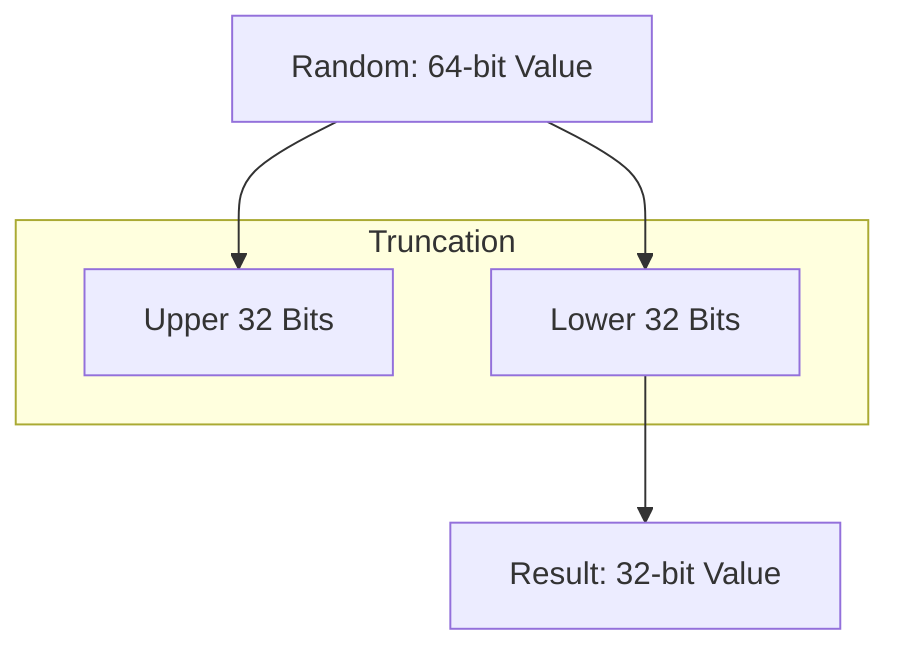

This involves discarding the higher bits and retaining only the lower bits. This method is simple and efficient when the lower bits are sufficient for your needs. Due to the involved data-types both halves have the same size.

```cs
uint Truncate32(IRandomNumberGenerator instance) => (uint)instance.Next();
```

> [!CAUTION]
> If the RNG's output is not uniformly distributed across all bits, this can exacerbate non-uniformities, especially if the lower bits are less random.

#### Shifting

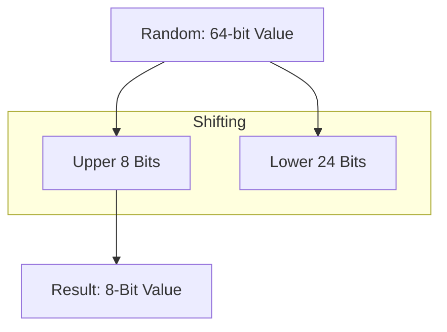

This involves discarding the lower bits by right-shifting the RNG output, effectively keeping only the higher bits. Arbitrary shift values are possible making the number of output bits very flexible.

```cs
byte Shift8(IRandomNumberGenerator instance) => (byte)(instance.Next() >> 56);
```

> [!CAUTION]
> Similar to truncating, if the RNG has non-uniformity issues in its higher bits, shifting can result in biased outputs.

#### Masking

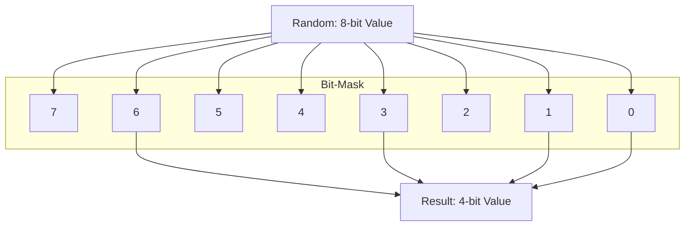

This allows you to take specific bits from the RNG output by applying a bitmask. This method is useful when you need a certain range of bits from the output. Depending on the implementation it might be possible to extract non-contiguous bits and combine them together into the final output.

```cs
ushort Mask16(IRandomNumberGenerator instance) => (ushort)((instance.Next() & 0x000000FFFF000000) >> 24);
```

> [!CAUTION]
> Masking can also suffer from the same non-uniformity issues as truncating and shifting if the RNG is biased in the selected bit range.

#### Sponging

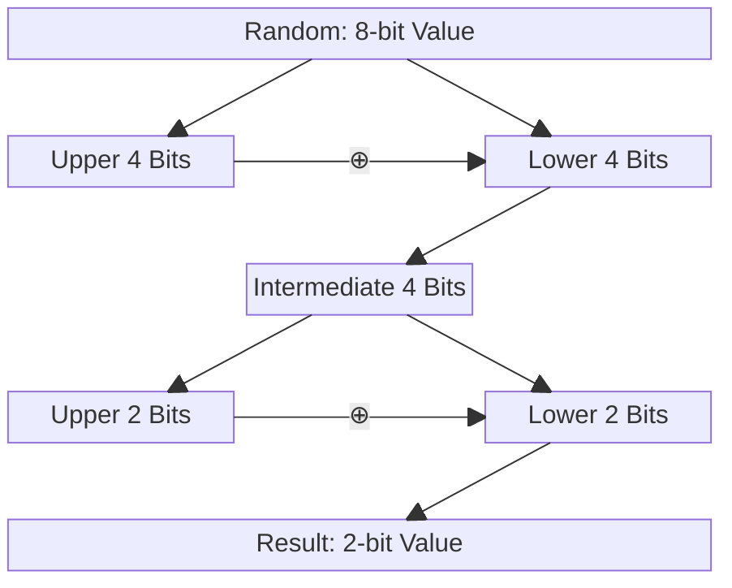

This technique involves repeatedly XORing the RNG output with itself after progressively smaller right shifts. This ensures that the final extracted bit(s) are influenced by all bits in the RNG output, increasing entropy and security. Due to the construction of the sponge the output bit count is a power of 2.

```cs
bool Sponge1(IRandomNumberGenerator instance) {
  ulong result = instance.Next();
  result ^= result >> 32; // HHHHHHHHHHHHHHHHHHHHHHHHHHHHHHHHLLLLLLLLLLLLLLLLLLLLLLLLLLLLLLLL -> XXXXXXXXXXXXXXXXXXXXXXXXXXXXXXXX
  result ^= result >> 16; // 00000000000000000000000000000000HHHHHHHHHHHHHHHHLLLLLLLLLLLLLLLL -> XXXXXXXXXXXXXXXX
  result ^= result >> 8;  // 000000000000000000000000000000000000000000000000HHHHHHHHLLLLLLLL -> XXXXXXXX
  result ^= result >> 4;  // 00000000000000000000000000000000000000000000000000000000HHHHLLLL -> XXXX
  result ^= result >> 2;  // 000000000000000000000000000000000000000000000000000000000000HHLL -> XX
  result ^= result >> 1;  // 00000000000000000000000000000000000000000000000000000000000000HL -> X
  return (result & 1) != 0;
}
```

> [!TIP]
> This method helps distribute any biases uniformly across all bits, making it more resilient to non-uniformity issues.

#### Construction

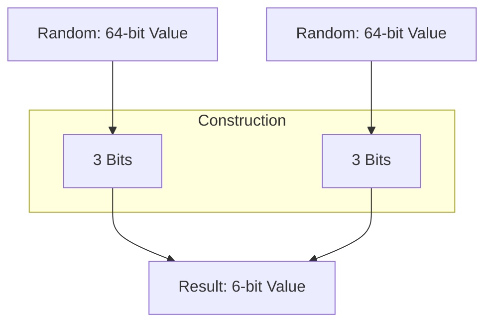

In this method, you repeatedly call the RNG to generate the exact number of bits you need. This approach can be useful when you need a non-standard number of bits (e.g., 24 bits) and want to ensure each bit is generated with uniform randomness.

```cs
byte Construct6(IRandomNumberGenerator instance) {
  int result = 0;
  for (int i = 0; i < 2 ; ++i) {
    int s = instance.Next();
    int x = (s & (1 << 62)) >> 62; // Take bit 62
    int y = (s & (1 <<  7)) >>  7; // Take bit 7
    int z = (s & (1 << 31)) >> 31; // Take bit 31
    result = x | y << 1 | z << 2 | result << 3;
  }

  return result;
}
```

> [!CAUTION]
> If the RNG is biased for certain bits, this approach can accumulate those biases across multiple calls, leading to a non-uniform final output.

#### Slicing

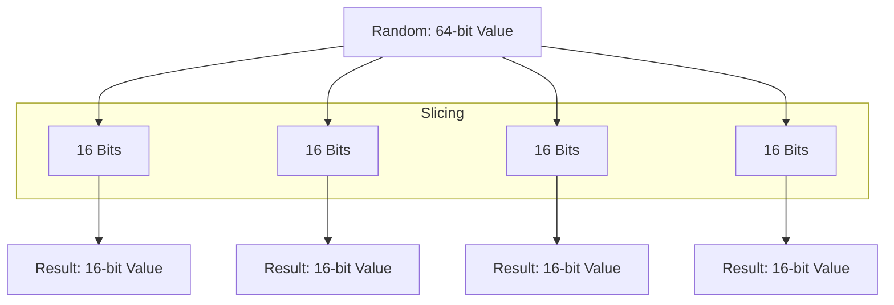

This involves splitting the RNG output into smaller parts and using those parts as needed. This can be useful when you need multiple smaller random values from a single RNG output.

```cs
(ushort, ushort, ushort, ushort) Slice16x4(IRandomNumberGenerator instance) {
  ulong result = instance.Next();
  ushort part1 = (ushort)(result & 0xFFFF);
  ushort part2 = (ushort)((result >> 16) & 0xFFFF);
  ushort part3 = (ushort)((result >> 32) & 0xFFFF);
  ushort part4 = (ushort)((result >> 48) & 0xFFFF);
  return (part1, part2, part3, part4);
}
```

> [!CAUTION]
> If the RNG has non-uniform distribution across different bit ranges, slicing can result in biased sub-values.

#### Modulo Operation

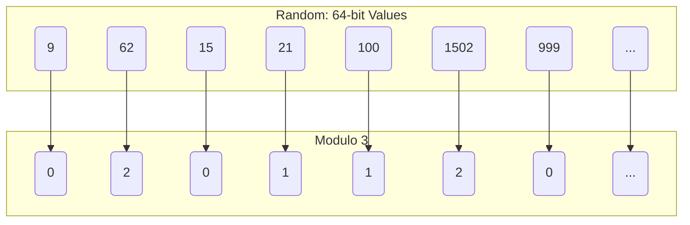

This operation is commonly used to reduce a large random number to a smaller range. For example, reducing a 64-bit RNG output to a value between 0 and 19.

```cs
byte NextD20(IRandomNumberGenerator instance) => (byte)(1 + instance.Next() % 20);
```

> [!CAUTION]
> [Modulo Bias](https://research.kudelskisecurity.com/2020/07/28/the-definitive-guide-to-modulo-bias-and-how-to-avoid-it/) occurs when the RNG output is not perfectly divisible by the target range. This bias can make certain values more likely than others.

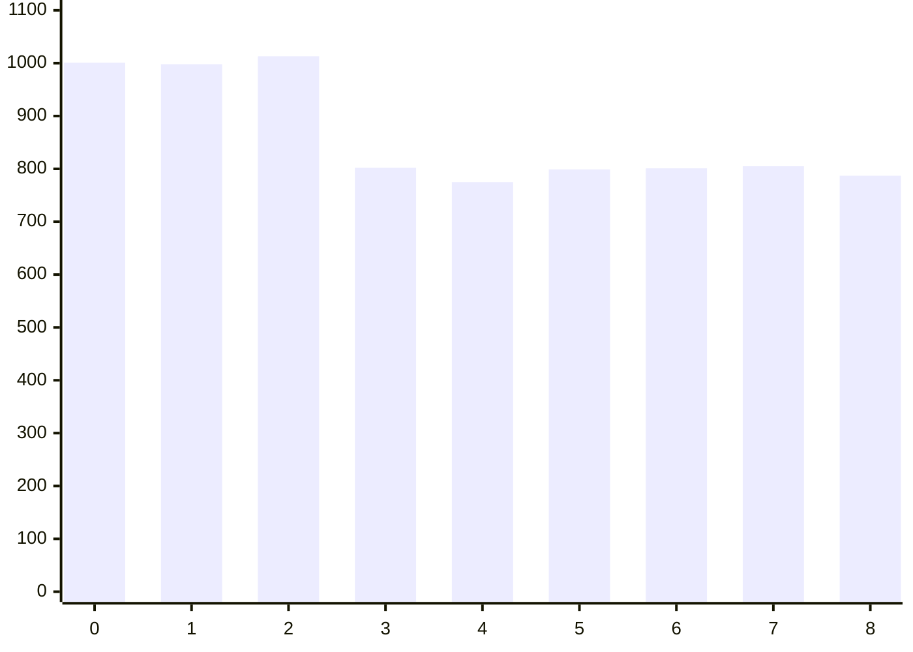

#### Rejection Sampling

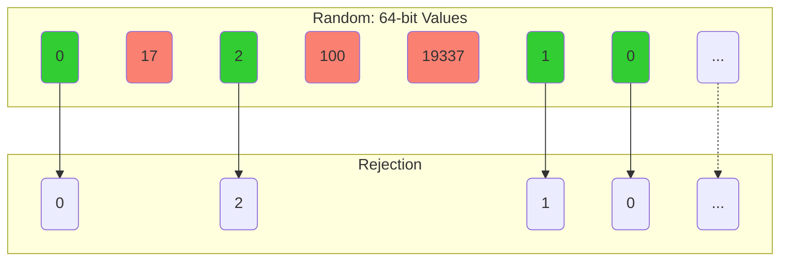

This is a technique to avoid modulo bias by discarding values that would introduce bias. This method involves generating random numbers until one falls within the desired range without bias.

```cs
byte NextD6(IRandomNumberGenerator instance) {
  ulong result;
  do {
    result = instance.Next();
  } while (result >= 6);
  return (byte)(1 + result);
}
```

> [!CAUTION]
> While this method eliminates modulo bias, it can be slow and inefficient, especially if the range is small compared to the RNG output, leading to frequent rejections.

#### Modulo-Rejection Combination

A combination of both [modulo operation](#modulo-operation) and [rejection sampling](#rejection-sampling) can be used to strike a balance between efficiency and eliminating bias.

```cs
byte NextD12(IRandomNumberGenerator instance) {
  ulong result;
  ulong maxValidRange = ulong.MaxValue - (ulong.MaxValue % 12);
  do {
    result = instance.Next();
  } while (result >= maxValidRange);
  return (byte)(1 + (result % 12));
}
```

> [!TIP]
> This method effectively reduces bias while improving efficiency over pure rejection sampling, especially when working with large RNG outputs.

#### Scaling

This method involves normalizing the RNG's output to a floating-point value between $[0.0, 1.0]$, then scaling it to the desired range.

```cs
byte NextD4(IRandomNumberGenerator instance) => (byte)(1 + ((double)instance.Next() / ulong.MaxValue) * 4);
```

> [!CAUTION]
> The method relies on floating-point arithmetic, which may introduce inaccuracies due to the finite precision of `double`. However, for typical RNG ranges and moderate scaling factors, this is usually negligible.

#### Reals

This method constructs floating-point numbers between $[0.0, 1.0)$ according to the [IEEE 754 standard](https://en.wikipedia.org/wiki/IEEE_754), focusing on generating the mantissa randomly while keeping the exponent and sign fixed.

```cs
float NextSingle() {
  uint mantissa = (uint)(rng.Next() >> (64 - 23)); // Extract 23 bits for the mantissa
  uint floatBits = (127 << 23) | mantissa;         // 127 is the biased exponent for 2^0 in single-precision
  return BitConverter.Int32BitsToSingle((int)floatBits) - 1.0f;
}

double NextDouble() {
  uint mantissa = rng.Next() >> (64 - 52);         // Extract 52 bits for the mantissa
  uint doubleBits = (1023UL << 52) | mantissa;     // 1023 is the biased exponent for 2^0 in double-precision
  return BitConverter.Int64BitsToDouble((long)doubleBits) - 1.0d;
}
```

> [!CAUTION]
> This approach uses the shifting method to generate the mantissa, which can inherit flaws if the underlying RNG has non-uniformity issues in certain bits. The distribution of the resulting floating-point values might be slightly biased, particularly if the RNG doesn't produce truly uniform random bits across its entire range.

### Arbitrary RNG Part I

Given the methods, we can now create a more generic class to deal with that:

```cs
partial class ArbitraryNumberGenerator(IRandomNumberGenerator rng) : IRandomNumberGenerator {

  public uint Truncate32() => (uint)rng.Next();
  public ushort Truncate16() => (ushort)rng.Next();
  public byte Truncate8() => (byte)rng.Next();
  public bool Truncate1() => (rng.Next() & 1) == 1;

  public ulong Truncate(byte bitCount) {
    ArgumentOutOfRangeException.ThrowIfZero(bitCount);
    ArgumentOutOfRangeException.ThrowIfGreaterThan(bitCount, (byte)63);
    
    return rng.Next() & ((1UL << bitCount) - 1);
  }

  public uint Shift32() => (uint)(rng.Next() >> 32);
  public ushort Shift16() => (ushort)(rng.Next() >> 48);
  public byte Shift8() => (byte)(rng.Next() >> 56);
  public bool Shift1() => (rng.Next() >> 63) == 1;

  public ulong Shift(byte bitCount) {
    ArgumentOutOfRangeException.ThrowIfZero(bitCount);
    ArgumentOutOfRangeException.ThrowIfGreaterThan(bitCount, (byte)63);
    
    return rng.Next() >> (64 - bitCount);
  }


  public uint Mask32(ulong mask) {
    ArgumentOutOfRangeException.ThrowIfZero(mask);
    ArgumentOutOfRangeException.ThrowIfGreaterThan(ulong.PopCount(mask), 32UL, nameof(mask));
    
    return (uint)_ParallelBitExtract(rng.Next(), mask);
  }

  public ushort Mask16(ulong mask) {
    ArgumentOutOfRangeException.ThrowIfZero(mask);
    ArgumentOutOfRangeException.ThrowIfGreaterThan(ulong.PopCount(mask), 16UL, nameof(mask));
    
    return (ushort)_ParallelBitExtract(rng.Next(), mask);
  }

  public byte Mask8(ulong mask) {
    ArgumentOutOfRangeException.ThrowIfZero(mask);
    ArgumentOutOfRangeException.ThrowIfGreaterThan(ulong.PopCount(mask), 8UL, nameof(mask));
    
    return (byte)_ParallelBitExtract(rng.Next(), mask);
  }

  public bool Mask1(ulong mask) {
    ArgumentOutOfRangeException.ThrowIfZero(mask);
    ArgumentOutOfRangeException.ThrowIfGreaterThan(ulong.PopCount(mask), 1UL, nameof(mask));
    
    return _ParallelBitExtract(rng.Next(), mask) != 0;
  }

  public ulong Mask(ulong mask) {
    ArgumentOutOfRangeException.ThrowIfZero(mask);
    ArgumentOutOfRangeException.ThrowIfGreaterThan(ulong.PopCount(mask), 63UL, nameof(mask));
    
    return _ParallelBitExtract(rng.Next(), mask);
  }

  public uint Sponge32() {
    ulong result = rng.Next();
    result ^= result >> 32;
    return (uint)result;
  }

  public ushort Sponge16() {
    ulong result = rng.Next();
    result ^= result >> 32;
    result ^= result >> 16;
    return (ushort)result;
  }

  public byte Sponge8() {
    ulong result = rng.Next();
    result ^= result >> 32;
    result ^= result >> 16;
    result ^= result >> 8;
    return (byte)result;
  }

  public byte Sponge4() {
    ulong result = rng.Next();
    result ^= result >> 32;
    result ^= result >> 16;
    result ^= result >> 8;
    result ^= result >> 4;
    return (byte)(result & 0xF);
  }

  public byte Sponge2() {
    ulong result = rng.Next();
    result ^= result >> 32;
    result ^= result >> 16;
    result ^= result >> 8;
    result ^= result >> 4;
    result ^= result >> 2;
    return (byte)(result & 0x3);
  }

  public bool Sponge1() {
    ulong result = rng.Next();
    result ^= result >> 32; 
    result ^= result >> 16; 
    result ^= result >> 8;  
    result ^= result >> 4;  
    result ^= result >> 2;  
    result ^= result >> 1;  
    return result != 0;
  }

  public ulong Construct(byte bitsTotal, ulong mask) {
    ArgumentOutOfRangeException.ThrowIfZero(bitsTotal);
    ArgumentOutOfRangeException.ThrowIfGreaterThan(bitsTotal, 64);
    ArgumentOutOfRangeException.ThrowIfZero(mask);
    byte bitsPerRound = (byte)BitOperations.PopCount(mask);
    ArgumentOutOfRangeException.ThrowIfNotEqual(bitsTotal % bitsPerRound,0, nameof(mask));
    
    ulong result = 0UL;
    do {
      ulong random = rng.Next();
      ulong roundBits = _ParallelBitExtract(random, mask);
      result <<= bitsPerRound;
      result |= roundBits;
      bitsTotal -= bitsPerRound;
    } while (bitsTotal > 0);

    return result;
  }

  public (uint,uint) Slice32x2() {
    SliceUnion random = new SliceUnion(rng.Next());
    return (
      random.R32_0,
      random.R32_1
    );
  }

  public (ushort, ushort, ushort, ushort) Slice16x4() {
    SliceUnion random = new SliceUnion(rng.Next());
    return (
      random.R16_0,
      random.R16_1,
      random.R16_2,
      random.R16_3
    );
  }

  public (byte, byte, byte, byte, byte, byte, byte, byte) Slice8x8() {
    SliceUnion random = new SliceUnion(rng.Next());
    return (
      random.R8_0,
      random.R8_1,
      random.R8_2,
      random.R8_3,
      random.R8_4,
      random.R8_5,
      random.R8_6,
      random.R8_7
    );
  }

  public ulong Modulo(ulong mod) => rng.Next() % mod;
  
  public ulong RejectionSampling(ulong mod) {
    ulong result;
    do 
      result = rng.Next(); 
    while (result >= mod);

    return result;
  }

  public ulong ModuloRejectionSampling(ulong mod) {
    ulong maxValidRange = ulong.MaxValue - ulong.MaxValue % mod;
    ulong result;
    do 
      result = rng.Next();
    while (result >= maxValidRange);

    return result % mod;
  }

  public double Scale(double scale) => rng.Next() * scale / ulong.MaxValue;

  public float NextSingle() {
    uint mantissa = (uint)(rng.Next() >> (64 - 23));
    uint floatBits = (127 << 23) | mantissa;
    return BitConverter.Int32BitsToSingle((int)floatBits) - 1.0f;
  }

  public double NextDouble() {
    ulong mantissa = rng.Next() >> (64 - 52);
    ulong doubleBits = (1023UL << 52) | mantissa;
    return BitConverter.Int64BitsToDouble((long)doubleBits) - 1.0d;
  }
  
}
```

### When you need more bits than the RNG provides

In some scenarios, the output of an RNG may be too limited in size, and you might need more bits than it provides in a single call. This situation is common in cryptographic applications, simulations, or when working with RNGs that produce relatively small outputs (e.g., 32-bit RNGs) but require larger random values (e.g., 128-bit or 256-bit numbers). Here are a few methods to handle such situations:

#### Concatenation

This method involves generating multiple smaller random numbers from the RNG and then concatenating them to form a larger random number.

```cs
UInt128 Concat128() => (UInt128)rng.Next() << 64 | rng.Next();
```

> [!CAUTION]
> Ensure that each call to the RNG is independent and that the RNG's internal state changes adequately between calls. If the RNG has any weaknesses or patterns in its output, concatenation can amplify these flaws.

#### SpreadBits

This is a technique where the bits of a small RNG output are "spread" or "stretched" over a larger bit space. This is typically done using bitwise operations that distribute the original bits across the desired output size.

```cs
UInt128 SpreadBits128(UInt128 mask) {
  int bitCount = 
    BitOperations.PopCount((ulong)mask) 
    + BitOperations.PopCount((ulong)(mask >> 64))
    ;

  ulong random = rng.Next();
  UInt128 result = UInt128.Zero;
  for (int i = 0; i < bitCount; ++i) {
    UInt128 bit = random & 1;
    random >>= 1;

    int upperZero= BitOperations.TrailingZeroCount((ulong)(mask >> 64));
    int nextPosition = BitOperations.TrailingZeroCount((ulong)mask);
    if (nextPosition == 64)
      nextPosition += upperZero;

    result |= bit << nextPosition;
    mask &= ~(UInt128.One << nextPosition);
  }
  
  return result;
}
```

> [!CAUTION]
> This leaves a lot of bits at zero so maintaining randomness is not guaranteed.

#### SplitMix

This method is used to expand a smaller RNG output into a larger one by applying a mixing function that scrambles the bits and produces additional randomness.

```cs
Vector256<ulong> SplitMix256() {
  ulong random = rng.Next();
  return Vector256.Create(
    random, 
    SplitMix64.Next(ref random), 
    SplitMix64.Next(ref random), 
    SplitMix64.Next(ref random)
  );
}
```

> [!CAUTION]
> The quality of the output heavily depends on the mixing function used. A poor choice can lead to weak or biased random values. However, when done correctly, SplitMix can produce high-quality random numbers.

#### Feistel-Network

The [Feistel network](https://en.wikipedia.org/wiki/Feistel_cipher) technique enhances the randomness of bits generated by a basic RNG by applying a structure commonly used in cryptographic algorithms like [DES (Data Encryption Standard)](https://en.wikipedia.org/wiki/Data_Encryption_Standard). A Feistel network splits the data into two halves, applies a round function with a key, and then swaps the halves, repeating this process to achieve strong diffusion. This makes it an excellent method to improve the distribution and randomness of the output bits, ensuring they are more secure and less predictable.

```cs
IEnumerable<byte> FeistelGenerator() {
  ulong state = rng.Next();
  ulong key = rng.Next();
  ulong counter = rng.Next();

  int counterIndex = 0;
  for (;;) {
    int roundBits = (int)(counter >> counterIndex) & 0b1111;
    counterIndex += 4;
    if (counterIndex >= 64) {
      (counter, state) = (state, counter);
      counterIndex = 0;
    }

    ++roundBits; // at least one round each time
    for (int i = 0; i < roundBits; ++i) {
      DoFeistelRound(ref state, key);
      DoFeistelRound(ref state, key);
      (state, key) = (key, state);
    }

    SliceUnion result = new SliceUnion(state);
    yield return result.R8_0;
    yield return result.R8_1;
    yield return result.R8_2;
    yield return result.R8_3;
    yield return result.R8_4;
    yield return result.R8_5;
    yield return result.R8_6;
    yield return result.R8_7;
  }
  
  void DoFeistelRound(ref ulong plainText, ulong roundKey) {
    uint left = (uint)plainText;
    uint right = (uint)(plainText>>32);
    left ^= RoundFunction(right, roundKey);
    (left, right) = (right, left);
    plainText = left | (ulong)right << 32;
  }

  uint RoundFunction(uint right,ulong roundKey) {
    uint result=BitOperations.RotateLeft(right, 3);
    result ^= (uint)roundKey;
    result = BitOperations.RotateRight(result, 17);
    result ^= (uint)(roundKey >> 32);
    return result;
  }
}
```

> [!CAUTION]
> The randomness quality of the output still heavily depends on the initial entropy provided by the RNG and the round function. If the RNG is weak or biased, the Feistel network alone may not sufficiently mitigate these issues.

#### Hash-Function

This technique uses a [cryptographic hash function](https://en.wikipedia.org/wiki/Cryptographic_hash_function) to enhance and expand the randomness provided by an RNG. By seeding the hash function with an initial RNG output and then iteratively rehashing the result with a counter, you can generate a stream of random bits with strong diffusion properties. This method leverages the [avalanche effect](https://en.wikipedia.org/wiki/Avalanche_effect) of hash functions, where a small change in input (like the counter) drastically changes the output, making it a powerful tool for random number generation.

```cs
IEnumerable<byte> HashGenerator() {
  HashAlgorithm instance = SHA512.Create();
  int entropyBitsNeeded = instance.HashSize;
  int entropyBytesNeeded = entropyBitsNeeded >> 3;
  
  // Generate the initial salt using RNG
  byte[] salt = this.ConcatGenerator().Take(entropyBytesNeeded).ToArray();
  
  // Initialize the counter
  byte[] counter = new byte[entropyBytesNeeded];

  for (;;) {
    
    // Combine the salt and counter using XOR
    byte[] plainData = salt.Zip(counter, (s, c) => (byte)(s ^ c)).ToArray();
    
    // Generate the hash
    byte[] hash = instance.ComputeHash(plainData);
    
    // Yield each byte of the hash as part of the random stream
    foreach (byte entry in hash)
      yield return entry;

    // Increment the counter
    for (int i = 0; i < counter.Length; ++i)
      if (++counter[i] != 0)
        break;
  }
}
```

> [!CAUTION]
> The initial seed from the RNG is critical to the quality of the randomness produced. If the RNG has low entropy or is biased, the resulting hash stream might not be as random as expected. Always ensure that the underlying RNG is secure and provides sufficient entropy.

#### Cipher

This method leverages a block cipher in Counter (CTR) mode to generate a stream of random bytes. CTR mode is a popular choice for such applications because it turns a block cipher into a stream cipher, allowing it to generate a continuous stream of pseudorandom bits, which can be used as random numbers. Other mode may also be possible depending on the concrete cipher used.

```cs
IEnumerable<byte> CipherGenerator() {
  using SymmetricAlgorithm instance = Aes.Create();
  instance.Mode = CipherMode.ECB; // CTR mode is simulated with ECB
  instance.Padding = PaddingMode.None;

  // Generate a random key and initialization vector (IV)
  byte[] key = this.ConcatGenerator().Take(instance.KeySize >> 3).ToArray();

  int blockSizeInBytes = instance.BlockSize >> 3;
  byte[] iv = this.ConcatGenerator().Take(blockSizeInBytes).ToArray();
  
  instance.Key = key;
  instance.IV = iv;

  // Initialize the counter
  byte[] counter = new byte[blockSizeInBytes];

  byte[] cipherText = new byte[blockSizeInBytes];
  using ICryptoTransform encryptor = instance.CreateEncryptor();
  for (;;) {
    
    // Encrypt the counter block
    encryptor.TransformBlock(counter, 0, blockSizeInBytes, cipherText, 0);

    // Yield each byte from the encrypted block as random output
    foreach (byte value in cipherText)
      yield return value;

    // Increment the counter
    for (int i = 0; i < counter.Length; ++i)
      if (++counter[i] != 0)
        break;
  }
}
```

> [!CAUTION]
> Ensure that the key and IV generated by the RNG are of high entropy and secure. A weak key or IV can compromise the security of the entire system. While this method is robust and secure, the overhead of encryption may make it slower than simpler RNG methods.

### Arbitrary RNG Part II

Given those new tricks, we can now enhance our more generic class to provide that:

```cs
partial class ArbitraryNumberGenerator {
  
  public UInt128 Concat128() => (UInt128)rng.Next() << 64 | rng.Next();
  
  public Vector256<ulong> Concat256() => Vector256.Create(
    rng.Next(), rng.Next(), rng.Next(), rng.Next()
  );
  
  public Vector512<ulong> Concat512() => Vector512.Create(
    rng.Next(), rng.Next(), rng.Next(), rng.Next(),
    rng.Next(), rng.Next(), rng.Next(), rng.Next()
  );

  public IEnumerable<byte> ConcatGenerator() {
    for (;;) {
      SliceUnion random = new SliceUnion(rng.Next());
      yield return random.R8_0;
      yield return random.R8_1;
      yield return random.R8_2;
      yield return random.R8_3;
      yield return random.R8_4;
      yield return random.R8_5;
      yield return random.R8_6;
      yield return random.R8_7;
    }
  }

  public unsafe byte[] ConcatGenerator(int count) {
    ArgumentOutOfRangeException.ThrowIfNegativeOrZero(count);

    byte[] result = new byte[count];

    fixed (byte* pointer = &result[0]) {
      byte* index = pointer;
      ulong random = rng.Next();

      // full rounds
      while (count >= 8) {
        *(ulong*)index = random;
        random = rng.Next();
        index += 8;
        count -= 8;
      }

      // remaining bytes
      switch (count) {
        case 0: break;
        case 1:
          *index = (byte)random;
          break;
        case 2:
          *(ushort*)index = (ushort)random;
          break;
        case 3:
          *(ushort*)index = (ushort)random;
          index[2] = (byte)(random >> 16);
          break;
        case 4:
          *(uint*)index = (uint)random;
          break;
        case 5:
          *(uint*)index = (uint)random;
          index[4] = (byte)(random >> 32);
          break;
        case 6:
          *(uint*)index = (uint)random;
          ((ushort*)index)[2] = (ushort)(random >> 32);
          break;
        case 7:
          *(uint*)index = (uint)random;
          ((ushort*)index)[2] = (ushort)(random >> 32);
          index[6] = (byte)(random >> 48);
          break;
      }
    }

    return result;
  }

  public UInt128 SplitMix128() {
    ulong random = rng.Next();
    return (UInt128)random << 64 | SplitMix64.Next(ref random);
  }

  public Vector256<ulong> SplitMix256() {
    ulong random = rng.Next();
    return Vector256.Create(random, SplitMix64.Next(ref random), SplitMix64.Next(ref random), SplitMix64.Next(ref random));
  }

  public Vector512<ulong> SplitMix512() {
    ulong random = rng.Next();
    return Vector512.Create(
      random, SplitMix64.Next(ref random), SplitMix64.Next(ref random), SplitMix64.Next(ref random),
      SplitMix64.Next(ref random), SplitMix64.Next(ref random), SplitMix64.Next(ref random), SplitMix64.Next(ref random)
    );
  }

  public UInt128 SpreadBits128(UInt128 mask) {
    ArgumentOutOfRangeException.ThrowIfZero(mask);
    byte bitCount = _PopCount(mask);
    ArgumentOutOfRangeException.ThrowIfGreaterThan(bitCount, 64);

    ulong random = rng.Next();
    UIn128 result = UInt128.Zero;
    for (int i = 0; i < bitCount; ++i) {
      UInt128 bit = random & 1;
      random >>= 1;

      int upperZero= BitOperations.TrailingZeroCount((ulong)(mask >> 64));
      int nextPosition = BitOperations.TrailingZeroCount((ulong)mask);
      if (nextPosition == 64)
        nextPosition += upperZero;

      result |= bit << nextPosition;
      mask &= ~(UInt128.One << nextPosition);
    }
    
    return result;
  }

  public Vector256<ulong> SpreadBits256(Vector256<ulong> mask) {
    ushort bitCount = _PopCount(mask);
    ArgumentOutOfRangeException.ThrowIfZero(bitCount, nameof(mask));
    ArgumentOutOfRangeException.ThrowIfGreaterThan(bitCount, 64);

    ulong random = rng.Next();
    Vector256<ulong> result = Vector256<ulong>.Zero;
    for (int i = 0; i < bitCount; ++i) {
      ulong bit = random & 1;
      random >>= 1;

      ulong value0 = mask.GetElement(0);
      ulong value1 = mask.GetElement(1);
      ulong value2 = mask.GetElement(2);
      ulong value3 = mask.GetElement(3);

      int zeroes0 = BitOperations.TrailingZeroCount(value0);
      int zeroes1 = BitOperations.TrailingZeroCount(value1);
      int zeroes2 = BitOperations.TrailingZeroCount(value2);
      int zeroes3 = BitOperations.TrailingZeroCount(value3);

      int nextPosition = zeroes0;
      if (zeroes0 == 64) {
        nextPosition += zeroes1;
        if (zeroes1 == 64) {
          nextPosition += zeroes2;
          if (zeroes2 == 64)
            nextPosition += zeroes3;
        }
      }

      int elementIndex = nextPosition >> 6;
      int intraElementIndex = nextPosition & 63;
      ulong element = result.GetElement(elementIndex);
      element |= bit << intraElementIndex;
      result = result.WithElement(elementIndex, element);

      mask = mask.WithElement(elementIndex, mask.GetElement(elementIndex) & ~(1UL << intraElementIndex));
    }

    return result;
  }

  public Vector512<ulong> SpreadBits512(Vector512<ulong> mask) {
    ushort bitCount = _PopCount(mask);
    ArgumentOutOfRangeException.ThrowIfZero(bitCount, nameof(mask));
    ArgumentOutOfRangeException.ThrowIfGreaterThan(bitCount, 64);

    ulong random = rng.Next();
    Vector512<ulong> result = Vector512<ulong>.Zero;
    for (int i = 0; i < bitCount; ++i) {
      ulong bit = random & 1;
      random >>= 1;

      int nextPosition = 0;
      for (int j = 0; j < 8; ++j) {
        int currentZeroes = BitOperations.TrailingZeroCount(mask.GetElement(j));
        nextPosition += currentZeroes;
        if (currentZeroes != 64)
          break;
      }

      int elementIndex = nextPosition >> 6;
      int intraElementIndex = nextPosition & 63;
      ulong element = result.GetElement(elementIndex);
      element |= bit << intraElementIndex;
      result = result.WithElement(elementIndex, element);

      mask = mask.WithElement(elementIndex, mask.GetElement(elementIndex) & ~(1UL << intraElementIndex));
    }

    return result;
  }

  public IEnumerable<byte> FeistelGenerator() {
    ulong state = rng.Next();
    ulong key = rng.Next();
    ulong counter = rng.Next();

    int counterIndex = 0;
    for (;;) {
      int roundBits = (int)(counter >> counterIndex) & 0b1111;
      counterIndex += 4;
      if (counterIndex >= 64) {
        (counter, state) = (state, counter);
        counterIndex = 0;
      }

      ++roundBits;
      for (int i = 0; i < roundBits; ++i) {
        DoFeistelRound(ref state, key);
        DoFeistelRound(ref state, key);
        (state, key) = (key, state);
      }

      SliceUnion result = new SliceUnion(state);
      yield return result.R8_0;
      yield return result.R8_1;
      yield return result.R8_2;
      yield return result.R8_3;
      yield return result.R8_4;
      yield return result.R8_5;
      yield return result.R8_6;
      yield return result.R8_7;
    }
    
    void DoFeistelRound(ref ulong plainText, ulong roundKey) {
      uint left = (uint)plainText;
      uint right = (uint)(plainText>>32);
      left ^= RoundFunction(right, roundKey);
      (left, right) = (right, left);
      plainText = left | (ulong)right << 32;
    }

    uint RoundFunction(uint right,ulong roundKey) {
      uint result=BitOperations.RotateLeft(right, 3);
      result ^= (uint)roundKey;
      result = BitOperations.RotateRight(result, 17);
      result ^= (uint)(roundKey >> 32);
      return result;
    }
  }

  public IEnumerable<byte> HashGenerator<THash>() where THash : HashAlgorithm, new() {
    using THash instance=new THash();
      return this.HashGenerator(instance);
  }

  public IEnumerable<byte> HashGenerator(HashAlgorithm instance) {
    ArgumentNullException.ThrowIfNull(instance);

    int entropyBitsNeeded = instance.HashSize;
    int entropyBytesNeeded = entropyBitsNeeded >> 3;
    
    // Generate the initial salt using RNG
    byte[] salt = this.ConcatGenerator(entropyBytesNeeded);
    
    // Initialize the counter
    byte[] counter = new byte[entropyBytesNeeded];

    for (;;) {

      // Combine the salt and counter using XOR
      byte[] plainData = salt.Zip(counter, (s, c) => (byte)(s ^ c)).ToArray();

      // Generate the hash
      byte[] hash = instance.ComputeHash(plainData);
      
      // Yield each byte of the hash as part of the random stream
      foreach (byte entry in hash)
        yield return entry;

      _Increment(counter);
    }
  }

  public IEnumerable<byte> CipherGenerator<TCipher>() where TCipher : SymmetricAlgorithm, new() {
    using TCipher instance = new TCipher();
    return this.CipherGenerator(instance);
  }

  public IEnumerable<byte> CipherGenerator(SymmetricAlgorithm instance) {
    instance.Mode = CipherMode.ECB; // CTR mode is simulated with ECB
    instance.Padding = PaddingMode.None;

    // Generate a random key and initialization vector (IV)
    byte[] key = this.ConcatGenerator(instance.KeySize >> 3);

    int blockSizeInBytes = instance.BlockSize >> 3;
    byte[] iv = this.ConcatGenerator(blockSizeInBytes);
    
    instance.Key = key;
    instance.IV = iv;

    // Initialize the counter
    byte[] counter = new byte[blockSizeInBytes];

    byte[] cipherText = new byte[blockSizeInBytes];
    using ICryptoTransform encryptor = instance.CreateEncryptor();
    for (;;) {
      
      // Encrypt the counter block
      encryptor.TransformBlock(counter, 0, blockSizeInBytes, cipherText, 0);

      // Yield each byte from the encrypted block as random output
      foreach (byte value in cipherText)
        yield return value;

      // Increment the counter
      _Increment(counter);
    }
  }

}
```

## NURNG-Algorithms

For the upcoming algorithms we'll utilize a different interface than above to generate floating-point 64-bit values with specific distribution properties:

```c#
interface IDoubleRandomNumberGenerator {

  double Next() {
    var (result, _) = this.NextPair();
    return result;
  }

  (double, double) NextPair() => (this.Next(), this.Next());

}
```

### Inverse Transform Sampling (ITS) [^40]

[^40]: [ITS](https://brilliant.org/wiki/inverse-transform-sampling/)

Here’s how it works:

1. **Generate a Uniform Random Number**:
   Start by generating a random number, $U$, uniformly distributed between 0 and 1 using a simple RNG. This $U$ will be the foundation of your transformation.

2. **Compute the Inverse CDF**:
   The next step is to compute the inverse of the cumulative distribution function (CDF) of your target distribution. The CDF, denoted as $f(x)$, represents the probability that a random variable $X$ takes a value less than or equal to $x$. The inverse CDF, $f^{-1}(u)$, will give you the value $x$ such that the probability of $X$ being less than or equal to $x$ is exactly $u$. Mathematically, this can be written as:

   $$X = f^{-1}(U)$$

   Here, $x$ is the random sample drawn from the desired distribution.

3. **Output the Result**:
   The value $x$ obtained from the inverse CDF is your random sample that follows the target probability distribution.

Let’s consider an example where you need to sample from an exponential distribution, which is commonly used in survival analysis, queueing theory, and many other fields. The exponential distribution with rate $\lambda$ has the CDF:

$$u = f(x) = 1 - e^{-\lambda x}$$

To apply inverse transform sampling, you first solve for $x$ in terms of $u$:

$$x = -\frac{\ln(1 - u)}{\lambda}$$

This equation allows you to convert a uniform random number $u$ into a sample $x$ from the exponential distribution.

```cs
double Exponential(double lambda, IRandomNumberGenerator rng) {
  double u = rng.NextDouble();
  return -Math.Log(1 - u) / lambda;
}
```

### Box-Muller Method (BM) [^41]

[^41]: [BM](https://www.researchgate.net/publication/264324131_Box-Muller_transformation)

This is another popular algorithm used to generate pairs of independent, normally distributed random variables (also known as Gaussian variables) from uniformly distributed random numbers. The method is named after George E. P. Box and Mervin E. Muller, who introduced it in 1958. It is straightforward to implement and produces two normally distributed values per iteration, making it efficient for simulations and other applications requiring Gaussian distributions.

The BM operates in two main steps:

* **Generate Two Uniform Random Numbers**: The method begins by generating two independent random numbers, $x$ and $y$, from a uniform distribution over the interval $(0, 1]$.

* **Transform to Gaussian Distribution**: The uniform random numbers are then transformed into a pair of independent, normally distributed random variables $z_0$ and $z_1$ using the following formulas:

  $$r = \sqrt{-2 \ln(x)}$$

  $$\theta = 2 \pi y$$

  $$z_0 = r \cdot \cos(\theta)$$

  $$z_1 = r \cdot \sin(\theta)$$

  These transformations are derived from the properties of the normal distribution and trigonometric identities.

```cs
(double, double) Next() {
  double x = 2 * generator.NextDouble() - 1;
  double y = 2 * generator.NextDouble() - 1;
 
  double r = Math.Sqrt(-2.0 * Math.Log(x));
  double theta = 2.0 * Math.PI * y;

  double z0 = r * Math.Cos(theta);
  double z1 = r * Math.Sin(theta);

  return (z0, z1);
}
```

### Marsaglia Polar Method (MP) [^42]

[^42]: [MP](https://www.jstor.org/stable/2027592)

This is a widely used algorithm for generating pairs of Gaussian variables from a uniform RNG. This method is particularly efficient because it generates two normally distributed values simultaneously, making it faster than some other methods like the [BM](#box-muller-method-bm) transform.

The MP relies on the fact that a pair of independent, uniformly distributed variables can be transformed into a pair of independent, normally distributed variables. The method involves the following steps:

* **Generate Two Uniform Random Numbers**: Two random variables $x$ and $y$ are drawn from a uniform distribution between $-1$ and $+1$. These are mapped from an underlying uniform RNG that typically provides values in the range $[0, 1)$.

* **Calculate their Sum of Squares**: The sum of squares $s = x^2 + y^2$ is computed. This value represents the squared distance of the point $(x, y)$ from the origin in a 2D plane.

* **Accept or Reject the Pair**: If $s$ is outside the interval $(0, 1)$, the pair is rejected, and the process repeats. This ensures the points lie within the unit circle, which is essential for the next step to correctly produce normally distributed outputs.

* **Transform to Gaussian Distribution**: Once a valid pair is found (i.e., when $s$ is within the unit circle), the method uses the formula:

   $$\text{multiplier} = \sqrt{\frac{-2 \cdot \ln(s)}{s}}$$

  to transform the uniform random variables $x$ and $y$ into independent, normally distributed random variables.

* **Return Two Normally Distributed Variables**: The transformed values $x \times \text{multiplier}$ and $y \times \text{multiplier}$ are the resulting Gaussian variables.

```cs
(double, double) Next() {
  while (true) {
    double x = 2 * generator.NextDouble() - 1;
    double y = 2 * generator.NextDouble() - 1;
    double s = x * x + y * y;

    if (s is <= 0 or >= 1)
      continue;

    double multiplier = Math.Sqrt(-2 * Math.Log(s) / s);
    return (x * multiplier, y * multiplier);
  }
}
```

### Ziggurat (ZIG) [^43]

[^43]: [ZIG](https://www.jstatsoft.org/article/view/v005i08)

This is an efficient algorithm for generating random numbers from a variety of probability distributions, most notably the normal (Gaussian) distribution. It is particularly well-suited for high-performance applications where speed is critical, such as simulations and cryptographic systems.

The ZIG generates random numbers by partitioning the target distribution into multiple layers, resembling a ziggurat (a terraced structure from ancient Mesopotamia). Each layer is either a rectangle or a tail region, and the method efficiently samples from these regions. The key steps in the Ziggurat Method are:

* **Precompute Layers**: The distribution is divided into a series of layers, each represented by a rectangle. These layers cover the bulk of the distribution, with the top layer accounting for the distribution's tails.

* **Uniform Sampling**: A random rectangle is selected uniformly from the precomputed layers. Within this rectangle, a random point is chosen uniformly.

* **Acceptance or Rejection**: If the point falls within the desired distribution, it is accepted as a valid sample. If not, the algorithm resorts to a fallback method, such as the Box-Muller transform or a direct sampling from the tail region, to generate the sample.

* **Efficiency**: The method is efficient because most samples fall within the rectangles, and the expensive fallback step is needed only for a small fraction of cases.

```cs
class Ziggurat(ArbitraryNumberGenerator generator) {

  private const int NUM_LAYERS = 128;
  private const double R = 3.442619855899;
  private const double V = 9.91256303526217e-3;
  private const double R_INVERSE = 1 / R;

  private static readonly double[] layerWidths = new double[NUM_LAYERS];
  private static readonly double[] layerHeights = new double[NUM_LAYERS];

  static Ziggurat() {

    // Precompute the widths and heights of the layers
    double f = Math.Exp(-0.5 * R * R);
    layerWidths[0] = V / f;
    layerWidths[1] = R;

    double lastLayerWidth = R;
    for (int i = 2; i < NUM_LAYERS; ++i) {
      lastLayerWidth = layerWidths[i] = Math.Sqrt(-2 * Math.Log(V / lastLayerWidth + f));
      f = Math.Exp(-0.5 * lastLayerWidth * lastLayerWidth);
    }

    layerHeights[NUM_LAYERS - 1] = 0;
    for (int i = 0; i < NUM_LAYERS - 1; ++i)
      layerHeights[i] = layerWidths[i + 1] / layerWidths[i];

  }

  public double Next() {
    for (;;) {
      int i = (int)generator.ModuloRejectionSampling(NUM_LAYERS);
      double u = 2 * generator.NextDouble() - 1;

      /* first try the rectangular boxes */
      double layerWidth = layerWidths[i];
      double x = u * layerWidth;
      if (Math.Abs(u) < layerHeights[i])
        return x;

      /* bottom box: sample from the tail */
      if (i == 0)
        return SampleTail(u < 0);

      /* is this a sample from the wedges? */
      double xSqr = x * x;
      double nextLayerWidth = i == NUM_LAYERS - 1 ? 0 : layerWidths[i + 1];

      double f0 = Math.Exp(-0.5 * (layerWidth * layerWidth - xSqr));
      double f1 = Math.Exp(-0.5 * (nextLayerWidth * nextLayerWidth - xSqr));
      if (f1 + generator.NextDouble() * (f0 - f1) < 1.0)
        return x;
    }

    double SampleTail(bool isNegative) {
      for (;;) {
        double x = -Math.Log(generator.NextDouble()) * R_INVERSE;
        double y = -Math.Log(generator.NextDouble());
        if (y + y < x * x)
          continue;

        double result = R + x;
        if (isNegative)
          result = -result;

        return result;
      }
    }
  }

}
```

# Points of Interest

## Comparative Tests

There nearly infinite methods to compare algorithms against each other so I have to decide which I want to include even though the table won't ever be complete.

**Speed:**

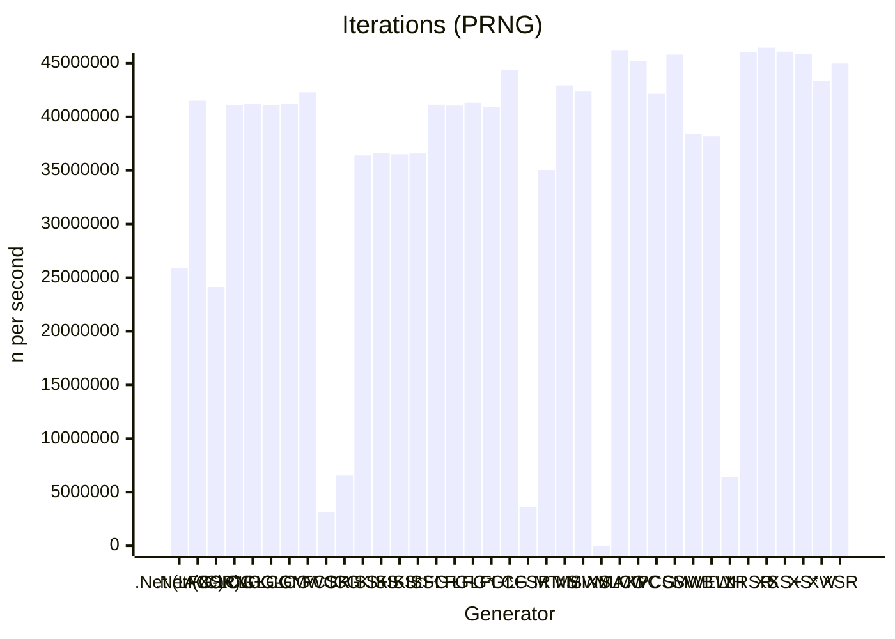

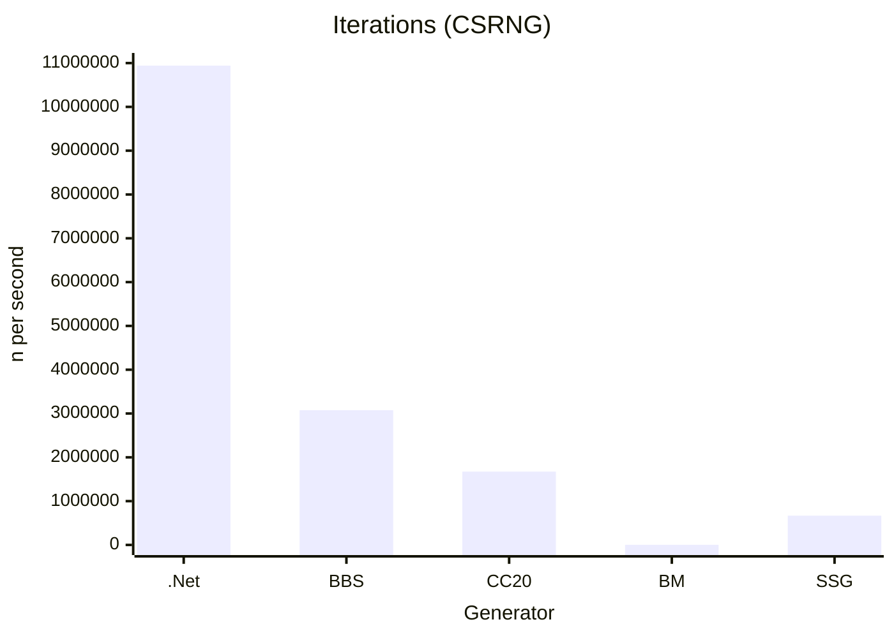

tbd: histogramm of 64 1-bits above line and 64 0-bits below line (64 buckets * 2)
tbd: histogramm of 1-bit counts (64 buckets)
tbd: histogramm of spacing between consecutive values
tbd: repetition test for n iterations
tbd: randogram 8x8x8, 4x256x256

## The NuGet package

The library includes performance-oriented implementations of most of the examples discussed above. The code is designed to be both readable and understandable, with a focus on clarity without compromising on efficiency. It offers parameterized entities and methods, making it easy to customize and extend according to your specific needs.

# Links

* [RNG Engines](https://pracrand.sourceforge.net/RNG_engines.txt)
* [Reversable RNG](http://robotics.ucsd.edu/ReversibleRNG.pdf)
* [FastRNG](https://github.com/SommerEngineering/FastRng)
* [Randomness in .NET](https://blogs.siliconorchid.com/post/coding-inspiration/randomness-in-dotnet/)

# History

* 20240711 - Initial GitHub Version
* 20240624 - Initial Version
