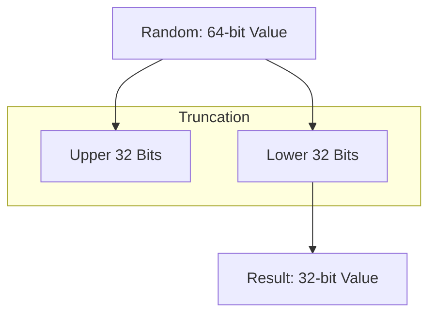
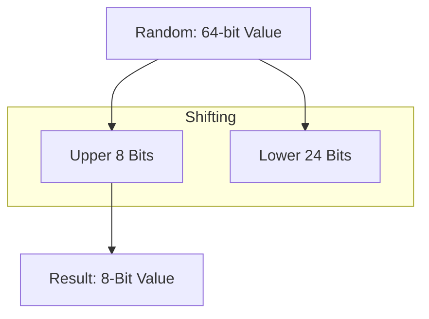
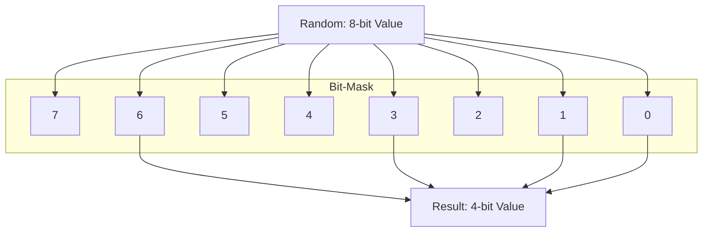
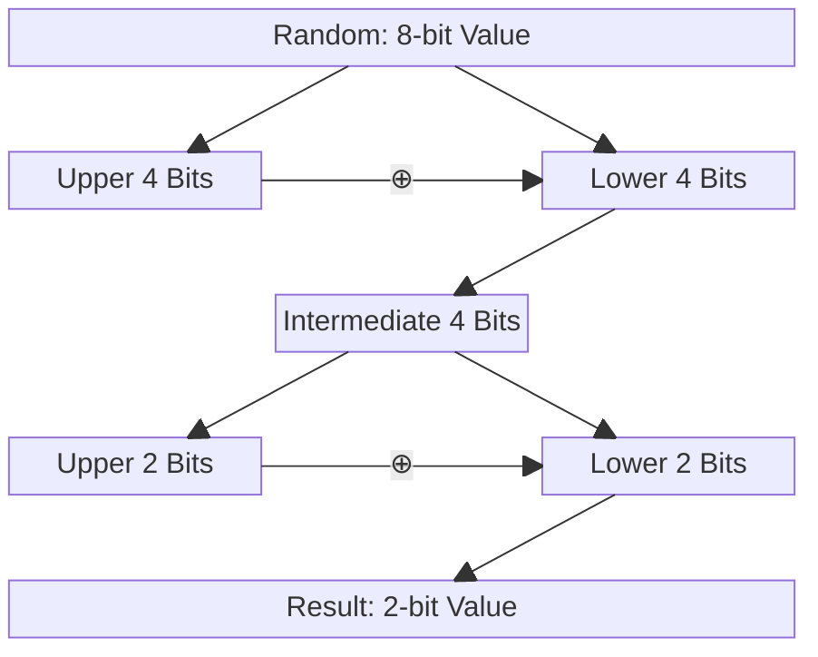
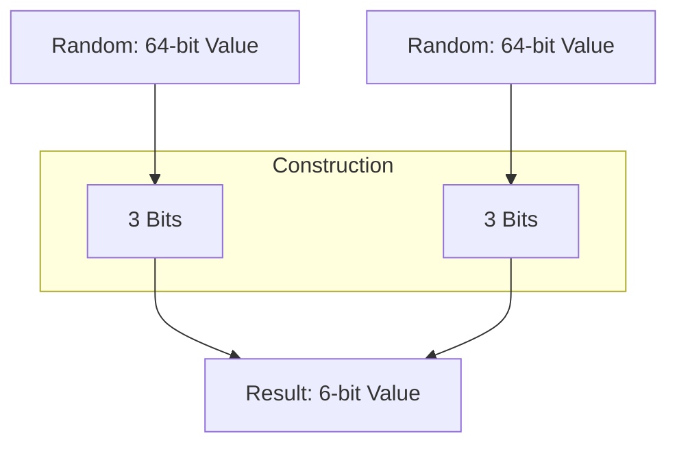
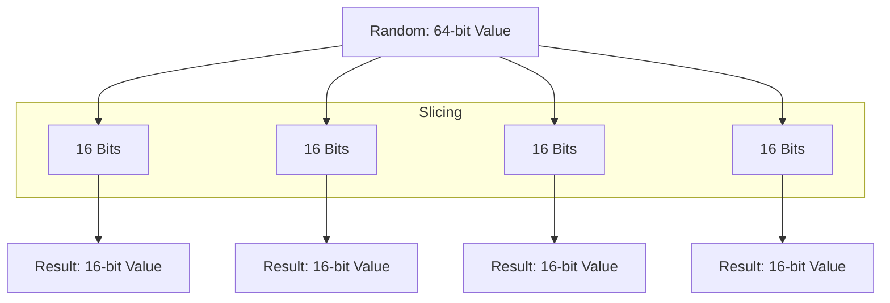
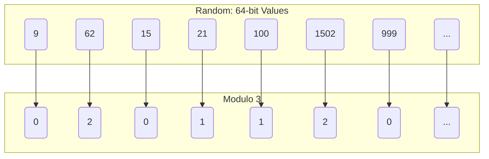
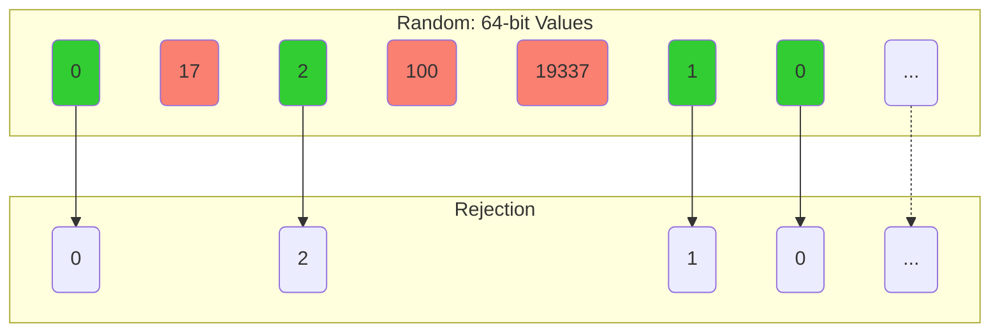

<!-- omit from toc -->
# Demystifying Randomness

A Deep Dive into Random Number Generators and Their Implementations.

# Introduction

In the world of computing, randomness is more than a theoretical concept—it's a cornerstone of numerous applications that drive modern technology. From securing sensitive information to simulating complex systems, random numbers play a pivotal role in ensuring efficiency, security, and fairness.

# Target Audience

This article is not for the faint of heart or those simply looking for quick results. It is intended for readers who are willing to delve deeply into the intricacies of randomness and its implementations. If you are someone who enjoys exploring complex concepts, understanding the underlying principles and questioning how things work beneath the surface, then this article is for you.

Be prepared for an in-depth exploration that reflects the author's current understanding and insights. While every effort has been made to present the information thoroughly and accurately, there is no guarantee that it is complete or error-free. This is a journey into the nuanced world of random number generators, and like all explorations, it is marked by both discovery and recognition of the limits of current knowledge.

# Background

Randomness is crucial in fields such as cryptography, where it underpins the generation of secure encryption keys and cryptographic protocols. Without high-quality randomness, data security could be compromised, making it easier for malicious actors to predict or reproduce secret keys.

In simulations and modeling, randomness enables the accurate representation of real-world phenomena. Techniques like [Monte Carlo simulations](https://en.wikipedia.org/wiki/Monte_Carlo_method) and [Particle filters](https://en.wikipedia.org/wiki/Particle_filter) use random sampling to solve mathematical problems and predict outcomes in finance, engineering, and scientific research. The accuracy of these simulations depends heavily on the quality of the random numbers used.

In gaming, randomness ensures that outcomes are unpredictable and fair, enhancing the gaming experience. Whether it’s the roll of a dice, the shuffle of a deck, or the spawn of in-game items, randomness provides the element of chance that keeps games exciting and engaging.

# Let's dive into it

## What is Randomness?

Randomness refers to the lack of pattern or predictability in events. In the context of computing and mathematics, randomness is the concept of generating sequences of numbers or symbols that cannot be reasonably predicted better than by random chance. This unpredictability is essential to ensure fairness, security, and accurate simulation of real-world phenomena.

## Types of Randomness?

### Non-Deterministic (TRNG)

Non-deterministic randomness, often referred to as "true randomness," is derived from physical processes that are inherently unpredictable. These are generated through various physical phenomena such as:

* **Thermal Noise**: Electronic circuits generate thermal noise, which is the random fluctuation of electrical signals caused by the thermal agitation of electrons. This noise can be captured and digitized to produce random numbers.

* **Radioactive Decay**: The decay of radioactive isotopes is a random process governed by quantum mechanics. Geiger counters can detect these decay events, and the timing between decays can be used to generate random numbers.

* **Photon Emission**: The emission of photons from certain materials can also be used as a source of randomness. Devices that detect single photons can record the intervals between emissions to generate random sequences.

* **Quantum Randomness**: Quantum mechanics provides several phenomena that are inherently random. For example, measurements of quantum states, such as the polarization of photons or spin of electrons, yield results that are unpredictable.

* **Atmospheric Noise**: Variations in atmospheric conditions, such as radio noise from lightning or other natural sources, can be captured and used as a source of true randomness.

#### Challenges in Generating True Randomness

While true random number generators offer high-quality randomness, they also come with certain challenges:

* **Hardware Complexity**: They often require specialized hardware to capture and process physical phenomena.

* **Environmental Sensitivity**: The quality of randomness can be affected by environmental factors such as temperature, humidity, and electromagnetic interference.

* **Speed**: They may not generate random numbers as quickly as deterministic algorithms, making them less suitable for applications requiring high-throughput random numbers.

##### True Randomness in Personal Computers

In personal computers, true randomness can be sourced from several hardware-based mechanisms:

* **Peripheral Devices**: Some peripherals, such as network cards, sound cards, and disk drives, can capture environmental noise and other random events to generate random numbers. Additionally, using keyboard, gamepad, and mouse inputs as an additional entropy source is common.

* **Hardware Random Number Generators (HRNGs)**: Many modern hardware comes with built-in HRNGs that utilize physical phenomena to generate random numbers.

  * **CPU-Support**

    * **Intel RDRAND**: Intel processors with the Ivy Bridge architecture and later include the [`RDRAND`](https://www.intel.com/content/www/us/en/developer/articles/guide/intel-digital-random-number-generator-drng-software-implementation-guide.html) instruction, which provides random numbers generated by an onboard hardware RNG. This RNG uses thermal noise as its entropy source.

      Here’s an example in [C](https://en.wikipedia.org/wiki/C_(programming_language)), for using the RDRAND instruction to generate a 64-Bit number:

      ```c
      #include <immintrin.h>
      #include <stdio.h>

      int main() {
        unsigned long long random_number;
        
        if (_rdrand64_step(&random_number)) {
          printf("Random 64-bit number: %016llx\n", random_number);
        } else {
          printf("Failed to generate random number\n");
        }

        return 0;
      }
      ```

    * **AMD RDSEED**: Similar to Intel's `RDRAND`, AMD processors also include the [`RDSEED`](https://www.amd.com/content/dam/amd/en/documents/pdfs/developer/aocl/amd-secure-random-number-generator-library-2.0-whitepaper.pdf) instruction. The source of entropy for RDSEED in AMD processors, like Intel’s implementation, is based on a hardware noise source, typically using thermal noise within the silicon to produce true random bits. This entropy source is then conditioned to ensure high-quality randomness suitable for cryptographic applications.

      Here’s an example in [Rust](https://en.wikipedia.org/wiki/Rust_(programming_language)), utilizing the RDSEED intrinsic to generate a 64-Bit number:

      ```rust
      use std::arch::x86_64::_rdseed64_step;

      fn main() {
          let mut random_number: u64 = 0;
          let success: i32;

          unsafe {
              success = _rdseed64_step(&mut random_number);
          }

          if success == 1 {
              println!("Random 64-bit number: {:016x}", random_number);
          } else {
              println!("Failed to generate random number");
          }
      }
      ```

    * **ARM RNDR**: In ARM architecture, [`RNDR` and `RNDRRS`](https://developer.arm.com/documentation/ka005114/latest/) are instructions used to read random numbers. These instructions are part of the ARMv8.5-A architecture and later versions, providing access to random number generation functionality directly from the CPU.

      Here’s an example in [ARM-Assembler](https://en.wikipedia.org/wiki/Assembly_language), using the `RNDR` register to generate a 64-Bit number:

      ```armasm
      .global _start

      .section .data
      random_number: .space 8

      .section .text
      _start:
          mrs x0, RNDR
          str x0, random_number
          
          mov x8, 93
          mov x0, 0
          svc 0
      ```

  * **Operating System Support**
  
    * **Windows**: Windows operating systems provide access to hardware-based randomness through the Cryptography API: Next Generation (CNG) using functions such as [`BCryptGenRandom`](https://learn.microsoft.com/de-de/windows/win32/api/bcrypt/nf-bcrypt-bcryptgenrandom).

      Here’s an example in [C++](https://en.wikipedia.org/wiki/C%2B%2B), using the bcrypt library to generate a 64-Bit number:

      ```c++
      #include <windows.h>
      #include <bcrypt.h>
      #include <iostream>

      #pragma comment(lib, "bcrypt.lib")

      int main() {
          UCHAR random_number[8]; // Generate 64-bit random number
          NTSTATUS status = BCryptGenRandom(
              NULL,
              random_number,
              sizeof(random_number),
              BCRYPT_USE_SYSTEM_PREFERRED_RNG
          );

          if (status == STATUS_SUCCESS) {
              std::cout << "Random 64-bit number: ";
              for (int i = 0; i < sizeof(random_number); i++) {
                  printf("%02x", random_number[i]);
              }
              std::cout << std::endl;
          } else {
              std::cerr << "Failed to generate random number" << std::endl;
          }

          return 0;
      }
      ```

    * **Linux**: Linux offers support for HRNGs through the virtual devices [`/dev/random` and `/dev/urandom`](https://en.wikipedia.org/wiki//dev/random), which include entropy from hardware sources. Additionally, the [`getrandom()`](https://man7.org/linux/man-pages/man2/getrandom.2.html) system call can be used for this purpose. The `getrandom()` system call is recommended because it blocks until enough entropy is available, ensuring high-quality random numbers, especially useful during the early boot phase.

      Here’s an example in [Perl](https://en.wikipedia.org/wiki/Perl), using the virtual devices to generate a 64-Bit number:

      ```perl
      use strict;
      use warnings;

      my $random_number;
      open my $fh, '<', '/dev/urandom' or die "Can't open /dev/urandom: $!";
        binmode $fh;
        read $fh, $random_number, 8; # Read 64-bit random number
      close $fh;

      print "Random 64-bit number: ";
      foreach my $byte (split //, $random_number) {
        printf "%02x", ord($byte);
      }
      print "\n";
      ```

    * **macOS**: macOS provides access to high-quality random numbers through the [`SecRandomCopyBytes`](https://developer.apple.com/documentation/security/1399291-secrandomcopybytes?language=objc) function in the Security framework.

      Here’s an example in [Python](https://en.wikipedia.org/wiki/Python_(programming_language)), using the OS-function to generate a 64-Bit number:

      ```python
      import ctypes
      import os

      def get_random_bytes(n):
        buf = (ctypes.c_ubyte * n)()
        result = ctypes.cdll.LoadLibrary(ctypes.util.find_library("Security")).SecRandomCopyBytes(None, n, buf)
        if result != 0:
          raise ValueError("Failed to generate random bytes")

        return bytes(buf)

      random_bytes = get_random_bytes(8)  # Generate 64-bit random number
      print("Random 64-bit number: ", random_bytes.hex())
      ```

### Deterministic

Deterministic randomness is generated by algorithms designed to produce sequences of numbers that appear random but are actually determined by some initial value. Unlike true random numbers, these sequences are predictable if the state and algorithm are known. Despite this predictability, high-quality deterministic random number generators can produce sequences that are sufficiently random for many practical applications. All of them use an internal state and perform various computational operations to generate each number in the sequence, updating the internal state with each invocation to ensure the sequence continues.

### Seeds - Sources of Entropy

Seeds play a crucial role in generating deterministic random numbers. A seed is an initial value provided to a generator that determines the sequence of numbers it produces. The same seed will always result in the same sequence, which is essential for reproducibility in many applications. In most cases the seed will not be the first value produced, but a starting point for the internal state machine.

#### Importance of Seeds

* **Reproducibility**: In simulations and testing, reproducibility is vital. Using the same seed allows researchers and developers to regenerate the same sequence of random numbers, ensuring consistent results and enabling the verification of experiments or debugging of programs.

* **Initialization**: Seeds are used to initialize the internal state of the generator. The quality of the seed impacts the quality of the random numbers generated. Poorly chosen seeds can lead to predictable sequences, undermining the randomness.

* **Entropy Sources**: For cryptographic applications, seeds must be derived from high-entropy sources to ensure unpredictability. Entropy sources can include any non-deterministic source, or system states that are difficult to predict.

#### Generating Seeds

* **Hardware Entropy**: Using any available HRNG to obtain entropy, which is then used as a seed.

  Here's an example in [JavaScript](https://en.wikipedia.org/wiki/JavaScript), that obtains a seed value using network latencies:

  ```javascript
  async function getNetworkLatencySeed() {
    return await _getNetworkLatencySeed(
      [
        'https://google.com',
        'https://bing.com',
        'https://yahoo.com',
        'https://duckduckgo.com',
        'https://ecosia.org',
      ], 
      10
    );
  }

  async function _getNetworkLatencySeed(hosts, count) {
    let seed = 0;

    const getLatency = (host) =>
      new Promise((resolve) => {
        const start = Date.now();
        fetch(host, { mode: 'no-cors' })
          .then(() => resolve(Date.now() - start))
          .catch(() => resolve(Date.now() - start)); // resolve even if the fetch fails
      });

    const combineSeed = (seed, latency) => (seed * 31 + latency) % Number.MAX_SAFE_INTEGER;

    for (let i = 0; i < count; i++) {
      const latency = await getLatency(hosts[i % hosts.length]);
      seed = combineSeed(seed, latency);
    }

    return seed;
  }
  ```

* **Time-based Seeds**: A common method is using the current time as a seed, leveraging the system clock. This can be predictable if the (tick-)exact time the seed was generated is known. However if one knows at least the interval in which the seeding occured, one can still try all ticks within this interval to break randomness.

  Here’s an example in [VB.NET](https://en.wikipedia.org/wiki/Visual_Basic_(.NET)), using the current time to seed a random number generator:

  ```vbnet
  Imports System

  Module Program
      Sub Main()
          Dim seed As Integer = DateTime.Now.Ticks And Integer.MaxValue
          Dim rand As New Random(seed)
          Console.WriteLine("Random 64-bit number: " & rand.NextInt64())
      End Sub
  End Module
  ```

* **Re-Seeding**: It is also very common to update the seed after a given amount of generated numbers or based on a timer, to make the outcomes even more unpredictable.

  Here’s an example in [Pascal](https://en.wikipedia.org/wiki/Pascal_(programming_language)), showing re-seeding after the first number was generated:

  ```pascal
  program GenerateRandom64Bit;

  uses
    SysUtils;

  function Generate64BitRandomNumber: UInt64;
  begin
    Result := (UInt64(Random(MaxInt)) shl 32) or UInt64(Random(MaxInt));
  end;

  var
    RandomNumber: UInt64;
  begin
    // Seed the random number generator with the current time
    Randomize;
    RandomNumber := Generate64BitRandomNumber;
    WriteLn('First 64-bit random number: ', RandomNumber);

    // Re-Seed the random number generator again with the current time
    Randomize;
    RandomNumber := Generate64BitRandomNumber;
    WriteLn('Second 64-bit random number: ', RandomNumber2);

    ReadLn;
  end.
  ```

Using a high-entropy seed source, especially in cryptographic applications, ensures that the generator produces a sequence that is difficult to predict and reverse-engineer.

## Types of Random Number Generators (RNG)

### Pseudo-Random Number Generators (PRNG)

#### PRNG Characteristics

* **Deterministic**: PRNGs generate sequences of numbers that are determined by an initial seed. The same seed will always produce the same sequence.

* **Fast**: PRNGs are typically faster than true random number generators because they use algorithmic processes rather than physical phenomena.

* **Reproducible**: Essential for applications where reproducibility is necessary, such as simulations and debugging.

#### PRNG Applications

* **Simulations and Modeling**: PRNGs are widely used in simulations, such as statistical simulations, where large quantities of random numbers are needed.

* **Games**: PRNGs provide the randomness required for game mechanics, ensuring fair play and varied experiences.

* **Procedural Generation**: Used in applications like content generation in games and art, where large, diverse datasets are created algorithmically.

### Cryptographically Secure Random Number Generators (CSRNG)

#### CSRNG Characteristics

* **Unpredictable**: CSRNGs are designed to be cryptographically secure, meaning their outputs are unpredictable and resistant to reverse-engineering.

* **High Entropy**: They use high-entropy sources for seeding to ensure the randomness quality.

* **Security**: They incorporate mechanisms to prevent attackers from predicting future outputs even if some internal states are known.

#### CSRNG Applications

* **Cryptography**: Generating keys, salts, nonces, initialization vectors, and other cryptographic values that require high security.

* **Secure Protocols**: Ensuring the unpredictability of random values in secure communication protocols.

#### CSRNG Construction

Although it is possible to use a stream cipher, a block cipher or a cryptographically secure hash function to create a generator, these constructions often do not have the desired statistical properties and therefore need to be further tweaked to be practically useful.

### Cascade Construction RNG

Most hardware RNG, especially those found in CPUs utilize a cascade of on-chip thermal entropy and a CSRNG (for example Intel is utilizing the AES-block cipher in counter mode and CBC-MAC), re-seeded again and again to present you a HRNG. This leads to high-throughput hard-to-predict random numbers.

## Benchmarking RNGs

Benchmarking random number generators involves evaluating their performance and quality to determine their suitability for various applications. This process covers several key aspects, which we will now dive into.

### Categories

#### Speed

Speed is a crucial metric for RNGs, especially in applications requiring a high throughput of random numbers, such as simulations and gaming. The generation rate is typically measured in terms of the number of random numbers generated per second or the average time taken to generate a single random number.

##### Methods for determining generation speed

* **Microbenchmarking:** Using precise timers to measure the time taken to generate a large sequence of random numbers.

* **Profiling Tools:** Using performance profiling tools (e.g., [`perf`](https://man7.org/linux/man-pages/man1/perf.1.html) on Linux, [`gprof`](https://man7.org/linux/man-pages/man1/gprof.1.html) on Unix) to analyze and record the time taken by RNG functions.

#### Memory

Memory usage is another critical factor, especially for applications with limited resources. Benchmarking memory usage involves evaluating the amount of memory required by the RNG to maintain its state and generate random numbers.

##### Methods for resource usage analysis

* **Static Analysis:** Evaluating the memory requirements of the RNG's data structures and state variables.

* **Dynamic Analysis:** Monitoring the actual memory usage during the execution of the RNG using profiling tools.

#### Uniform Distribution

Uniform distribution is a fundamental property of high-quality RNGs, ensuring that each possible outcome is equally likely. Benchmarks for uniform distribution assess whether the numbers generated by the RNG follow a uniform distribution.

##### Methods for ensuring equal probability for all outcomes

* **Histogram Analysis:** Collecting a large number of random samples and plotting a histogram to visually inspect the distribution.

* **Chi-Square Test:** Performing a statistical chi-square test to determine if the observed distribution matches the expected uniform distribution.

#### Independence / Correlation

High-quality RNGs produce sequences where each number is independent of the others, meaning there should be no discernible patterns or correlations. Benchmarks for independence and correlation assess whether the generated numbers are truly independent.

##### Methods for ensuring lack of patterns or dependencies in sequences

* **Autocorrelation Test:** Measuring the correlation between numbers in the sequence separated by various lag distances.

* **Runs Test:** Evaluating the randomness of a sequence by analyzing the occurrence and length of runs (consecutive sequences of increasing or decreasing numbers).

#### Period Length

The period length of an RNG is the number of values it produces before the sequence starts repeating. A long period is essential for applications requiring large amounts of random data to ensure the sequence does not repeat prematurely.

##### Methods for assuring long periods in RNGs

* **Theoretical Calculation:** Analyzing the algorithm to determine its maximum period length based on its mathematical properties.

* **Empirical Testing:** Generating random numbers and detecting repetitions to estimate the actual period length.

### Test-Suites

#### Diehard [^1]

[^1]: [Diehard](https://github.com/eltonlaw/diehard)

These tests are a suite of statistical tests designed by George Marsaglia to assess the quality of RNGs. These tests evaluate various aspects of randomness, including distribution uniformity, independence, and the occurrence of patterns.

##### Key Tests of Diehard

* **Birthday Spacings:** Tests for the spacing between repeated values.

* **Overlapping Permutations:** Checks for the frequency of overlapping permutations in sequences.

* **Rank of Matrices:** Evaluates the rank of matrices constructed from random numbers.

#### TestU01 [^2]

[^2]: [TestU01](https://simul.iro.umontreal.ca/testu01/tu01.html)

This is a comprehensive software library developed by Pierre L'Ecuyer for testing RNGs. It includes several batteries of tests, ranging from small (Crush) to large (BigCrush), providing a thorough evaluation of an RNG's statistical properties.

##### Key Features of TestU01

* **SmallCrush:** A smaller battery for quick assessments
* **Crush:** A moderate battery of tests suitable for initial evaluations.
* **BigCrush:** A large and highly stringent battery for thorough testing.

#### NIST Statistical Test Suite[^3]

[^3]: [NIST-STS](https://nvlpubs.nist.gov/nistpubs/legacy/sp/nistspecialpublication800-22r1a.pdf)

The NIST Statistical Test Suite is a set of tests developed by the National Institute of Standards and Technology to evaluate the quality of random numbers, particularly for cryptographic applications. This suite assesses the randomness of binary sequences.

##### Key Features of NIST

* **Frequency (Monobit) Test:** Evaluates the proportion of ones and zeros.

* **Runs Test:** Analyzes the occurrence and length of runs in the sequence.

* **Approximate Entropy Test:** Measures the entropy, or unpredictability, of the sequence.

## Algorithms

The upcoming algorithms may contain sample implementation in [C#](https://en.wikipedia.org/wiki/C_Sharp_(programming_language)). For them we are gonna use a common interface to generate 64-Bit random integer numbers:

```c#
public interface IRandomNumberGenerator {
  void Seed(ulong seed);
  ulong Next();
}
```

If a modulo is present in the calculations, it is implicitly set to $2^{32}$ or $2^{64}$ to cover the full range of `uint` or `ulong`. This means that all arithmetic operations automatically wrap around on [overflow and underflow](https://en.wikipedia.org/wiki/Integer_overflow). Mathematically, this results in all arithmetic being performed in the finite fields $`\mathbb{F}_{2^{32}}`$ or $`\mathbb{F}_{2^{64}}`$.

However, some methods have specific statistical properties that might prevent them from conforming strictly to this interface.

### Middle Square (MS) [^4]

[^4]: [MS](http://bit-player.org/2022/the-middle-of-the-square)

This method was proposed by John von Neumann in 1946. It generates a sequence of n-digit pseudorandom numbers by squaring an n-digit starting value and extracting the middle n digits from the result. This process is repeated to generate additional numbers. The value of n must be even to ensure a well-defined middle portion of the digits. The maximum period length for an n-digit generator is 8n. It is defined by this formula:

$$s_i = s_{i-1}^2$$

$$X_i= \left\lfloor \frac{s_{i}}{m} \right\rfloor \mod M$$

Where:

* $s$ is the internal state
* $M$ is the modulo (typical $2^{bits}$)
* $X$ is the result

Although it is historically significant, it is not widely used today due to its poor randomness quality. The middle-square method is often ineffective for practical applications because it typically has a very short period and significant shortcomings. With enough repetitions, it will start to generate the same number repeatedly (for example 0 or 1) or revert to a previous number in the sequence, causing an endless loop.

The code example will work on binary instead of decimal digits.

```cs
class MiddleSquare : IRandomNumberGenerator {

  private UInt128 _state;

  public void Seed(ulong seed) => this._state = (UInt128)seed << 64 | ~seed;

  public ulong Next() => (ulong)((this._state *= this._state) >> 32);

}
```

### Middle Square Weyl Sequence (MSWS) [^5]

[^5]: [MSWS](https://arxiv.org/pdf/1704.00358)

This method was proposed by Bernard Widynski in 2017. This algorithm improves upon the classic [MS](#middle-square-ms) method by incorporating a Weyl sequence, which helps to avoid the short periods and cycles that the original Middle Square method suffers from. MSWS combines the squaring process of the MS method with an additional [Weyl sequence](https://en.wikipedia.org/wiki/Weyl_sequence) to improve randomness quality and performance.

The Weyl sequence is an integer stepping sequence $0, w, 2w, 3w, ...$ of period $2^{64}$, requiring $w$ to be odd (eitherwise half of all elements will never be taken), which is used to add an additional element of randomness to each iteration. This sequence ensures that the generator does not fall into short cycles or the "zero mechanism" problem where the generator would continue to produce zero outputs.

```cs
class MiddleSquareWeylSequence : IRandomNumberGenerator {

  private const ulong _WEYL_CONSTANT = 0xB5AD4ECEDA1CE2A9;
  private UInt128 _state;
  private UInt128 _weyl;

  public void Seed(ulong seed) {
    this._state = (UInt128)seed << 64 | ~seed;
    this._weyl = 0;
  }

  public ulong Next() {
    this._state *= this._state;
    this._state += this._weyl += _WEYL_CONSTANT;
    return (ulong)(this._state >> 32);
  }

}
```

### Multiplicative Linear Congruential Generator (MLCG) [^6]

[^6]: [MLCG](https://en.wikipedia.org/wiki/Lehmer_random_number_generator)

Originally introduced by D.H. Lehmer in 1951, this is a simple and efficient method for generating pseudo-random numbers. It uses the following formula:

$$X_i = (a \cdot X_{i-1}) \mod M$$

* $X$ is the sequence of pseudo-random values.
* $M$ is the modulus, $1 < M$.
* $a$ is the multiplier, $1 < a < M$.
* $X_0$ is the seed or start value, $1 \leq X_0 < M$.

In 1988, Stephen K. Park and Keith W. Miller proposed a widely adopted variant of the MLCG with specific parameters: $a = 16807$ and $M=2^{31}-1$ (which is a prime number known as the Mersenne prime). This choice of parameters ensures a long period of $2^{31}-2$, good statistical properties, and efficient computation. However if $X_i$ ever happens to be zero, the generator will continue to produce zeros indefinitely.

```cs
class MultiplicativeLinearCongruentialGenerator : IRandomNumberGenerator {
  
  private const ulong _MULTIPLIER = 6364136223846793005;
  private ulong _state;

  public void Seed(ulong seed) => this._state = seed == 0 ? 1 : seed;

  public ulong Next() => _state *= _MULTIPLIER; // implicit mod 2^64

}
```

### Wichmann-Hill (WH) [^7]

[^7]: [WH](https://www.researchgate.net/publication/220055967_Generating_good_pseudo-random_numbers)

This generator combines three separate [MLCG](#multiplicative-linear-congruential-generator-mlcg)s to produce a sequence of pseudorandom numbers with a very long period and good statistical properties. This generator was introduced by B. A. Wichmann and I. D. Hill in 1982.

The WH uses three individual MLCGs, each with its own modulus, multiplier, and seed. The output of these three generators is combined to produce a single pseudorandom number. The mathematical definitions of the three LCGs are as follows:

**First LCG:**

   $$x_i = (171 \cdot x_{i-1}) \mod 30269$$

**Second LCG:**

   $$y_i = (172 \cdot y_{i-1}) \mod 30307$$

**Third LCG:**

   $$z_i = (170 \cdot z_{i-1}) \mod 30323$$

The combined output $X_i$ of the Wichmann-Hill generator at step $i$ is given by:

$$X_i = x_i + y_i + z_i$$

This combination ensures that the resulting sequence has a very long period, specifically the least common multiple of the three moduli, which is approximately $2.8 \times 10^{12}$ however it can only produce numbers between $0$ and the sum of the three moduli: $90899$ in this case.

```cs
class WichmannHill : IRandomNumberGenerator {
  private const ulong _MODULUS_X = 18446744073709551557;
  private const ulong _MODULUS_Y = 18446744073709551533;
  private const ulong _MODULUS_Z = 18446744073709551521;
  private const ulong _MULTIPLIER_X = 6364136223846793005;
  private const ulong _MULTIPLIER_Y = 1442695040888963407;
  private const ulong _MULTIPLIER_Z = 1229782938247303441;

  private UInt128 _x, _y, _z;
  
  public void Seed(ulong seed) {
    var (q, r) = Math.DivRem(seed, _MODULUS_X);
    this._x = r == 0 ? ~r : r;
    (q, r) = Math.DivRem(q, _MODULUS_Y);
    this._y = r == 0 ? ~r : r;
    this._z = q == 0 ? ~q : q;
  }

  public ulong Next() {
    this._x = this._x * _MULTIPLIER_X % _MODULUS_X;
    this._y = this._y * _MULTIPLIER_Y % _MODULUS_Y;
    this._z = this._z * _MULTIPLIER_Z % _MODULUS_Z;

    return (ulong)(this._x + this._y + this._z);
  }
}
```

### Linear Congruential Generator (LCG) [^8]

[^8]: [LCG](https://en.wikipedia.org/wiki/Linear_congruential_generator)

This is one of the oldest and most well-known PRNG algorithms. Introduced by W. E. Thomson and A. Rotenberg in 1958, it generates a sequence of numbers using a piecewise linear equation. The generator is defined by the recurrence relation:

$$X_i = (a \cdot X_{i-1} + c) \mod M$$

Where:

* $X$ is the sequence of pseudo-random values.
* $M$ is the modulus, $0 < M$.
* $a$ is the multiplier, $0 < a < M$.
* $c$ is the increment, $0 \leq c < M$.
* $X_0$ is the seed or start value, $0 \leq X_0 < M$.

The Linear Congruential Generator is a simple and efficient way to produce pseudo-random numbers. However, the quality of the output is highly dependent on the choice of parameters $a$, $c$, and $M$. Properly chosen parameters ensure a long period and good statistical properties, making the LCG suitable for many applications, although it is generally not recommended for cryptographic purposes due to its predictability.

```cs
class LinearCongruentialGenerator : IRandomNumberGenerator {

  private const ulong _MULTIPLIER = 6364136223846793005;
  private const ulong _INCREMENT = 1442695040888963407;
  private ulong _state;

  public void Seed(ulong seed) => this._state = seed;

  public ulong Next() => this._state = _MULTIPLIER * _state + _INCREMENT; // implicit mod 2^64

}
```

### Combined Linear Congruential Generator (CLCG) [^9]

[^9]: [CLCG](https://en.wikipedia.org/wiki/Combined_linear_congruential_generator)

This is an extension of the [LCG](#linear-congruential-generator-lcg) designed to improve the statistical properties and period length by combining multiple LCGs. This method aims to mitigate the weaknesses inherent in single LCGs, such as short periods and poor distribution, by combining several generators with different parameters.

In a CLCG, multiple LCGs are run in parallel, and their outputs are combined using addition or XOR operations to produce the final random number. The combination of multiple generators with carefully chosen parameters ensures that the resulting sequence has a much longer period and better statistical properties than any individual LCG.

Each $x_{i,j}$ is generated by an individual LCG with its own set of parameters:

$$x_{i,j} = (a_j \cdot x_{i-1,j} + c_j) \mod M_j$$

The CLCG can be defined using one of the following formulas, where $k$ LCGs are combined:

$$X_i = \left [ \sum_{j=1}^k {(a_j \cdot x_{i-1,j} + c_j) \mod M_j} \right ] \mod M = \left [ \sum_{j=1}^k {x_{i,j}} \right ] \mod M = [x_{i,1}+\cdots+x_{i,k}] \mod M$$

$$X_i = \left [ \prod_{j=1}^k {(a_j \cdot x_{i-1,j} + c_j) \mod M_j} \right ] \mod M = \left [ \prod_{j=1}^k {x_{i,j}} \right ] \mod M = [x_{i,1} \cdot \cdots \cdot x_{i,k}] \mod M$$

Where:

* $X$ is the sequence of pseudo-random values.
* $x_{i,j}$ is the sequence of pseudo-random values from the $j$-th LCG.
* $M$ is the modulus of the CLCG.
* $M_j$ is the modulus of the $j$-th LCG.
* $a_j$ is the multiplier of the $j$-th LCG.
* $c_j$ is the increment of the $j$-th LCG.
* $x_{0,j}$ is the seed of the $j$-th LCG.

```cs
class CombinedLinearCongruentialGenerator : IRandomNumberGenerator {

  private ulong _state1;
  private ulong _state2;

  private const ulong _A1 = 6364136223846793005;  // Multiplier for LCG1
  private const ulong _C1 = 1442695040888963407;  // Increment  for LCG1
  
  private const ulong _A2 = 3935559000370003845;  // Multiplier for LCG2
  private const ulong _C2 = 2691343689449507681;  // Increment  for LCG2
  
  public void Seed(ulong seed) {
    this._state1 = seed;
    this._state2 = seed ^ 0x5DEECE66D; // Ensure different seeds for the two LCGs
  }

  public ulong Next() // implicit mod 2^64
    => (this._state1 = _A1 * this._state1 + _C1) 
       + (this._state2 = _A2 * this._state2 + _C2)
  ;
    
}
```

### Inversive Congruential Generator (ICG) [^10]

[^10]: [ICG](https://www.ams.org/journals/mcom/1991-56-193/S0025-5718-1991-1052092-X/S0025-5718-1991-1052092-X.pdf)

These are a type of nonlinear congruential pseudorandom number generator that use the modular multiplicative inverse to generate the next number in a sequence. These generators offer excellent uniformity properties and longer periods compared to LCGs.

The standard formula for an ICG, modulo a prime number $q$, is:

$$
X_i =
\begin{cases}
(a \cdot X_{i-1}^{-1} + c) \mod M & \text{if } X_{i-1} \neq 0 \\
c & \text{if } X_{i-1} = 0
\end{cases}
$$

Where:

* $X_i$ is the current value in the sequence.
* $a$ is the multiplier.
* $c$ is the increment.
* $M$ is the modulus.
* $X_{i-1}^{-1}$ is the modular multiplicative inverse of $X_{i-1}$ modulo $M$.

The maximum period for an ICG is $M$, provided $a$ and $c$ are chosen appropriately, such that the polynomial $f(x) = x^2 - cx - a$ is primitive over the finite field $\mathbb{F}_M$.

```cs
class InversiveCongruentialGenerator : IRandomNumberGenerator {

  private ulong _state;
  private const ulong _A = 6364136223846793005;
  private const ulong _C = 1442695040888963407;
  private const ulong _M = 18446744073709551557;

  public void Seed(ulong seed) => this._state = seed % _M;

  public ulong Next() {
    return this._state = this._state == 0 ? _C : (_A * ModInverse(this._state, _M) + _C) % _M;

    [MethodImpl(MethodImplOptions.AggressiveInlining)]
    ulong ModInverse(ulong value, ulong modulus) {
      ulong t = 0, newT = 1;
      ulong r = modulus, newR = value;

      while (newR != 0) {
        ulong quotient = r / newR;
        ulong tProduct = quotient * newT;
        ulong rProduct = quotient * newR;
        
        (t, newT) = (newT, tProduct > t ? modulus + t - tProduct : t - tProduct);
        (r, newR) = (newR, rProduct > t ? modulus + r - rProduct : r - rProduct);
      }

      return r > 1 ? 0 : t;
    }
  }

}
```

### Multiply with Carry (MWC) [^11]

[^11]: [MWC](http://www.cs.engr.uky.edu/~klapper/pdf/MWC.pdf)

These are a class of PRNGs that combines multiplication, addition, and a carry mechanism to produce sequences of random numbers, introduced by George Marsaglia in 1994.

The key difference between MWC and [LCG](#linear-congruential-generator-lcg) is the introduction of a carry value in MWC. This carry value is carried over to the next step, which helps in achieving longer periods and better statistical properties compared to traditional LCGs.

The general formula for an MWC generator is as follows:

$$X_i = (a \cdot X_{i-1} + C_{i-1}) \mod M$$

Where:

* $X_{i}$ is the current state.
* $a$ is the multiplier.
* $C_{i-1}$ is the carry from the previous step.
* $M$ is the modulus.

The carry value $C_i$ is updated in each step as follows:

$$C_i = \left\lfloor \frac{X_i}{M} \right\rfloor$$

In this mechanism, the next state $X_i$ depends not only on the current state $X_{i-1}$ and the multiplier $a$, but also on the carry value $C_{i-1}$, which introduces a non-linear component to the generator, distinguishing it from the linear nature of LCGs.

```cs
class MultiplyWithCarry : IRandomNumberGenerator {
  private const ulong A = 6364136223846793005UL;  // Multiplier
  private ulong _state;                           // Current state
  private ulong _carry;                           // Carry value

  public void Seed(ulong seed) {
      _state = seed;
      _carry = ~seed;
  }

  public ulong Next() { // implicit mod 2^64
    UInt128 state = this._state;
    state *= A;
    state += this._carry;

    this._state = (ulong)state;
    this._carry = (ulong)(state >> 64);

    return _state;
  }
}
```

### XorShift (XS) [^12]

[^12]: [XS](https://www.jstatsoft.org/index.php/jss/article/view/v008i14/916)

This method was introduced by George Marsaglia in 2003, and is a class of extremely fast and simple RNGs. These generators operate by repeatedly applying the exclusive-or ([xor](https://en.wikipedia.org/wiki/Exclusive_or)) operation combined with bit shifts to produce sequences of random numbers. XS RNGs can generate sequences of integers with periods $2^k - 1$ for values of $k$ like $32, 64, 96, 128, 160$ and $192$.

The algorithm uses a binary vector space model where each step involves applying a linear transformation over the binary vectors. The primary operations involve xor'ing a computer word with a shifted (=multiplied) version of itself, either left or right. For instance, the operations

$y \leftarrow y \oplus ( y << a )$ shifts $y$ left by $a$ bits and xor's the result with $y$ whereas

$y \leftarrow y \oplus ( y >> b )$ shifts $y$ right by $b$ bits and xor's the result with $y$.

```cs
class XorShift : IRandomNumberGenerator {
  
  private ulong _state;

  public void Seed(ulong seed) => this._state = seed == 0 ? 1 : seed;

  public ulong Next() {
    var s = this._state;
    s ^= s << 7;
    s ^= s >> 9;
    return this._state = s;
  }

}
```

### XorShift+ (XS+) [^13]

[^13]: [XS+](https://arxiv.org/pdf/1404.0390)

This method, introduced by Sebastiano Vigna, is an extension of XS generators. Instead of using a multiplication operation, XS+ returns the sum of two consecutive outputs from the [XS](#xorshift-xs) generator. This approach helps to eliminate linear artifacts typically associated with linear operations in
$\mathbb{Z}/2^{32}\mathbb{Z}$. The XS+ generators have been adopted in various JavaScript engines, including those in Chrome, Firefox, Safari, and Microsoft Edge. They are faster and have better statistical properties than some earlier RNGs, passing rigorous tests like BigCrush from the TestU01 suite.

It is also designed to avoid weaknesses in lower bits that were observed in some other RNGs, ensuring a uniform distribution of random numbers.

```cs
class XorShiftPlus : IRandomNumberGenerator {

  private ulong _x, _y;

  public void Seed(ulong seed) {
    this._x = seed == 0 ? 1 : seed;
    this._y = ~seed == 0 ? 1 : ~seed;
  }

  public ulong Next() {
    var x = this._x;
    var y = this._y;

    x ^= x << 23;
    x ^= x >> 17;
    x ^= y ^ (y >> 26);

    return (this._x = y) + (this._y = x);
  }

}
```

### XorShift*(XS*) [^14]

[^14]: [XS*](https://rosettacode.org/wiki/Pseudo-random_numbers/Xorshift_star)

These generators are an enhancement over the basic [XS](#xorshift-xs) generators, incorporating an invertible multiplication (modulo the word size) as a non-linear transformation to the output. This technique was suggested by Marsaglia to address linear artifacts inherent in pure XS generators. The multiplication step ensures that the output sequence is equidistributed in the maximum possible dimension, which means it spans all possible values in its range more uniformly than the basic XS. These generators are designed to produce high-quality pseudorandom numbers and are widely used due to their simplicity and efficiency.

```cs
class XorShiftStar : IRandomNumberGenerator {
  
  private const ulong _MULTIPLICATOR = 0x2545F4914F6CDD1D;
  private ulong _state;

  public void Seed(ulong seed) => this._state = seed == 0 ? 1 : seed;

  public ulong Next() {
    var s = this._state;
    s ^= s >> 12;
    s ^= s << 25;
    s ^= s >> 27;

    return (this._state = s) * _MULTIPLICATOR;
  }

}
```

### XorWow [^15]

[^15]: [XorWow](https://www.pcg-random.org/downloads/snippets/uncxorwow.c)

This is another variant introduced by Marsaglia, that adds a simple additive counter (a Weyl sequence) to the output of a [XS](#xorshift-xs) generator. This method extends the period and enhances the randomness of the output. The XorWow generator is used as the default RNG in Nvidia's CUDA toolkit, demonstrating its effectiveness in high-performance computing environments.

```cs
class XorWow : IRandomNumberGenerator {
  
  private const uint _WEYL_CONSTANT = 362437;
  private uint _x, _y, _z, _w, _v, _weyl;
  
  public void Seed(ulong seed) {
    var low = (uint)seed;
    var high = (uint)(seed >> 32);

    var s0 = low ^ 0xAAD26B49;
    var s1 = high ^ 0xF7DCEFDD;
    var t0 = 1099087573 * s0;
    var t1 = 2591861531 * s1;

    this._weyl = 6615241 + t1 + t0;
    this._x = 123456789 + t0;
    this._y = 362436069 ^ t0;
    this._z = 521288629 + t1;
    this._w = 88675123 ^ t1;
    this._v = 5783321 + t0;
  }

  public ulong Next() {
    uint high = Next32();
    uint low = Next32();
    return (ulong)high << 32 | low;

    [MethodImpl(MethodImplOptions.AggressiveInlining)]
    uint Next32() {
      uint x = this._x;
      x ^= x >> 2;
      x ^= x << 1;

      (this._x, this._y, this._z, this._w) 
      = (this._y, this._z, this._w, this._v)
      ;

      uint v = this._v;
      v ^= v << 4;
      v ^= x;

      return (this._v = v) + (this._weyl += _WEYL_CONSTANT);
    }
  }

}
```

### SplitMix (SM) [^16]

[^16]: [SM](https://gee.cs.oswego.edu/dl/papers/oopsla14.pdf)

This generator is a simple and fast pseudo-random number generator designed by Sebastiano Vigna. It combines adding the golden gamma constant ($2^{64}/\phi$ where $\phi = \frac{1 + \sqrt{5}}{2}$) to David Stafford’s Mix13 variant of the [MurmurHash](https://en.wikipedia.org/wiki/MurmurHash)3 finalizer. It's primarily used for initializing the states of other more complex generators, such as Xoroshiro and Xoshiro. It is particularly well-suited for this purpose because of its excellent statistical properties and simplicity.

```cs
class SplitMix64 : IRandomNumberGenerator {

  private const ulong _GOLDEN_GAMMA = 0x9E3779B97F4A7C15;
  private ulong _state;

  public void Seed(ulong seed) => this._state = seed;

  public ulong Next() => Next(ref this._state);

  public static ulong Next(ref ulong z) {
    z += _GOLDEN_GAMMA;
    z = (z ^ (z >> 30)) * 0xBF58476D1CE4E5B9;
    z = (z ^ (z >> 27)) * 0x94D049BB133111EB;
    z ^= z >> 31;
    return z;
  }

}
```

### XoShiRo (XSR) [^17]

[^17]: [XSR](https://prng.di.unimi.it/)

This algorithm is designed for high performance and quality. It uses a combination of XOR operations, bitwise shifts, and bitwise rotations to generate random numbers. XSR256** is used in various software implementations, including the GNU Fortran compiler, Lua 5.4, and the .NET framework from version 6.0 onwards.

```cs
class Xoshiro256SS : IRandomNumberGenerator {
  private ulong _w, _x, _y, _z;

  public void Seed(ulong seed) {
    this._w = SplitMix64.Next(ref seed);
    this._x = SplitMix64.Next(ref seed);
    this._y = SplitMix64.Next(ref seed);
    this._z = SplitMix64.Next(ref seed);
  }

  public ulong Next() {
    ulong result = BitOperations.RotateLeft(this._x * 5, 7) * 9;

    ulong x = this._x << 17;

    this._y ^= this._w;
    this._z ^= this._x;
    this._x ^= this._y;
    this._w ^= this._z;

    this._y ^= x;
    this._z = BitOperations.RotateLeft(this._z, 45);

    return result;
  }

}
```

### XoRoShiRo (XRSR) [^18]

[^18]: [XRSR](https://vigna.di.unimi.it/ftp/papers/ScrambledLinear.pdf)

The name stands for XOR/rotate/shift/rotate, which describes the core operations used in these generators. These generators are designed to provide high performance utilizing less memory while maintaining excellent statistical properties

```cs
class Xoroshiro128PlusPlus : IRandomNumberGenerator {
  private ulong _x;
  private ulong _y;

  public void Seed(ulong seed) {
    this._x = SplitMix64.Next(ref seed);
    this._y = SplitMix64.Next(ref seed);
  }

  public ulong Next() {
    var x = this._x;
    var y = this._y;
    var result = BitOperations.RotateLeft(x + y, 17) + x;

    y ^= x;
    this._x = BitOperations.RotateLeft(x, 49) ^ y ^ (y << 21);
    this._y = BitOperations.RotateLeft(y, 28);

    return result;
  }

}
```

### Keep it simple stupid(KISS) [^19]

[^19]: [KISS](https://eprint.iacr.org/2011/007.pdf)

This generator is a combination of several simple and fast pseudorandom number generators. It was introduced by George Marsaglia to create a generator with a longer period and better statistical properties by combining the outputs of multiple generators. The idea behind KISS is to use the strengths of different RNGs to compensate for each other's weaknesses.

A typical KISS generator combines [LCG](#linear-congruential-generator-lcg), [XS](#xorshift-xs), and a [MWC](#multiply-with-carry-mwc). Each of these generators produces a sequence of pseudorandom numbers independently, and their outputs are combined using a simple bitwise operation to produce the final random number.

```cs
class KeepItSimpleStupid:IRandomNumberGenerator {

  private readonly LinearCongruentialGenerator _lcg = new();
  private readonly XorShift _xs = new();
  private readonly MultiplyWithCarry _mwc = new();

  public void Seed(ulong seed) {
    this._lcg.Seed(seed);
    this._xs.Seed(seed);
    this._mwc.Seed(seed);
  }

  public ulong Next() => this._lcg.Next() ^ this._xs.Next() ^ this._mwc.Next();

}
```

### Complementary Multiply with Carry (CMWC) [^20]

[^20]: [CMWC](https://blacklen.wordpress.com/2011/05/15/prng-3-complementary-multiply-with-carry/)

This generator is a refinement of the [MWC](#multiply-with-carry-mwc) method. In a CMWC generator, a sequence of random numbers is produced using a multiplier and a carry value, similar to the MWC method. However, the CMWC method maintains an array of states and updates them in a more sophisticated manner to improve the quality of the generated random numbers.

The CMWC generator is defined by the following parameters:

* $a$: Multiplier
* $m$: Modulus (typically a power of 2 for computational efficiency)
* $r$: The size of the state array
* $c$: Carry value
* $Q$: State array of size $r$

The generator produces the next random number using the following steps:

1. Select an index $j$ from the state array.
2. Calculate the new value of the state $Q_j$ using the formula:

   $$t = a \cdot Q_j + c$$

3. The new state value is given by the lower bits of $t$:

   $$Q_j = t \mod M$$

4. The carry value is updated using the upper bits of $t$:

   $$c = \left\lfloor \frac{t}{M} \right\rfloor$$

5. The new random number is the complement of the new state value:

   $$X_i = (M - 1) - Q_j$$

This process ensures that the state values are updated in a way that maintains a high-quality sequence of random numbers with a long period.

```cs
class ComplementaryMultiplyWithCarry : IRandomNumberGenerator {
  private static readonly UInt128 A = 6364136223846793005UL;
  private const int R = 4096;
  private readonly ulong[] _state = new ulong[R];
  private ulong _carry;
  private int _index = R - 1;

  public void Seed(ulong seed) {
    for (int i = 0; i < R; ++i)
      this._state[i] = SplitMix64.Next(ref seed);

    this._carry = SplitMix64.Next(ref seed);
  }

  public ulong Next() { // implicit mod 2^64
    this._index = (this._index + 1) % R;
    UInt128 t = A * this._state[this._index] + this._carry;

    this._carry = (ulong)(t >> 64);
    this._state[this._index] = (ulong)t;

    return ulong.MaxValue - this._state[this._index];
  }
}
```

### Lagged Fibonacci Generator (LFG) [^21]

[^21]: [LFG](https://asecuritysite.com/encryption/fab)

This is a type of pseudo-random number generator that extends the Fibonacci sequence concept to generate random numbers. Instead of simply adding the two previous numbers, as in the Fibonacci sequence, the LFG uses a combination of past values with different operations to produce the next value in the sequence.

The general form of the LFG is:

$$X_i = (X_{i-S} \, \circ \, X_{i-L}) \mod M$$

Where:

* $X_i$ is the current value in the sequence.
* $S$ and $L$ are lags, where $L > S \geq 0$.
* $\circ$ is a binary operation, such as addition, subtraction, multiplication, or bitwise XOR.
* $M$ is the modulus, which defines the range of the output values.
* The initial values, $X_0$ to $X_L$, are the seed values.

Depending on the operation used, LFGs can be categorized into different types:

* **Additive LFG**: Uses addition as the operation.
* **Subtractive LFG**: Uses subtraction.
* **Multiplicative LFG**: Uses multiplication.
* **XOR LFG**: Uses the XOR operation.

The LFG can be highly efficient and capable of generating sequences with very long periods, especially when properly chosen lags and modulus are used.

To further increase period length, one may store more than the last $L$ values in the internal state and utilize an incrementing index.

```cs
class LaggedFibonacciGenerator : IRandomNumberGenerator {

  private const int S = 0;
  private const int L = 21;
  private readonly ulong[] _state = new ulong[56];
  private int _index = 0;

  public void Seed(ulong seed) {
    for (int i = 0; i < this._state.Length; ++i)
      this._state[i] = SplitMix64.Next(ref seed);
  }

  public ulong Next() { // implicit mod 2^64
    ulong[] state = this._state;
    int length = state.Length;
    int index = this._index;

    var a = state[(index - S + length) % length];
    var b = state[(index - L + length) % length];
    ulong result = a + b;
    state[index] = result;

    this._index = ++index % length;
    return result;
  }

}
```

### Subtract with Borrow (SWB) [^22]

[^22]: [SWB](https://projecteuclid.org/journals/annals-of-applied-probability/volume-1/issue-3/A-New-Class-of-Random-Number-Generators/10.1214/aoap/1177005878.full)

This is a type of PRNG in the family of [LFG](#lagged-fibonacci-generator-lfg), introduced by George Marsaglia and Arif Zaman in 1991. These generators produce sequences of random numbers by using two preceding numbers at specified offsets or "lags" along with a carry value to influence the computation.

The SWC generator is defined by the following parameters:

* $r$: The size of the state array
* $S$: Short lag
* $L$: Long lag
* $c$: Carry value
* $M$: Modulus (typically a power of 2 for computational efficiency)
* $Q$: State array of size $r$

The generator produces the next random number using the following steps:

1. Select two indices, $i - S$ and $i - L$, from the state array.
2. Calculate the new value using the formula:

   $$X_i = (X_{i-S} - X_{i-L} - c) \mod M$$

3. Update the carry value $c$ based on the result:

   $`c = \begin{cases}
      1 & \text{if } X_{i-S} - X_{i-L} - c < 0 \\
      0 & \text{otherwise}
      \end{cases}`$

4. Update the state array at index $i$ with the new value $X_i$.

```cs
class SubtractWithBorrow : IRandomNumberGenerator {
  private const ulong M = ulong.MaxValue;
  private const int S = 63;
  private const int L = 4093;
  private const int R = 4096;
  private readonly ulong[] _state = new ulong[R];
  private ulong _carry;
  private int _index;

  public void Seed(ulong seed) {
    for (int i = 0; i < R; ++i)
      this._state[i] = SplitMix64.Next(ref seed);

    this._carry = SplitMix64.Next(ref seed);
    this._index = R - 1;
  }

  public ulong Next() {
    this._index = (this._index + 1) % R;
    int j = (this._index + R - S) % R;
    int k = (this._index + R - L) % R;

    Int128 t = (Int128)this._state[j] - this._state[k] - this._carry;
    this._carry = t < 0 ? 1UL : 0UL;
    if (t < 0)
      t += M;

    this._state[this._index] = (ulong)t;

    return this._state[this._index];
  }
}
```

### Linear Feedback Shift Register (LFSR) [^23]

[^23]: [LFSR](https://www.analog.com/en/resources/design-notes/random-number-generation-using-lfsr.html)

This is basically a shift register whose input bit is a linear function of its previous state. The most commonly used linear function of single bits is XOR. LFSRs are commonly used in applications such as cryptography, error detection and correction, and pseudorandom number generation due to their ability to produce sequences of bits with good statistical properties.

An LFSR is defined by its feedback polynomial, which determines how the previous bits of the register affect the new bit shifted into the register. The polynomial is typically represented in the form:

$$P(x) = x^n + c_{n-1}x^{n-1} + \cdots + c_1x + c_0$$

where $c_i$ are coefficients that are either $0$ or $1$. This polynomial is used to compute the feedback bit for the register. The state of the LFSR at step $i$ can be represented as a binary vector $X_i$, and the next state $X_{i+1}$ is computed by shifting all bits of $X_i$ to the right and inserting the new feedback bit at the leftmost position.

The feedback bit $f_i$ is calculated as follows:

$$f_i = X_{i,0} \oplus X_{i,k_1} \oplus \cdots \oplus X_{i,k_m} $$

where $k_{1..m}$ are the positions of the bits that correspond to the non-zero coefficients of the feedback polynomial.

Consider the polynomial $P(x) = x^{21} + x^{20} + x^{18} + x^{14} + x^{13} + x^{11} + x^9 + x^8 + x^6 + x^5 + x^2 + 1$. This polynomial can be represented as a binary number:

$$\text{POLYNOM} = 0b110100011010110110011$$

This polynomial will be used to compute the feedback bit for the LFSR.

```cs
class LinearFeedbackShiftRegister : IRandomNumberGenerator {
  private const ulong POLYNOM = 0b110100011010110110011;
  private ulong _state;

  public void Seed(ulong seed) => this._state = seed;

  public ulong Next() {
    ulong result = 0UL;
    for (int i = 0; i < 64; ++i)
      result |= (ulong)StepLFSR() << i;

    return result;

    byte StepLFSR() {
      this._state = (ulong)CalculateFeedback() << 63 | (this._state >> 1);
      return (byte)(this._state & 1);

      byte CalculateFeedback() {
        ulong masked = this._state & POLYNOM;
        masked ^= masked >> 32;
        masked ^= masked >> 16;
        masked ^= masked >> 8;
        masked ^= masked >> 4;
        masked ^= masked >> 2;
        masked ^= masked >> 1;
        return (byte)(masked & 1);
      }
    }
  }

}
```

### Self-shrinking Generator (SSG) [^24]

[^24]: [SSG](https://link.springer.com/book/10.1007/BFb0053418)

This is a type of PRNG that operates based on the principles of [LFSR](#linear-feedback-shift-register-lfsr)s. Introduced by Meier and Staffelbach in 1994, the SSG is particularly known for its simplicity and the inherent cryptographic properties derived from its LFSR-based design. This generator shrinks the output of an LFSR by selecting bits in a specific manner, thus providing a more secure and less predictable output sequence. It works by using the output of an LFSR in pairs of bits. Depending on the values of these pairs, it either includes or excludes certain bits from the final output sequence. Here's how the SSG operates in detail:

* **LFSR Step**: The LFSR is stepped to produce a new bit.
* **Pairing Bits**: The generator looks at pairs of bits $(x, y)$ produced by consecutive steps of the LFSR.
* **Output Rule**: If the first bit of the pair is `1`, the second bit is used as part of the output. If the first bit is `0`, the second bit is discarded.

This process effectively "shrinks" the sequence of bits by removing some based on the predefined rule, hence the name "Self-Shrinking Generator".

```cs
class SelfShrinkingGenerator : IRandomNumberGenerator {
  private const ulong POLYNOM = 0b110110010010001001010;
  private ulong _state;

  public void Seed(ulong seed) => this._state = seed;

  public ulong Next() {
    ulong result = 0UL;
    int resultBits = 0;

    do {
      var (x, y) = (StepLFSR(), StepLFSR());
      if (x == 0)
        continue;

      result |= ((ulong)y << resultBits);
      ++resultBits;
    } while (resultBits < 64);

    return result;
    
    byte StepLFSR() {
      this._state = (ulong)CalculateFeedback() << 63 | (this._state >> 1);
      return (byte)(this._state & 1);

      byte CalculateFeedback() {
        ulong masked = this._state & POLYNOM;
        masked ^= masked >> 32;
        masked ^= masked >> 16;
        masked ^= masked >> 8;
        masked ^= masked >> 4;
        masked ^= masked >> 2;
        masked ^= masked >> 1;
        return (byte)(masked & 1);
      }
    }
  }

}
```

### Feedback with Carry Shift Register (FCSR) [^25]

[^25]:[FCSR](https://www.researchgate.net/publication/220738954_A_Survey_of_Feedback_with_Carry_Shift_Registers)

This is a type of pseudorandom number generator that extends the concept of [LFSR](#linear-feedback-shift-register-lfsr)s by incorporating a carry value. They are particularly useful in cryptographic applications due to their complexity and unpredictability.

The FCSR generator operates by shifting bits through a register and using feedback to update the state of the register. The key difference between FCSR and LFSR is the addition of a carry value, which adds non-linearity to the generator and improves the randomness of the output sequence.

The FCSR generator is defined by the following parameters:

* $n$: The size of the shift register
* $P$: A feedback polynomial with coefficients in $\{0, 1\}$
* $r$: A carry value
* $s$: The state of the shift register, represented as a binary vector of length $n$

The generator produces the next random number using the following steps:

1. Calculate the feedback value using the feedback polynomial:

   $$f = \sum_{i=0}^{n-1} p_i \cdot s_i \mod 2$$

   where $p_i$ are the coefficients of the feedback polynomial $P$ and $s_i$ are the bits of the state vector $s$.

2. Add the carry value $r$ to the feedback value $f$:

   $$c = f + r$$

3. Update the carry value $r$:

   $$r = \left\lfloor \frac{c}{2} \right\rfloor$$

4. Update the state of the shift register by shifting all bits to the right and inserting the new bit (the least significant bit of $c$) at the leftmost position:

   $$s = (c \mod 2) \, || \, s_{0} \, || \, s_{1} \, || \, \ldots \, || \, s_{n-2}$$

5. The new random number is the bit that was shifted out of the register (the rightmost bit of the original state).

```cs
class FeedbackWithCarryShiftRegister : IRandomNumberGenerator {
  private ulong _state;
  private byte _carryBit;
  
  private const ulong POLY = 0b1000_1101__0101_1101__1100_1011__1101_1011__0110_0111__1100_1010__1101_1011__0110_0111;
  
  public void Seed(ulong seed) {
    this._carryBit = (byte)(seed & 1);
    this._state = seed;
  }

  public ulong Next() {
    ulong qword = 0UL;
    for (int i = 0; i < 64; ++i)
      qword |= (ulong)GetNextBit() << i;

    return qword;

    byte GetNextBit() {
      byte feedbackBit = ComputeFeedbackBit();
      byte feedbackCarrySum = feedbackBit + this._carryBit;
      this._carryBit = (byte)(feedbackCarrySum >> 1);

      // get one bit out of state
      byte result = (byte)(this._state & 1);
      this._state >>= 1;

      // and rotate the feedbackCarrySum in
      this._state |= (ulong)(feedbackCarrySum & 1) << 63;

      return result;
    }

    byte ComputeFeedbackBit() {
      ulong result = this._state & FeedbackWithCarryShiftRegister.POLY;
      result ^= result >> 32;
      result ^= result >> 16;
      result ^= result >> 8;
      result ^= result >> 4;
      result ^= result >> 2;
      result ^= result >> 1;
      return (byte)(result & 1);
    }

  }

}
```

### Additive Congruential Random Number Generator (ACORN) [^26]

[^26]: [ACORN](https://acorn.wikramaratna.org/concept.html)

This generator that uses modular arithmetic and addition to produce a sequence of random numbers. The generator can achieve good statistical properties and is relatively simple to implement.

The ACORN generator is defined by the following parameters:

* $M$: Modulus (a large integer, typically a power of 2)
* $k$: Order of the generator
* $Y_0$: Initial seed, where $0 < Y_0 < M$
* $Y^m_0$: Initial values for $m = 1, \ldots, k$, where $0 \leq Y^m_0 < M$

The sequence is generated using the following steps:

For $i \geq 1$ and $m = 1, \ldots, k$:

$$Y^m_i = \left(Y^m_{i-1} + Y^{m-1}_{i-1} \right) \mod M$$

$$X_i = Y^k_i$$

```cs
class AdditiveCongruentialRandomNumberGenerator : IRandomNumberGenerator {
  private const int K = 12;
  private readonly ulong[] _state = new ulong[K + 1];

  public void Seed(ulong seed) {
    for (int m = 0; m <= K; ++m)
      this._state[m] = SplitMix64.Next(ref seed);
  }

  public ulong Next() { // implicit mod 2^64
    for (int m = 1; m <= K; ++m)
      this._state[m] += this._state[m - 1];

    return this._state[K];
  }

}
```

### Permuted Congruential Generator (PCG) [^27]

[^27]: [PCG](https://www.pcg-random.org/pdf/hmc-cs-2014-0905.pdf)

This is a pseudorandom number generation algorithm developed in 2014 by Dr. Melissa E. O'Neill. PCG applies an output permutation function to improve the statistical properties of a modulo- $2^n$ [LCG](#linear-congruential-generator-lcg).

The key features of PCG are:

* **Large Modulus and State**: The LCG modulus and state are usually twice the size of the desired output.
* **Power-of-2 Modulus**: Uses a power-of-2 modulus for efficient implementation.
* **Output Permutation**: The state is not output directly; instead, it is permuted to improve randomness.

The permutation step typically involves a combination of bitwise rotations, shifts, and xors, ensuring that the generated numbers have good statistical properties.

The PCG family includes several different output transformations, each with specific characteristics:

* **XSH-RR**: An xorshift followed by a random rotation.
* **XSH-RS**: An xorshift followed by a random shift.
* **XSL-RR**: A simplified xorshift followed by a random rotation, optimized for 128-bit states.
* **RXS-M-XS**: An xorshift by a random amount, followed by a multiplication and another xorshift. This is the slowest and strongest output transformation when producing half-size output.
* **XSL-RR-RR**: A combination of xorshift and double random rotations, producing 128-bit output from 128-bit state.

```cs
class PermutedCongruentialGenerator : IRandomNumberGenerator {
  private UInt128 _state;
  
  private static readonly UInt128 MULTIPLIER = UInt128.Parse("110282366920938463463374607431768211471", NumberStyles.Integer, CultureInfo.InvariantCulture);
  private static readonly UInt128 INCREMENT = 1442695040888963407UL;

  public void Seed(ulong seed) => this._state = (UInt128)seed << 64 | ~seed;

  public ulong Next() {
    this._state = this._state * MULTIPLIER + INCREMENT;

    return Permute(this._state);

    // Apply RXS-M-XS permutation
    [MethodImpl(MethodImplOptions.AggressiveInlining)]
    static ulong Permute(UInt128 state) {
      int count = (int)(state >> 122);
      state ^= state >> (5 + count);
      state *= 12605985483714917081UL;
      state ^= state >> 43;

      return (ulong)state;
    }
  }

}
```

### MIXMAX [^28]

[^28]: [MIXMAX](https://arxiv.org/pdf/1403.5355)

This generator is based on the properties of [Kolmogorov](https://link.springer.com/article/10.1134/S1063779620040644)-[Anosov C-systems](https://arxiv.org/pdf/1507.06348), which are a class of chaotic dynamical systems known for their excellent mixing properties. This generator utilizes an integer-valued unimodular matrix of size $NxN$ and arithmetic defined on a Galois field $GF[p]$ with a large prime modulus $p$. The primary idea is to leverage the dynamics of linear automorphisms on the unit hypercube in $\mathbb{R}^N$, which can be expressed as:

$$u_i(t + 1) = \sum_{j=1}^{N} A_{ij} u_j(t) \mod 1$$

Here, $u$ represents the vector in the unit interval [0, 1), and $A$ is the defining matrix whose entries are integers, $A_{ij} \in \mathbb{Z}$. The conditions for the matrix $A$ to ensure the desired properties are:

* $\det A = 1$
* The eigenvalues $\lambda_k$ of $A$ must not lie on the unit circle, i.e., $|\lambda_k| \neq 1$ for all $k = 1, 2, ..., N$.

These conditions ensure that the map defined by $A$ is volume-preserving and exhibits exponential divergence of nearby trajectories, creating a highly chaotic and mixing behavior necessary for generating high-quality pseudo-random numbers.

The specific form of the MIXMAX matrix used in the generator is:

$$ A =
\begin{pmatrix}
1 & 1 & 1 & 1 & \cdots & 1 \\
1 & 2 & 1 & 1 & \cdots & 1 \\
1 & 3 + s & 2 & 1 & \cdots & 1 \\
1 & 4 & 3 & 2 & \cdots & 1 \\
\vdots & \vdots & \vdots & \vdots & \ddots & \vdots \\
1 & N & N-1 & N-2 & \cdots & 2 \\
\end{pmatrix}
$$

The matrix is recursively defined, and the only variable entry is $A_{32} = 3 + s$, where $s$ is a small integer chosen to avoid eigenvalues lying on the unit circle.

In practice, the MIXMAX RNG is implemented using modular arithmetic with a large prime modulus $p$, ensuring that the state vectors remain within a finite field $GF[p]$. The period of the generator is determined by the characteristic polynomial of the matrix $A$, and the maximal period is attained when this polynomial is primitive in the extended Galois field $GF[p^N]$.

```cs
class Mixmax : IRandomNumberGenerator {
  
  private const int _matrixSize = 256;
  private const long _magicNumber = -3;
  private ulong[] _state;
  private readonly ulong[,] _matrix;

  public Mixmax() {
    this._state = new ulong[_matrixSize];
    this._matrix = new ulong[_matrixSize, _matrixSize];
    this.InitializeMatrix();
  }

  private void InitializeMatrix() {
    for (int row = 0; row < _matrixSize; ++row) {
      this._matrix[row, 0] = 1;
      for (int column = 1; column < _matrixSize; ++column)
        if (column > row)
          this._matrix[row, column] = 1;
        else
          this._matrix[row, column] = (ulong)(row - column + 2);
    }

    this._matrix[2, 1]+= unchecked((ulong)_magicNumber);
  }

  public void Seed(ulong seed) {
    for (int i = 0; i < _matrixSize; ++i)
      this._state[i] = SplitMix64.Next(ref seed);
  }

  public ulong Next() { // implicit mod 2^64

    ulong result = 0;
    for (int i = 0; i < _matrixSize; ++i)
      result += this._state[i];

    var newState = new ulong[_matrixSize];
    for (int i = 0; i < _matrixSize; ++i) {
      newState[i] = 0;
      for (int j = 0; j < _matrixSize; ++j)
        newState[i] += this._matrix[i, j] * this._state[j];
    }

    this._state = newState;
    return result;
  }
}
```

### Mersenne Twister (MT) [^29]

[^29]: [MT](https://www.sciencedirect.com/topics/computer-science/mersenne-twister)

This was developed by Makoto Matsumoto and Takuji Nishimura in 1997. It is known for its long period, high order of equidistribution, and efficient implementation. The most widely used version of the Mersenne Twister is MT19937, which has a period of $2^{19937}-1$.

The MT generates sequences of random numbers using a large state array and uses a tempering transformation to produce the final output.

```cs
class MersenneTwister : IRandomNumberGenerator {
  private const int N = 624;
  private const int PERIOD = 397;
  private const uint MATRIX_A = 0x9908B0DF;
  private const uint UPPER_MASK = 0x80000000;
  private const uint LOWER_MASK = 0x7FFFFFFF;
  private const uint _TEMPERING_MASK_B = 0x9D2C5680;
  private const uint _TEMPERING_MASK_C = 0xEFC60000;

  private readonly uint[] _state = new uint[N];
  private int _index = N + 1;
  private static readonly uint[] _MAG01 = [0, MATRIX_A];

  public void Seed(ulong seed) {
    seed ^= seed >> 32;
    this._state[0] = (uint)seed;
    for (this._index = 1; this._index < N; ++this._index)
      this._state[this._index] = 1812433253 * (this._state[this._index - 1] ^ (this._state[this._index - 1] >> 30)) + (uint)this._index;
  }

  public ulong Next() {
    return (ulong)Next32() << 32 | Next32();
    
    uint Next32() {
      if (this._index >= N) {
        int i;

        for (i = 0; i < N - PERIOD; ++i) {
          uint y = (this._state[i] & UPPER_MASK) | (this._state[i + 1] & LOWER_MASK);
          this._state[i] = this._state[i + PERIOD] ^ (y >> 1) ^ _MAG01[y & 1];
        }

        for (; i < N - 1; ++i) {
          uint y = (this._state[i] & UPPER_MASK) | (this._state[i + 1] & LOWER_MASK);
          this._state[i] = this._state[i + (PERIOD - N)] ^ (y >> 1) ^ _MAG01[y & 1];
        }

        {
          uint y = (this._state[N - 1] & UPPER_MASK) | (this._state[0] & LOWER_MASK);
          this._state[N - 1] = this._state[PERIOD - 1] ^ (y >> 1) ^ _MAG01[y & 1];
        }

        this._index = 0;
      }

      uint x = this._state[this._index++];

      x ^= x >> 11;
      x ^= (x << 7) & _TEMPERING_MASK_B;
      x ^= (x << 15) & _TEMPERING_MASK_C;
      x ^= x >> 18;

      return x;
    }
  }
  
}
```

### Well Equidistributed Long-Period Linear (WELL) [^30]

[^30]: [WELL](https://www.iro.umontreal.ca/~lecuyer/myftp/papers/lfsr04.pdf)

The family of this generators was developed to improve upon [MT](#mersenne-twister-mt) by offering better equidistribution properties and faster recovery from bad states. Introduced by François Panneton and Pierre L'Ecuyer, WELL generators aim to provide high-quality random numbers for computational statistics and simulation.

Characteristics

* **Equidistribution**: WELL generators offer better equidistribution in high dimensions compared to the Mersenne Twister, ensuring a more uniform distribution of generated numbers.
* **Bit-Mixing**: WELL generators perform more bit transformations, leading to better statistical properties and reducing the impact of dependencies among successive output values.
* **Performance**: They maintain competitive performance in terms of speed while improving the quality of the random numbers.
* **Period Length**: WELL generators have extremely long periods, similar to MT, making them suitable for applications requiring extensive random data.
Algorithm

The WELL generators are based on linear recurrences modulo 2, specifically designed to improve the equidistribution and bit-mixing properties of the generated sequences. The state transition function uses a series of matrix transformations to update the state and produce the next random number.

```cs
class WellEquidistributedLongperiodLinear : IRandomNumberGenerator {
  private const int R = 32;
  private const int M1 = 3;
  private const int M2 = 24;
  private const int M3 = 10;

  private uint index;
  private readonly uint[] _state = new uint[R];
  
  [MethodImpl(MethodImplOptions.AggressiveInlining)]
  private static uint MAT0POS(int t, uint v) => v ^ (v >> t);

  [MethodImpl(MethodImplOptions.AggressiveInlining)]
  private static uint MAT0NEG(int t, uint v) => v ^ (v << -t);

  private uint V0 {
    [MethodImpl(MethodImplOptions.AggressiveInlining)]
    get => this._state[this.index];
  }

  private uint VM1 {
    [MethodImpl(MethodImplOptions.AggressiveInlining)]
    get => this._state[(this.index + M1) % R];
  }

  private uint VM2 {
    [MethodImpl(MethodImplOptions.AggressiveInlining)]
    get => this._state[(this.index + M2) % R];
  }

  private uint VM3 {
    [MethodImpl(MethodImplOptions.AggressiveInlining)]
    get => this._state[(this.index + M3) % R];
  }

  private uint VRm1 {
    [MethodImpl(MethodImplOptions.AggressiveInlining)]
    get => this._state[(this.index + R - 1) % R]; 
  }

  private uint newV0 {
    [MethodImpl(MethodImplOptions.AggressiveInlining)]
    set => this._state[(this.index + R - 1) % R] = value;
  }

  private uint newV1 {
    [MethodImpl(MethodImplOptions.AggressiveInlining)]
    set => this._state[this.index] = value;
  }

  public void Seed(ulong seed) {
    this.index = 0;
    for (int i = 0; i < this._state.Length; ++i)
      this._state[i] = (uint)SplitMix64.Next(ref seed);
  }

  public ulong Next() {
    return (ulong)Next32() << 32 | Next32();

    uint Next32() {
      const int T1 = 8;
      const int T2 = -19;
      const int T3 = -14;
      const int T4 = -11;
      const int T5 = -7;
      const int T6 = -13;
      
      var z0 = this.VRm1;
      var z1 = this.V0 ^ MAT0POS(T1, this.VM1);
      var z2 = MAT0NEG(T2, this.VM2) ^ MAT0NEG(T3, this.VM3);
      var z3 = z1 ^ z2;

      this.newV1 = z3;
      this.newV0 = MAT0NEG(T4, z0) ^ MAT0NEG(T5, z1) ^ MAT0NEG(T6, z2);
      this.index = (this.index + R - 1) % R;
      return this._state[this.index];
    }
  }
}
```

### Blum Blum Shub (BBS) [^34] [^35]

[^34]: [BBS](https://www.cs.miami.edu/home/burt/learning/Csc609.062/docs/bbs.pdf)
[^35]: [BBS-Paper](https://people.tamu.edu/~rojas/bbs.pdf)

This generator is a cryptographically secure pseudorandom number generator based on the difficulty of factoring large composite numbers. It was proposed by Lenore Blum, Manuel Blum, and Michael Shub in 1986. The generator is particularly known for its security properties, making it suitable for cryptographic applications.

The BBS is defined by the following parameters:

* Two large prime numbers, $p$ and $q$, where both $p$ and $q$ are congruent to 3 modulo 4.
* The modulus $M = p \cdot q$ .
* An initial seed $s$ such that $s$ is relatively prime to $M$ (i.e., $\gcd(s, M) = 1$).

The generator produces the next state using the recurrence relation:
$$X_i = X_{i-1}^2 \mod M$$

To generate pseudorandom bits, the least significant bit (LSB) of each $X_i$ is used. For more bits, several of the least significant bits can be extracted.

```cs
class BlumBlumShub : IRandomNumberGenerator {
  private UInt128 _state;
  private readonly UInt128 _modulus;

  public BlumBlumShub() : this(18446744073709551559, 30064771079) { }

  public BlumBlumShub(ulong p, ulong q) {
    if (p % 4 != 3 || q % 4 != 3)
      throw new ArgumentException("Both p and q must be congruent to 3 modulo 4.");

    this._modulus = (UInt128)p * q;
  }

  public void Seed(ulong seed) {
    this._state = seed % this._modulus;
    
    // Ensure seed is relatively prime to modulus
    while (BigInteger.GreatestCommonDivisor(this._state, this._modulus) != 1)
      this._state = (this._state + 1) % this._modulus;
  }

  public ulong Next() {
    ulong result = 0;
    for (int i = 0; i < 64; i += 8) { // extract 8 bits at a time
      this._state = this._state * this._state % this._modulus;
      result |= (ulong)(this._state & 0xff) << i;
    }
    return result;
  }
}
```

### ChaCha20 (CC20) [^36]

[^36]: [CC20](https://www.chronox.de/chacha20_drng/)

tbd

### Yarrow (YAR) [^37]

[^37]: [YAR](https://www.schneier.com/wp-content/uploads/2016/02/paper-yarrow.pdf)

tbd

### Fortuna (FORT) [^38] [^39]

[^38]: [FORT](https://www.codeproject.com/Articles/6321/Fortuna-A-Cryptographically-Secure-Pseudo-Random-N)

[^39]: [FORT-Paper](https://www.schneier.com/wp-content/uploads/2015/12/fortuna.pdf)

tbd

### Blum-Micali (BM) [^40]

[^40]: [BM](https://pages.cs.wisc.edu/~cs812-1/blum.micali82.pdf)

tbd

### ANSI X9.17 (ANSI) [^41]

[^41]: [ANSI](https://www.researchgate.net/publication/267297736_EFFICIENT_COMBINATION_OF_SEVERAL_TECHNIQUES_IN_THE_DESIGN_AND_IMPLEMENTATION_OF_A_NETWORKS_SECURITY_SYSTEM)

tbd

## Drinking Bit-Soup

### When you need less bits than the RNG provides

In cryptographic applications and other scenarios where precise control over the number of random bits is required, it's common to encounter situations where you need fewer bits than what the RNG provides. For example, an RNG might output 64 bits at a time, but your application only requires 16 bits, or you need numbers in a specific range (e.g. 1 to 6). Simply discarding the extra bits might seem straightforward, but this approach can lead to inefficiencies or, worse, security vulnerabilities if not handled correctly.

Here are several methods to extract exactly the number of bits you need, along with their potential pitfalls and ways to mitigate them:

#### Truncating



This involves discarding the higher bits and retaining only the lower bits. This method is simple and efficient when the lower bits are sufficient for your needs. Due to the involved data-types both halves have the same size.

```cs
uint Truncate32(IRandomNumberGenerator instance) => (uint)instance.Next();
```

> [!CAUTION]
> If the RNG's output is not uniformly distributed across all bits, this can exacerbate non-uniformities, especially if the lower bits are less random.

#### Shifting



This involves discarding the lower bits by right-shifting the RNG output, effectively keeping only the higher bits. Arbitrary shift values are possible making the number of output bits very flexible.

```cs
byte Shift8(IRandomNumberGenerator instance) => (byte)(instance.Next() >> 56);
```

> [!CAUTION]
> Similar to truncating, if the RNG has non-uniformity issues in its higher bits, shifting can result in biased outputs.

#### Masking



This allows you to take specific bits from the RNG output by applying a bitmask. This method is useful when you need a certain range of bits from the output. Depending on the implementation it might be possible to extract non-contiguous bits and combine them together into the final output.

```cs
ushort Mask16(IRandomNumberGenerator instance) => (ushort)((instance.Next() & 0x000000FFFF000000) >> 24);
```

> [!CAUTION]
> Masking can also suffer from the same non-uniformity issues as truncating and shifting if the RNG is biased in the selected bit range.

#### Sponging



This technique involves repeatedly XORing the RNG output with itself after progressively smaller right shifts. This ensures that the final extracted bit(s) are influenced by all bits in the RNG output, increasing entropy and security. Due to the construction of the sponge the output bit count is a power of 2.

```cs
bool Sponge1(IRandomNumberGenerator instance) {
  ulong result = instance.Next();
  result ^= result >> 32; // HHHHHHHHHHHHHHHHHHHHHHHHHHHHHHHHLLLLLLLLLLLLLLLLLLLLLLLLLLLLLLLL -> XXXXXXXXXXXXXXXXXXXXXXXXXXXXXXXX
  result ^= result >> 16; // 00000000000000000000000000000000HHHHHHHHHHHHHHHHLLLLLLLLLLLLLLLL -> XXXXXXXXXXXXXXXX
  result ^= result >> 8;  // 000000000000000000000000000000000000000000000000HHHHHHHHLLLLLLLL -> XXXXXXXX
  result ^= result >> 4;  // 00000000000000000000000000000000000000000000000000000000HHHHLLLL -> XXXX
  result ^= result >> 2;  // 000000000000000000000000000000000000000000000000000000000000HHLL -> XX
  result ^= result >> 1;  // 00000000000000000000000000000000000000000000000000000000000000HL -> X
  return (result & 1) != 0;
}
```

> [!TIP]
> This method helps distribute any biases uniformly across all bits, making it more resilient to non-uniformity issues.

#### Construction



In this method, you repeatedly call the RNG to generate the exact number of bits you need. This approach can be useful when you need a non-standard number of bits (e.g., 24 bits) and want to ensure each bit is generated with uniform randomness.

```cs
byte Construct6(IRandomNumberGenerator instance) {
  int result = 0;
  for (int i = 0; i < 2 ; ++i) {
    int s = instance.Next();
    int x = (s & (1 << 62)) >> 62; // Take bit 62
    int y = (s & (1 <<  7)) >>  7; // Take bit 7
    int z = (s & (1 << 31)) >> 31; // Take bit 31
    result = x | y << 1 | z << 2 | result << 3;
  }

  return result;
}
```

> [!CAUTION]
> If the RNG is biased for certain bits, this approach can accumulate those biases across multiple calls, leading to a non-uniform final output.

#### Slicing



This involves splitting the RNG output into smaller parts and using those parts as needed. This can be useful when you need multiple smaller random values from a single RNG output.

```cs
(ushort, ushort, ushort, ushort) Slice16x4(IRandomNumberGenerator instance) {
  ulong result = instance.Next();
  ushort part1 = (ushort)(result & 0xFFFF);
  ushort part2 = (ushort)((result >> 16) & 0xFFFF);
  ushort part3 = (ushort)((result >> 32) & 0xFFFF);
  ushort part4 = (ushort)((result >> 48) & 0xFFFF);
  return (part1, part2, part3, part4);
}
```

> [!CAUTION]
> If the RNG has non-uniform distribution across different bit ranges, slicing can result in biased sub-values.

#### Modulo Operation



This operation is commonly used to reduce a large random number to a smaller range. For example, reducing a 64-bit RNG output to a value between 0 and 19.

```cs
byte NextD20(IRandomNumberGenerator instance) => (byte)(1 + instance.Next() % 20);
```

> [!CAUTION]
> Modulo Bias occurs when the RNG output is not perfectly divisible by the target range. This bias can make certain values more likely than others.

#### Rejection Sampling



This is a technique to avoid modulo bias by discarding values that would introduce bias. This method involves generating random numbers until one falls within the desired range without bias.

```cs
byte NextD6(IRandomNumberGenerator instance) {
  ulong result;
  do {
    result = instance.Next();
  } while (result >= 6);
  return (byte)(1 + result);
}
```

> [!CAUTION]
> While this method eliminates modulo bias, it can be slow and inefficient, especially if the range is small compared to the RNG output, leading to frequent rejections.

#### Modulo-Rejection Method

A combination of both [modulo operation](#modulo-operation) and [rejection sampling](#rejection-sampling) can be used to strike a balance between efficiency and eliminating bias.

```cs
byte NextD12(IRandomNumberGenerator instance) {
  ulong result;
  ulong maxValidRange = ulong.MaxValue - (ulong.MaxValue % 12);
  do {
    result = instance.Next();
  } while (result >= maxValidRange);
  return (byte)(1 + (result % 12));
}
```

> [!TIP]
> This method effectively reduces bias while improving efficiency over pure rejection sampling, especially when working with large RNG outputs.

#### Scaling

This method involves normalizing the RNG's output to a floating-point value between $0.0$ and $1.0$, then scaling it to the desired range.

```cs
byte NextD4(IRandomNumberGenerator instance) => (byte)(1 + ((double)instance.Next() / ulong.MaxValue) * 4);
```

> [!CAUTION]
> The method relies on floating-point arithmetic, which may introduce slight inaccuracies due to the finite precision of `double`. However, for typical RNG ranges and moderate scaling factors, this is usually negligible.

#### Reals

This method constructs floating-point numbers between $0.0$ and $1.0$ according to the [IEEE 754 standard](https://en.wikipedia.org/wiki/IEEE_754), focusing on generating the mantissa randomly while keeping the exponent and sign fixed.

```cs
float NextSingle() {
  uint mantissa = (uint)(rng.Next() >> (64 - 23)); // Extract 23 bits for the mantissa
  uint floatBits = (127 << 23) | mantissa;         // 127 is the biased exponent for 2^0 in single-precision
  return BitConverter.Int32BitsToSingle((int)floatBits) - 1.0f;
}

double NextDouble() {
  uint mantissa = rng.Next() >> (64 - 52);         // Extract 52 bits for the mantissa
  uint doubleBits = (1023UL << 52) | mantissa;     // 1023 is the biased exponent for 2^0 in double-precision
  return BitConverter.Int64BitsToDouble((long)doubleBits) - 1.0d;
}
```

> [!CAUTION]
> This approach uses the shifting method to generate the mantissa, which can inherit flaws if the underlying RNG has non-uniformity issues in certain bits. The distribution of the resulting floating-point values might be slightly biased, particularly if the RNG doesn't produce truly uniform random bits across its entire range.

### Arbitrary RNG Part I

Given the methods, we can now create a more generic class to deal with that:

```cs
partial class ArbitraryNumberGenerator(IRandomNumberGenerator rng) : IRandomNumberGenerator {

  public uint Truncate32() => (uint)rng.Next();
  public ushort Truncate16() => (ushort)rng.Next();
  public byte Truncate8() => (byte)rng.Next();
  public bool Truncate1() => (rng.Next() & 1) == 1;

  public ulong Truncate(byte bitCount) {
    ArgumentOutOfRangeException.ThrowIfZero(bitCount);
    ArgumentOutOfRangeException.ThrowIfGreaterThan(bitCount, (byte)63);
    
    return rng.Next() & ((1UL << bitCount) - 1);
  }

  public uint Shift32() => (uint)(rng.Next() >> 32);
  public ushort Shift16() => (ushort)(rng.Next() >> 48);
  public byte Shift8() => (byte)(rng.Next() >> 56);
  public bool Shift1() => (rng.Next() >> 63) == 1;

  public ulong Shift(byte bitCount) {
    ArgumentOutOfRangeException.ThrowIfZero(bitCount);
    ArgumentOutOfRangeException.ThrowIfGreaterThan(bitCount, (byte)63);
    
    return rng.Next() >> (64 - bitCount);
  }


  public uint Mask32(ulong mask) {
    ArgumentOutOfRangeException.ThrowIfZero(mask);
    ArgumentOutOfRangeException.ThrowIfGreaterThan(ulong.PopCount(mask), 32UL, nameof(mask));
    
    return (uint)_ParallelBitExtract(rng.Next(), mask);
  }

  public ushort Mask16(ulong mask) {
    ArgumentOutOfRangeException.ThrowIfZero(mask);
    ArgumentOutOfRangeException.ThrowIfGreaterThan(ulong.PopCount(mask), 16UL, nameof(mask));
    
    return (ushort)_ParallelBitExtract(rng.Next(), mask);
  }

  public byte Mask8(ulong mask) {
    ArgumentOutOfRangeException.ThrowIfZero(mask);
    ArgumentOutOfRangeException.ThrowIfGreaterThan(ulong.PopCount(mask), 8UL, nameof(mask));
    
    return (byte)_ParallelBitExtract(rng.Next(), mask);
  }

  public bool Mask1(ulong mask) {
    ArgumentOutOfRangeException.ThrowIfZero(mask);
    ArgumentOutOfRangeException.ThrowIfGreaterThan(ulong.PopCount(mask), 1UL, nameof(mask));
    
    return _ParallelBitExtract(rng.Next(), mask) != 0;
  }

  public ulong Mask(ulong mask) {
    ArgumentOutOfRangeException.ThrowIfZero(mask);
    ArgumentOutOfRangeException.ThrowIfGreaterThan(ulong.PopCount(mask), 63UL, nameof(mask));
    
    return _ParallelBitExtract(rng.Next(), mask);
  }

  public uint Sponge32() {
    var result = rng.Next();
    result ^= result >> 32;
    return (uint)result;
  }

  public ushort Sponge16() {
    var result = rng.Next();
    result ^= result >> 32;
    result ^= result >> 16;
    return (ushort)result;
  }

  public byte Sponge8() {
    var result = rng.Next();
    result ^= result >> 32;
    result ^= result >> 16;
    result ^= result >> 8;
    return (byte)result;
  }

  public byte Sponge4() {
    var result = rng.Next();
    result ^= result >> 32;
    result ^= result >> 16;
    result ^= result >> 8;
    result ^= result >> 4;
    return (byte)(result & 0xF);
  }

  public byte Sponge2() {
    var result = rng.Next();
    result ^= result >> 32;
    result ^= result >> 16;
    result ^= result >> 8;
    result ^= result >> 4;
    result ^= result >> 2;
    return (byte)(result & 0x3);
  }

  public bool Sponge1() {
    var result = rng.Next();
    result ^= result >> 32; 
    result ^= result >> 16; 
    result ^= result >> 8;  
    result ^= result >> 4;  
    result ^= result >> 2;  
    result ^= result >> 1;  
    return result != 0;
  }

  public ulong Construct(byte bitsTotal, ulong mask) {
    ArgumentOutOfRangeException.ThrowIfZero(bitsTotal);
    ArgumentOutOfRangeException.ThrowIfGreaterThan(bitsTotal, 64);
    ArgumentOutOfRangeException.ThrowIfZero(mask);
    var bitsPerRound = (byte)BitOperations.PopCount(mask);
    ArgumentOutOfRangeException.ThrowIfNotEqual(bitsTotal % bitsPerRound,0, nameof(mask));
    
    var result = 0UL;
    do {
      var random = rng.Next();
      var roundBits = _ParallelBitExtract(random, mask);
      result <<= bitsPerRound;
      result |= roundBits;
      bitsTotal -= bitsPerRound;
    } while (bitsTotal > 0);

    return result;
  }

  public (uint,uint) Slice32x2() {
    var random = new SliceUnion(rng.Next());
    return (
      random.R32_0,
      random.R32_1
    );
  }

  public (ushort, ushort, ushort, ushort) Slice16x4() {
    var random = new SliceUnion(rng.Next());
    return (
      random.R16_0,
      random.R16_1,
      random.R16_2,
      random.R16_3
    );
  }

  public (byte, byte, byte, byte, byte, byte, byte, byte) Slice8x8() {
    var random = new SliceUnion(rng.Next());
    return (
      random.R8_0,
      random.R8_1,
      random.R8_2,
      random.R8_3,
      random.R8_4,
      random.R8_5,
      random.R8_6,
      random.R8_7
    );
  }

  public ulong Modulo(ulong mod) => rng.Next() % mod;
  
  public ulong RejectionSampling(ulong mod) {
    ulong result;
    do 
      result = rng.Next(); 
    while (result >= mod);

    return result;
  }

  public ulong ModuloRejectionSampling(ulong mod) {
    var maxValidRange = ulong.MaxValue - ulong.MaxValue % mod;
    ulong result;
    do 
      result = rng.Next();
    while (result >= maxValidRange);

    return result % mod;
  }

  public double Scale(double scale) => rng.Next() * scale / ulong.MaxValue;

  public float NextSingle() {
    var mantissa = (uint)(rng.Next() >> (64 - 23));
    var floatBits = (127 << 23) | mantissa;
    return BitConverter.Int32BitsToSingle((int)floatBits) - 1.0f;
  }

  public double NextDouble() {
    var mantissa = rng.Next() >> (64 - 52);
    var doubleBits = (1023UL << 52) | mantissa;
    return BitConverter.Int64BitsToDouble((long)doubleBits) - 1.0d;
  }
  
}
```

### When you need more bits than the RNG provides

In some scenarios, the output of an RNG may be too limited in size, and you might need more bits than it provides in a single call. This situation is common in cryptographic applications, simulations, or when working with RNGs that produce relatively small outputs (e.g., 32-bit RNGs) but require larger random values (e.g., 128-bit or 256-bit numbers). Here are a few methods to handle such situations:

#### Concatenation

This method involves generating multiple smaller random numbers from the RNG and then concatenating them to form a larger random number.

```cs
UInt128 Concat128() => (UInt128)rng.Next() << 64 | rng.Next();
```

> [!CAUTION]
> Ensure that each call to the RNG is independent and that the RNG's internal state changes adequately between calls. If the RNG has any weaknesses or patterns in its output, concatenation can amplify these flaws.

#### SplitMix

This method is used to expand a smaller RNG output into a larger one by applying a mixing function that scrambles the bits and produces additional randomness.

```cs
Vector256<ulong> SplitMix256() {
  ulong random = rng.Next();
  return Vector256.Create(
    random, 
    SplitMix64.Next(ref random), 
    SplitMix64.Next(ref random), 
    SplitMix64.Next(ref random)
  );
}
```

> [!CAUTION]
> The quality of the output heavily depends on the mixing function used. A poor choice can lead to weak or biased random values. However, when done correctly, SplitMix can produce high-quality random numbers.

#### SpreadBits

This is a technique where the bits of a small RNG output are "spread" or "stretched" over a larger bit space. This is typically done using bitwise operations that distribute the original bits across the desired output size.

```cs
UInt128 SpreadBits128(UInt128 mask) {
  int bitCount = 
    BitOperations.PopCount((ulong)mask) 
    + BitOperations.PopCount((ulong)(mask >> 64))
    ;

  ulong random = rng.Next();
  UInt128 result = UInt128.Zero;
  for (int i = 0; i < bitCount; ++i) {
    UInt128 bit = random & 1;
    random >>= 1;

    int upperZero= BitOperations.TrailingZeroCount((ulong)(mask >> 64));
    int nextPosition = BitOperations.TrailingZeroCount((ulong)mask);
    if (nextPosition == 64)
      nextPosition += upperZero;

    result |= bit << nextPosition;
    mask &= ~(UInt128.One << nextPosition);
  }
  
  return result;
}
```

> [!CAUTION]
> This leaves a lot of bits at zero so maintaining randomness is not guaranteed.

#### Feistel-Network

The [Feistel network](https://en.wikipedia.org/wiki/Feistel_cipher) technique enhances the randomness of bits generated by a basic RNG by applying a structure commonly used in cryptographic algorithms like [DES (Data Encryption Standard)](https://en.wikipedia.org/wiki/Data_Encryption_Standard). A Feistel network splits the data into two halves, applies a round function with a key, and then swaps the halves, repeating this process to achieve strong diffusion. This makes it an excellent method to improve the distribution and randomness of the output bits, ensuring they are more secure and less predictable.

```cs
IEnumerable<byte> FeistelGenerator() {
  ulong state = rng.Next();
  ulong key = rng.Next();
  ulong counter = rng.Next();

  int counterIndex = 0;
  for (;;) {
    int roundBits = (int)(counter >> counterIndex) & 0b1111;
    counterIndex += 4;
    if (counterIndex >= 64) {
      (counter, state) = (state, counter);
      counterIndex = 0;
    }

    ++roundBits; // at least one round each time
    for (int i = 0; i < roundBits; ++i) {
      DoFeistelRound(ref state, key);
      DoFeistelRound(ref state, key);
      (state, key) = (key, state);
    }

    SliceUnion result = new SliceUnion(state);
    yield return result.R8_0;
    yield return result.R8_1;
    yield return result.R8_2;
    yield return result.R8_3;
    yield return result.R8_4;
    yield return result.R8_5;
    yield return result.R8_6;
    yield return result.R8_7;
  }
  
  void DoFeistelRound(ref ulong plainText, ulong roundKey) {
    uint left = (uint)plainText;
    uint right = (uint)(plainText>>32);
    left ^= RoundFunction(right, roundKey);
    (left, right) = (right, left);
    plainText = left | (ulong)right << 32;
  }

  uint RoundFunction(uint right,ulong roundKey) {
    uint result=BitOperations.RotateLeft(right, 3);
    result ^= (uint)roundKey;
    result = BitOperations.RotateRight(result, 17);
    result ^= (uint)(roundKey >> 32);
    return result;
  }
}
```

> [!CAUTION]
> The randomness quality of the output still heavily depends on the initial entropy provided by the RNG and the round function. If the RNG is weak or biased, the Feistel network alone may not sufficiently mitigate these issues.

#### Hash-Function

This technique uses a [cryptographic hash function](https://en.wikipedia.org/wiki/Cryptographic_hash_function) to enhance and expand the randomness provided by an RNG. By seeding the hash function with an initial RNG output and then iteratively rehashing the result with a counter, you can generate a stream of random bits with strong diffusion properties. This method leverages the [avalanche effect](https://en.wikipedia.org/wiki/Avalanche_effect) of hash functions, where a small change in input (like the counter) drastically changes the output, making it a powerful tool for random number generation.

```cs
IEnumerable<byte> HashGenerator() {
  HashAlgorithm instance = SHA512.Create();
  int entropyBitsNeeded = instance.HashSize;
  int entropyBytesNeeded = entropyBitsNeeded >> 3;
  
  // Generate the initial salt using RNG
  byte[] salt = this.ConcatGenerator().Take(entropyBytesNeeded).ToArray();
  
  // Initialize the counter
  byte[] counter = new byte[entropyBytesNeeded];

  for (;;) {
    
    // Combine the salt and counter using XOR
    byte[] plainData = salt.Zip(counter, (s, c) => (byte)(s ^ c)).ToArray();
    
    // Generate the hash
    byte[] hash = instance.ComputeHash(plainData);
    
    // Yield each byte of the hash as part of the random stream
    foreach (var entry in hash)
      yield return entry;

    // Increment the counter
    for (int i = 0; i < counter.Length; ++i)
      if (++counter[i] != 0)
        break;
  }
}
```

> [!CAUTION]
> The initial seed from the RNG is critical to the quality of the randomness produced. If the RNG has low entropy or is biased, the resulting hash stream might not be as random as expected. Always ensure that the underlying RNG is secure and provides sufficient entropy.

#### Cipher

This method leverages a block cipher in Counter (CTR) mode to generate a stream of random bytes. CTR mode is a popular choice for such applications because it turns a block cipher into a stream cipher, allowing it to generate a continuous stream of pseudorandom bits, which can be used as random numbers. Other mode may also be possible depending on the concrete cipher used.

```cs
IEnumerable<byte> CipherGenerator() {
  using var instance = Aes.Create();
  instance.Mode = CipherMode.ECB; // CTR mode is simulated with ECB
  instance.Padding = PaddingMode.None;

  // Generate a random key and initialization vector (IV)
  byte[] key = this.ConcatGenerator().Take(instance.KeySize >> 3).ToArray();

  var blockSizeInBytes = instance.BlockSize >> 3;
  byte[] iv = this.ConcatGenerator().Take(blockSizeInBytes).ToArray();
  
  instance.Key = key;
  instance.IV = iv;

  // Initialize the counter
  byte[] counter = new byte[blockSizeInBytes];

  byte[] cipherText = new byte[blockSizeInBytes];
  using var encryptor = instance.CreateEncryptor();
  for (;;) {
    
    // Encrypt the counter block
    encryptor.TransformBlock(counter, 0, blockSizeInBytes, cipherText, 0);

    // Yield each byte from the encrypted block as random output
    foreach (var value in cipherText)
      yield return value;

    // Increment the counter
    for (int i = 0; i < counter.Length; ++i)
      if (++counter[i] != 0)
        break;
  }
}
```

> [!CAUTION]
> Ensure that the key and IV generated by the RNG are of high entropy and secure. A weak key or IV can compromise the security of the entire system. While this method is robust and secure, the overhead of encryption may make it slower than simpler RNG methods. 

### Arbitrary RNG Part II

Given those new tricks, we can now enhance our more generic class to provide that:

```cs
partial class ArbitraryNumberGenerator {
  
  public UInt128 Concat128() => (UInt128)rng.Next() << 64 | rng.Next();
  
  public Vector256<ulong> Concat256() => Vector256.Create(
    rng.Next(), rng.Next(), rng.Next(), rng.Next()
  );
  
  public Vector512<ulong> Concat512() => Vector512.Create(
    rng.Next(), rng.Next(), rng.Next(), rng.Next(),
    rng.Next(), rng.Next(), rng.Next(), rng.Next()
  );

  public IEnumerable<byte> ConcatGenerator() {
    for (;;) {
      var random = new SliceUnion(rng.Next());
      yield return random.R8_0;
      yield return random.R8_1;
      yield return random.R8_2;
      yield return random.R8_3;
      yield return random.R8_4;
      yield return random.R8_5;
      yield return random.R8_6;
      yield return random.R8_7;
    }
  }

  public unsafe byte[] ConcatGenerator(int count) {
    ArgumentOutOfRangeException.ThrowIfNegativeOrZero(count);

    var result = new byte[count];

    fixed (byte* pointer = &result[0]) {
      var index = pointer;
      var random = rng.Next();

      // full rounds
      while (count >= 8) {
        *(ulong*)index = random;
        random = rng.Next();
        index += 8;
        count -= 8;
      }

      // remaining bytes
      switch (count) {
        case 0: break;
        case 1:
          *index = (byte)random;
          break;
        case 2:
          *(ushort*)index = (ushort)random;
          break;
        case 3:
          *(ushort*)index = (ushort)random;
          index[2] = (byte)(random >> 16);
          break;
        case 4:
          *(uint*)index = (uint)random;
          break;
        case 5:
          *(uint*)index = (uint)random;
          index[4] = (byte)(random >> 32);
          break;
        case 6:
          *(uint*)index = (uint)random;
          ((ushort*)index)[2] = (ushort)(random >> 32);
          break;
        case 7:
          *(uint*)index = (uint)random;
          ((ushort*)index)[2] = (ushort)(random >> 32);
          index[6] = (byte)(random >> 48);
          break;
      }
    }

    return result;
  }

  public UInt128 SplitMix128() {
    var random = rng.Next();
    return (UInt128)random << 64 | SplitMix64.Next(ref random);
  }

  public Vector256<ulong> SplitMix256() {
    var random = rng.Next();
    return Vector256.Create(random, SplitMix64.Next(ref random), SplitMix64.Next(ref random), SplitMix64.Next(ref random));
  }

  public Vector512<ulong> SplitMix512() {
    var random = rng.Next();
    return Vector512.Create(
      random, SplitMix64.Next(ref random), SplitMix64.Next(ref random), SplitMix64.Next(ref random),
      SplitMix64.Next(ref random), SplitMix64.Next(ref random), SplitMix64.Next(ref random), SplitMix64.Next(ref random)
    );
  }

  public UInt128 SpreadBits128(UInt128 mask) {
    ArgumentOutOfRangeException.ThrowIfZero(mask);
    var bitCount = _PopCount(mask);
    ArgumentOutOfRangeException.ThrowIfGreaterThan(bitCount, 64);

    var random = rng.Next();
    var result = UInt128.Zero;
    for (var i = 0; i < bitCount; ++i) {
      UInt128 bit = random & 1;
      random >>= 1;

      var upperZero= BitOperations.TrailingZeroCount((ulong)(mask >> 64));
      var nextPosition = BitOperations.TrailingZeroCount((ulong)mask);
      if (nextPosition == 64)
        nextPosition += upperZero;

      result |= bit << nextPosition;
      mask &= ~(UInt128.One << nextPosition);
    }
    
    return result;
  }

  public Vector256<ulong> SpreadBits256(Vector256<ulong> mask) {
    var bitCount = _PopCount(mask);
    ArgumentOutOfRangeException.ThrowIfZero(bitCount, nameof(mask));
    ArgumentOutOfRangeException.ThrowIfGreaterThan(bitCount, 64);

    var random = rng.Next();
    var result = Vector256<ulong>.Zero;
    for (var i = 0; i < bitCount; ++i) {
      var bit = random & 1;
      random >>= 1;

      var value0 = mask.GetElement(0);
      var value1 = mask.GetElement(1);
      var value2 = mask.GetElement(2);
      var value3 = mask.GetElement(3);

      var zeroes0 = BitOperations.TrailingZeroCount(value0);
      var zeroes1 = BitOperations.TrailingZeroCount(value1);
      var zeroes2 = BitOperations.TrailingZeroCount(value2);
      var zeroes3 = BitOperations.TrailingZeroCount(value3);

      var nextPosition = zeroes0;
      if (zeroes0 == 64) {
        nextPosition += zeroes1;
        if (zeroes1 == 64) {
          nextPosition += zeroes2;
          if (zeroes2 == 64)
            nextPosition += zeroes3;
        }
      }

      var elementIndex = nextPosition >> 6;
      var intraElementIndex = nextPosition & 63;
      var element = result.GetElement(elementIndex);
      element |= bit << intraElementIndex;
      result = result.WithElement(elementIndex, element);

      mask = mask.WithElement(elementIndex, mask.GetElement(elementIndex) & ~(1UL << intraElementIndex));
    }

    return result;
  }

  public Vector512<ulong> SpreadBits512(Vector512<ulong> mask) {
    var bitCount = _PopCount(mask);
    ArgumentOutOfRangeException.ThrowIfZero(bitCount, nameof(mask));
    ArgumentOutOfRangeException.ThrowIfGreaterThan(bitCount, 64);

    var random = rng.Next();
    var result = Vector512<ulong>.Zero;
    for (var i = 0; i < bitCount; ++i) {
      var bit = random & 1;
      random >>= 1;

      var nextPosition = 0;
      for (var j = 0; j < 8; ++j) {
        var currentZeroes = BitOperations.TrailingZeroCount(mask.GetElement(j));
        nextPosition += currentZeroes;
        if (currentZeroes != 64)
          break;
      }

      var elementIndex = nextPosition >> 6;
      var intraElementIndex = nextPosition & 63;
      var element = result.GetElement(elementIndex);
      element |= bit << intraElementIndex;
      result = result.WithElement(elementIndex, element);

      mask = mask.WithElement(elementIndex, mask.GetElement(elementIndex) & ~(1UL << intraElementIndex));
    }

    return result;
  }

  public IEnumerable<byte> FeistelGenerator() {
    var state = rng.Next();
    var key = rng.Next();
    var counter = rng.Next();

    var counterIndex = 0;
    for (;;) {
      var roundBits = (int)(counter >> counterIndex) & 0b1111;
      counterIndex += 4;
      if (counterIndex >= 64) {
        (counter, state) = (state, counter);
        counterIndex = 0;
      }

      ++roundBits;
      for (var i = 0; i < roundBits; ++i) {
        DoFeistelRound(ref state, key);
        DoFeistelRound(ref state, key);
        (state, key) = (key, state);
      }

      var result = new SliceUnion(state);
      yield return result.R8_0;
      yield return result.R8_1;
      yield return result.R8_2;
      yield return result.R8_3;
      yield return result.R8_4;
      yield return result.R8_5;
      yield return result.R8_6;
      yield return result.R8_7;
    }
    
    void DoFeistelRound(ref ulong plainText, ulong roundKey) {
      var left = (uint)plainText;
      var right = (uint)(plainText>>32);
      left ^= RoundFunction(right, roundKey);
      (left, right) = (right, left);
      plainText = left | (ulong)right << 32;
    }

    uint RoundFunction(uint right,ulong roundKey) {
      var result=BitOperations.RotateLeft(right, 3);
      result ^= (uint)roundKey;
      result = BitOperations.RotateRight(result, 17);
      result ^= (uint)(roundKey >> 32);
      return result;
    }
  }

  public IEnumerable<byte> HashGenerator<THash>() where THash : HashAlgorithm, new() {
    using var instance=new THash();
      return this.HashGenerator(instance);
  }

  public IEnumerable<byte> HashGenerator(HashAlgorithm instance) {
    ArgumentNullException.ThrowIfNull(instance);

    var entropyBitsNeeded = instance.HashSize;
    var entropyBytesNeeded = entropyBitsNeeded >> 3;
    
    // Generate the initial salt using RNG
    var salt = this.ConcatGenerator(entropyBytesNeeded);
    
    // Initialize the counter
    var counter = new byte[entropyBytesNeeded];

    for (;;) {

      // Combine the salt and counter using XOR
      var plainData = salt.Zip(counter, (s, c) => (byte)(s ^ c)).ToArray();

      // Generate the hash
      var hash = instance.ComputeHash(plainData);
      
      // Yield each byte of the hash as part of the random stream
      foreach (var entry in hash)
        yield return entry;

      _Increment(counter);
    }
  }

  public IEnumerable<byte> CipherGenerator<TCipher>() where TCipher : SymmetricAlgorithm, new() {
    using var instance = new TCipher();
    return this.CipherGenerator(instance);
  }

  public IEnumerable<byte> CipherGenerator(SymmetricAlgorithm instance) {
    instance.Mode = CipherMode.ECB; // CTR mode is simulated with ECB
    instance.Padding = PaddingMode.None;

    // Generate a random key and initialization vector (IV)
    var key = this.ConcatGenerator(instance.KeySize >> 3);

    var blockSizeInBytes = instance.BlockSize >> 3;
    var iv = this.ConcatGenerator(blockSizeInBytes);
    
    instance.Key = key;
    instance.IV = iv;

    // Initialize the counter
    var counter = new byte[blockSizeInBytes];

    var cipherText = new byte[blockSizeInBytes];
    using var encryptor = instance.CreateEncryptor();
    for (;;) {
      
      // Encrypt the counter block
      encryptor.TransformBlock(counter, 0, blockSizeInBytes, cipherText, 0);

      // Yield each byte from the encrypted block as random output
      foreach (var value in cipherText)
        yield return value;

      // Increment the counter
      _Increment(counter);
    }
  }

}
```

## Non-Uniform Random Number Generation (NURNG)

This is crucial for simulations, statistical modeling, and machine learning, where specific probability distributions such as Gaussian, exponential, or Poisson more accurately represent underlying data or processes. Unlike uniform random number generators (RNGs) that produce numbers with equal likelihood across a range, NURNG algorithms are designed to generate numbers that are more likely to occur in specific ranges based on these predefined distributions.

In practice, most programming languages come equipped with basic RNGs that only produce uniformly distributed numbers over the unit interval [0,1) or a set range of integers. While this might suffice for simple scenarios like simulating dice rolls, it is inadequate for more complex or nonlinear distributions needed in various applications. These include modeling complex systems such as virus transmission, gene expression, or stock market dynamics, where random samples must be drawn from these specialized distributions. The challenge lies in how to use these basic RNGs to sample from more complex, arbitrary probability distributions effectively.

### NURNG-Algorithms

### Inverse Transform Sampling (ITS) [^42]

[^42]: [ITS](https://brilliant.org/wiki/inverse-transform-sampling/)

Here’s how it works:

1. **Generate a Uniform Random Number**:
   Start by generating a random number, $U$, uniformly distributed between 0 and 1 using a simple RNG. This $U$ will be the foundation of your transformation.

2. **Compute the Inverse CDF**:
   The next step is to compute the inverse of the cumulative distribution function (CDF) of your target distribution. The CDF, denoted as $F(x)$, represents the probability that a random variable $X$ takes a value less than or equal to $x$. The inverse CDF, $F^{-1}(u)$, will give you the value $x$ such that the probability of $X$ being less than or equal to $x$ is exactly $u$. Mathematically, this can be written as:

   $$X = F^{-1}(U)$$

   Here, $x$ is the random sample drawn from the desired distribution.

3. **Output the Result**:
   The value $x$ obtained from the inverse CDF is your random sample that follows the target probability distribution.

Let’s consider an example where you need to sample from an exponential distribution, which is commonly used in survival analysis, queueing theory, and many other fields. The exponential distribution with rate $\lambda$ has the CDF:

$$F(x) = 1 - e^{-\lambda x}$$

To apply inverse transform sampling, you first solve for $x$ in terms of $u$:

$$x = -\frac{1}{\lambda} \ln(1 - u)$$

This equation allows you to convert a uniform random number $u$ into a sample $x$ from the exponential distribution.

```cs
double Exponential(double lambda, IRandomNumberGenerator rng) {
  double u = rng.NextDouble();
  return -Math.Log(1 - u) / lambda;
}
```

### Box-Muller Method (BM) [^31]

[^31]: [BM](https://www.researchgate.net/publication/264324131_Box-Muller_transformation)

This is another popular algorithm used to generate pairs of independent, normally distributed random variables (also known as Gaussian variables) from uniformly distributed random numbers. The method is named after George E. P. Box and Mervin E. Muller, who introduced it in 1958. It is straightforward to implement and produces two normally distributed values per iteration, making it efficient for simulations and other applications requiring Gaussian distributions.

The BM operates in two main steps:

* **Generate Two Uniform Random Numbers**: The method begins by generating two independent random numbers, $x$ and $y$, from a uniform distribution over the interval $(0, 1]$.

* **Transform to Gaussian Distribution**: The uniform random numbers are then transformed into a pair of independent, normally distributed random variables $z_0$ and $z_1$ using the following formulas:

  $$r = \sqrt{-2 \ln(x)}$$

  $$\theta = 2 \pi y$$

  $$z_0 = r \cdot \cos(\theta)$$

  $$z_1 = r \cdot \sin(\theta)$$

  These transformations are derived from the properties of the normal distribution and trigonometric identities.

```cs
(double, double) Next() {
  double x = 2 * generator.NextDouble() - 1;
  double y = 2 * generator.NextDouble() - 1;
 
  double r = Math.Sqrt(-2.0 * Math.Log(x));
  double theta = 2.0 * Math.PI * y;

  double z0 = r * Math.Cos(theta);
  double z1 = r * Math.Sin(theta);

  return (z0, z1);
}
```

### Marsaglia Polar Method (MP) [^32]

[^32]: [MP](https://www.jstor.org/stable/2027592)

This is a widely used algorithm for generating pairs of Gaussian variables from a uniform RNG. This method is particularly efficient because it generates two normally distributed values simultaneously, making it faster than some other methods like the Box-Muller transform.

The MP relies on the fact that a pair of independent, uniformly distributed variables can be transformed into a pair of independent, normally distributed variables. The method involves the following steps:

* **Generate Two Uniform Random Numbers**: Two random variables $x$ and $y$ are drawn from a uniform distribution between $-1$ and $+1$. These are mapped from an underlying uniform RNG that typically provides values in the range $[0, 1)$.

* **Calculate their Sum of Squares**: The sum of squares $s = x^2 + y^2$ is computed. This value represents the squared distance of the point $(x, y)$ from the origin in a 2D plane.

* **Accept or Reject the Pair**: If $s$ is outside the interval $(0, 1)$, the pair is rejected, and the process repeats. This ensures the points lie within the unit circle, which is essential for the next step to correctly produce normally distributed outputs.

* **Transform to Gaussian Distribution**: Once a valid pair is found (i.e., when $s$ is within the unit circle), the method uses the formula:

   $$\text{multiplier} = \sqrt{\frac{-2 \cdot \ln(s)}{s}}$$

  to transform the uniform random variables $x$ and $y$ into independent, normally distributed random variables.

* **Return Two Normally Distributed Variables**: The transformed values $x \times \text{multiplier}$ and $y \times \text{multiplier}$ are the resulting Gaussian variables.

```cs
(double, double) Next() {
  while (true) {
    double x = 2 * generator.NextDouble() - 1;
    double y = 2 * generator.NextDouble() - 1;
    double s = x * x + y * y;

    if (s is <= 0 or >= 1)
      continue;

    double multiplier = Math.Sqrt(-2 * Math.Log(s) / s);
    return (x * multiplier, y * multiplier);
  }
}
```

### Ziggurat (ZIG) [^33]

[^33]: [ZIG](https://www.jstatsoft.org/article/view/v005i08)

This is an efficient algorithm for generating random numbers from a variety of probability distributions, most notably the normal (Gaussian) distribution. It is particularly well-suited for high-performance applications where speed is critical, such as simulations and cryptographic systems.

The ZIG generates random numbers by partitioning the target distribution into multiple layers, resembling a ziggurat (a terraced structure from ancient Mesopotamia). Each layer is either a rectangle or a tail region, and the method efficiently samples from these regions. The key steps in the Ziggurat Method are:

* **Precompute Layers**: The distribution is divided into a series of layers, each represented by a rectangle. These layers cover the bulk of the distribution, with the top layer accounting for the distribution's tails.

* **Uniform Sampling**: A random rectangle is selected uniformly from the precomputed layers. Within this rectangle, a random point is chosen uniformly.

* **Acceptance or Rejection**: If the point falls within the desired distribution, it is accepted as a valid sample. If not, the algorithm resorts to a fallback method, such as the Box-Muller transform or a direct sampling from the tail region, to generate the sample.

* **Efficiency**: The method is efficient because most samples fall within the rectangles, and the expensive fallback step is needed only for a small fraction of cases.

```cs
class Ziggurat(ArbitraryNumberGenerator generator) {

  private const int NUM_LAYERS = 128;
  private const double R = 3.442619855899;
  private const double V = 9.91256303526217e-3;
  private const double R_INVERSE = 1 / R;

  private static readonly double[] layerWidths = new double[NUM_LAYERS];
  private static readonly double[] layerHeights = new double[NUM_LAYERS];

  static Ziggurat() {

    // Precompute the widths and heights of the layers
    var f = Math.Exp(-0.5 * R * R);
    layerWidths[0] = V / f;
    layerWidths[1] = R;

    var lastLayerWidth = R;
    for (var i = 2; i < NUM_LAYERS; ++i) {
      lastLayerWidth = layerWidths[i] = Math.Sqrt(-2 * Math.Log(V / lastLayerWidth + f));
      f = Math.Exp(-0.5 * lastLayerWidth * lastLayerWidth);
    }

    layerHeights[NUM_LAYERS - 1] = 0;
    for (var i = 0; i < NUM_LAYERS - 1; ++i)
      layerHeights[i] = layerWidths[i + 1] / layerWidths[i];

  }

  public double Next() {
    for (;;) {
      var i = (int)generator.ModuloRejectionSampling(NUM_LAYERS);
      var u = 2 * generator.NextDouble() - 1;

      /* first try the rectangular boxes */
      var layerWidth = layerWidths[i];
      var x = u * layerWidth;
      if (Math.Abs(u) < layerHeights[i])
        return x;

      /* bottom box: sample from the tail */
      if (i == 0)
        return SampleTail(u < 0);

      /* is this a sample from the wedges? */
      var xSqr = x * x;
      var nextLayerWidth = i == NUM_LAYERS - 1 ? 0 : layerWidths[i + 1];

      var f0 = Math.Exp(-0.5 * (layerWidth * layerWidth - xSqr));
      var f1 = Math.Exp(-0.5 * (nextLayerWidth * nextLayerWidth - xSqr));
      if (f1 + generator.NextDouble() * (f0 - f1) < 1.0)
        return x;
    }

    double SampleTail(bool isNegative) {
      for (;;) {
        var x = -Math.Log(generator.NextDouble()) * R_INVERSE;
        var y = -Math.Log(generator.NextDouble());
        if (y + y < x * x)
          continue;

        var result = R + x;
        if (isNegative)
          result = -result;

        return result;
      }
    }
  }

}
```

# Points of Interest

tbd: comparison table of all in the mentioned test categories and suites

tbd: charts and visualizations (esp. randogram 16x16 (visualizing an 8-bit part of the output) or 256x256 (visualizing a 16-bit part of the output) pixel grayscale images) [^](https://www.pcg-random.org/posts/visualizing-the-heart-of-some-prngs.html)

tbd: Practical examples and real-world applications.

# Links

* [RNG Engines](https://pracrand.sourceforge.net/RNG_engines.txt)
* [Reversable RNG](http://robotics.ucsd.edu/ReversibleRNG.pdf)
* [FastRNG](https://github.com/SommerEngineering/FastRng)

# History

* 20240711 - Initial GitHub Version
* 20240624 - Initial Version
